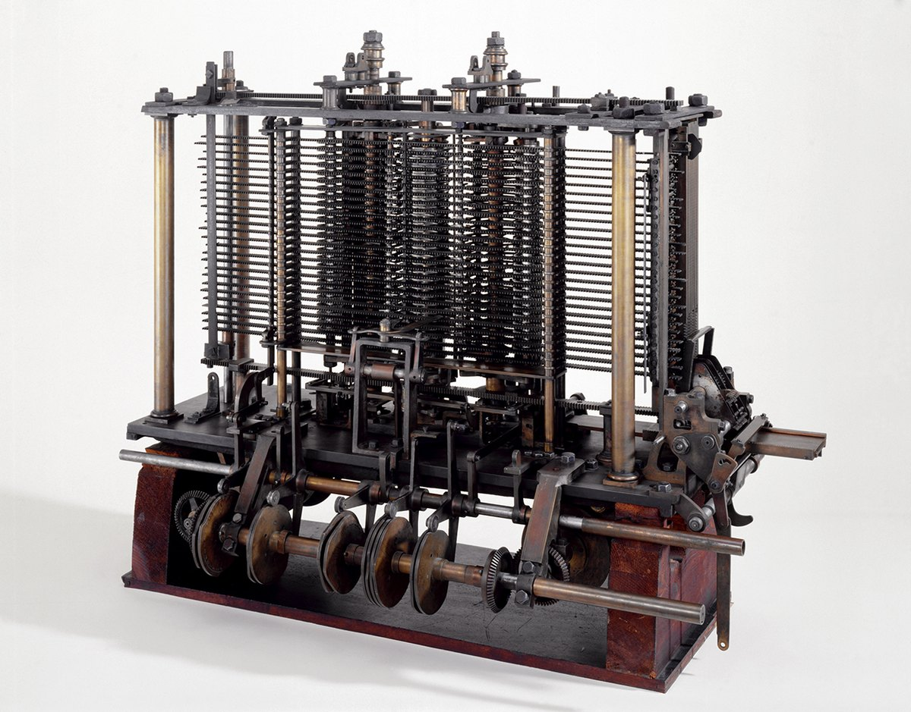
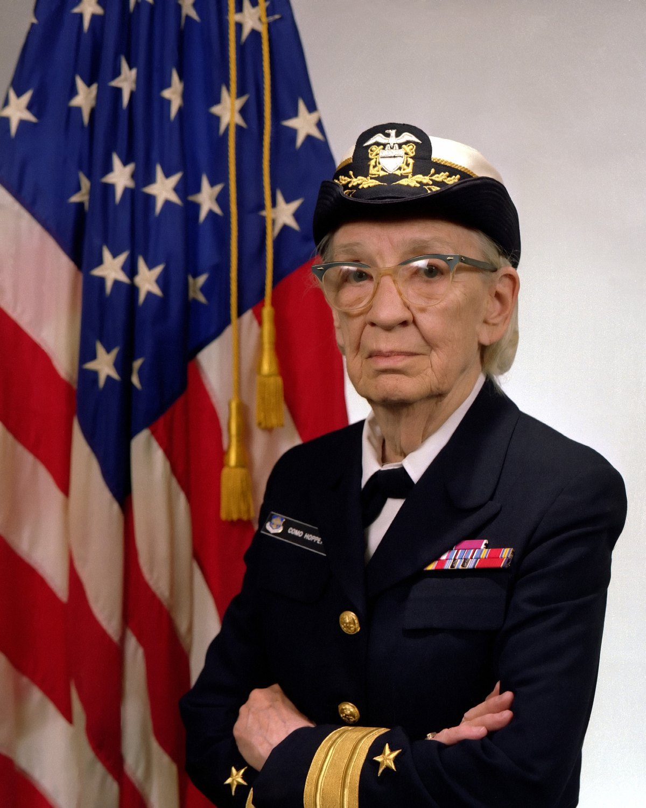

## Objetivos de aprendizagem

- Justificar, com o critério declarado, por que um artefato é chamado de
  primeiro em alguma coisa.
- Distinguir a data da ideia, a da primeira implementação e a da adoção em
  escala de uma mesma tecnologia.
- Reconhecer os marcos que separam as gerações de computadores e relacionar
  cada um ao problema que ele resolvia.
- Identificar pessoas cuja contribuição costuma ficar fora das listas usuais.
- Explicar por que a história da área ajuda a entender as tecnologias atuais.

## Conteúdo previsto

- Cálculo mecânico: ábaco, Pascal, Leibniz, Jacquard.
- Babbage e Lovelace: a máquina analítica e a ideia de programa.
- Boole e a álgebra de dois valores, retomada nos capítulos 5 e 6.
- Turing, Von Neumann e a arquitetura de programa armazenado.
- Gerações de computadores: válvula, transistor, circuito integrado,
  microprocessador.
- Computação pessoal, redes e a Web.
- Computação móvel: o smartphone e os serviços conectados.
- Transformações sociais associadas a cada etapa.

## Leituras recomendadas

Capítulos correspondentes em [@wazlawick2016] e [@brookshear2013]. A obra de
Wazlawick é a fonte principal deste capítulo e organiza a história em doze
partes, da contagem por marcas até as previsões registradas no momento em que
o livro foi escrito. Quem quiser ler a fonte primária de um dos marcos aqui
tratados encontra em @turing1937 o artigo que define a máquina abstrata
discutida na seção sobre os primeiros computadores.

## O propósito deste capítulo

A finalidade deste capítulo decide o que entra nele e o que fica de fora:

> Ser capaz de avaliar uma afirmação sobre a origem de uma tecnologia,
> declarando o critério que a sustenta e distinguindo a data da ideia, a da
> primeira implementação e a da adoção em escala.

Reparem no verbo: julgar. A cronologia deste capítulo existe para dar matéria a
esse julgamento, e reconhecer marcos é o meio, não o fim. É por isso que ele
começa com uma pergunta em vez de começar pelo ábaco.

## Cinco máquinas e uma pergunta

A Segunda Guerra acelerou a construção de máquinas de calcular. O período reúne
equipamentos com propósitos, tecnologias e graus de programabilidade muito
diferentes. Cinco deles aparecem em quase toda lista.

A **Z3**, desenvolvida por Konrad Zuse na Alemanha, era construída com relés,
que são interruptores acionados eletricamente. Recebia a sequência de operações
em fita perfurada e funcionou.

O **Colossus**, em Bletchley Park, no Reino Unido, foi construído com
**válvulas**, componentes que controlam a passagem de corrente sem nenhuma peça
que se mova. Era eletrônico, funcionou durante a guerra e fazia **criptanálise**,
que é a leitura de mensagens cifradas por quem não recebeu a chave.

{#fig-colossus width=82% fig-alt="Sala com um grande painel de equipamento eletrônico coberto de válvulas e cabos, ocupando toda a parede. Duas mulheres de uniforme trabalham diante do painel, uma delas manipulando um rolo de fita."}

O **Atanasoff-Berry Computer**, nos Estados Unidos, aplicava eletrônica à
solução de sistemas de equações lineares. Nunca chegou a operar de forma
plenamente confiável.

O **Harvard Mark I** era eletromecânico, ocupava uma sala, recebia instruções
em fita e produziu cálculos por anos seguidos.

O **ENIAC**, na Universidade da Pensilvânia, era eletrônico, resolvia problemas
de tipos variados e funcionou. Era programado por cabos e chaves: trocar o
problema significava reconectar a máquina, o que levava dias.

{#fig-eniac width=82% fig-alt="Painéis altos de equipamento eletrônico alinhados ao longo de uma parede, cobertos de mostradores circulares, cabos e conectores. Uma pessoa em pé opera um dos painéis."}

### Parem aqui e escrevam

Antes de seguir para a próxima seção, respondam por escrito, em uma folha que
vocês vão guardar até o fim do capítulo:

1.  Qual dessas cinco máquinas foi o primeiro computador?

2.  Em uma frase, por que essa e não as outras?

A segunda pergunta é a que interessa. Escrevam-na mesmo que a resposta pareça
óbvia, e escrevam antes de ler adiante. A folha será usada duas vezes: na
próxima seção e no fim do capítulo.

Quem preferir não escrever pode continuar lendo, e vai entender o capítulo do
mesmo jeito. Vai perder, porém, a única evidência de como raciocinava antes de
tê-lo lido, e essa evidência não pode ser reconstruída depois.

### Por que a resposta não fecha

Comparem a frase de vocês com a de dois colegas. Em uma turma de trinta pessoas,
as cinco máquinas costumam aparecer, e quase todas as justificativas são
defensáveis.

Quem respondeu ENIAC provavelmente escreveu algo como "resolvia problemas de
tipos diferentes". Quem respondeu Colossus provavelmente escreveu "era
eletrônico, e os outros tinham peças que se moviam". Quem respondeu Z3 talvez
tenha escrito "recebia um programa e podia ser reprogramado". Quem respondeu
Harvard Mark I pode ter escrito "funcionou de verdade, por anos".

Nenhuma dessas frases está errada. E é exatamente esse o problema.

Cada uma delas usa um critério diferente sem dizer que o está usando. Uma fala
de versatilidade, outra de tecnologia, outra de programabilidade, outra de uso
efetivo. Como os critérios são diferentes, as respostas não competem entre si:
elas respondem a perguntas distintas que soam como a mesma pergunta.

Isso significa que a discussão sobre qual foi o primeiro computador não pode ser
resolvida com mais informação histórica. Duas pessoas que conheçam todos os
fatos continuarão discordando enquanto não disserem qual critério estão
aplicando. O que falta é instrumento.

A pergunta de aprendizagem deste capítulo nasce daí:

> Que instrumentos permitem julgar uma afirmação sobre origem de tecnologia,
> em vez de apenas ter uma opinião sobre ela?

As quatro seções seguintes constroem esses instrumentos, e a @sec-cinco-maquinas
volta a estas cinco máquinas para vocês refazerem a pergunta com eles na mão.

## Os instrumentos que faltavam

A seção anterior terminou em um impasse: cinco respostas defensáveis, cada uma
apoiada num critério que ninguém tinha declarado. Esta seção entrega os quatro
instrumentos que desfazem o impasse, e o primeiro deles ataca diretamente a
frase que vocês escreveram.

Antes disso, uma observação sobre por que a história entra em uma disciplina
técnica. Este capítulo não existe para vocês decorarem nomes e datas. Ele existe
porque quase toda decisão técnica que vocês vão encontrar no curso tem uma
explicação histórica, e sem ela a decisão parece arbitrária.

Um exemplo serve de aviso. No capítulo 5, vocês vão aprender que o computador
representa tudo em base dois. A explicação usual é que o circuito eletrônico
distingue dois estados com facilidade, o que é verdade e é incompleto. A base
dois já tinha sido formulada como sistema numérico no século XVII, e a álgebra
que opera sobre dois valores lógicos foi construída em meados do século XIX,
antes de existir qualquer circuito. Quando a eletrônica precisou de uma
representação, ela encontrou uma pronta, esperando havia décadas. O binário não
foi inventado pelo computador; ele foi adotado por ele.

A solução costuma existir antes do problema que a torna útil, e esse padrão se
repete tantas vezes na história da área que vale enunciá-lo antes de percorrer a
cronologia. Guardem a observação e verifiquem se ela se confirma nas seções
seguintes.

### As três camadas de qualquer tecnologia de cálculo

Ao examinar um instrumento antigo, separem três camadas. É o método que
@wazlawick2016 usa, e ele evita a confusão mais comum deste assunto.

A primeira camada é o **problema**: contar um rebanho, prever um eclipse,
cobrar um imposto, decifrar uma mensagem. O problema é humano e antecede
qualquer máquina.

A segunda é a **representação**: as marcas, os dígitos, as posições, os
símbolos ou as escalas que tornam o problema manipulável. Uma quantidade não
pode ser somada; a representação dela pode.

A terceira é o **mecanismo**: a pessoa, o papel, a madeira, a engrenagem, o
relé ou o circuito que executa a manipulação.

Uma inovação pode estar em qualquer uma das três, e as três avançam em ritmos
diferentes. A @fig-tres-camadas aplica a separação a um instrumento que vocês
talvez nunca tenham visto funcionando.

```{mermaid}
%%| label: fig-tres-camadas
%%| fig-cap: "As três camadas aplicadas à régua de cálculo. A inovação está na camada do meio."
%%| fig-width: 6
%%| echo: false
flowchart LR
  P["Problema<br/>multiplicar dois numeros"]
  R["Representacao<br/>distancias proporcionais<br/>a logaritmos"]
  M["Mecanismo<br/>duas escalas<br/>que deslizam"]
  P --> R --> M
```

A régua de cálculo resolve uma multiplicação sem que o mecanismo saiba
multiplicar. Ele só sabe somar comprimentos. Quem fez o trabalho difícil foi a
representação, que converteu multiplicação em soma antes de a madeira entrar na
história. Voltaremos a esse instrumento adiante.

### O critério antes do superlativo

Peguem de novo a folha de vocês. A frase que justifica a escolha contém um
critério, mesmo que ele não esteja nomeado. "Resolvia problemas de tipos
diferentes" é um critério. "Era eletrônico" é outro. O defeito da resposta não
está no critério escolhido: está em ele ter ficado implícito, o que impede
qualquer comparação.

A pergunta "qual foi o primeiro computador?" é mal formulada, e é mal formulada
porque omite o critério.

@wazlawick2016 propõe substituí-la por uma matriz. Em vez de disputar um pódio,
declara-se sob que aspecto uma máquina vem antes das outras. A
@tbl-criterios-primeiro nomeia os cinco critérios que costumam estar escondidos
nas respostas, incluindo o que estava na frase de vocês.

| **Critério** | **Pergunta que ele faz** |
|---|---|
| Eletrônico | Os sinais são processados por componentes eletrônicos, e não por peças que se movem? |
| Programável | A sequência de instruções pode ser alterada sem reconstruir a máquina? |
| Propósito geral | A máquina resolve classes variadas de problemas, ou apenas um? |
| Programa armazenado | As instruções ficam na memória, junto com os dados? |
| Operacional | Houve uso documentado e repetível, ou apenas um protótipo? |

: Os cinco critérios que tornam a pergunta sobre o primeiro computador respondível. {#tbl-criterios-primeiro}

Localizem, na tabela, o critério que vocês usaram sem nomear. Ele está lá, em
alguma das cinco linhas, e reconhecê-lo é mais útil do que descobrir se a
máquina escolhida foi a certa.

A regra vale para além deste capítulo. Quando vocês lerem que uma empresa
lançou o primeiro telefone com tela sensível ao toque ou a primeira rede
social, a pergunta correta é sempre a mesma: primeiro sob qual critério.
Protótipo, patente, venda, escala de adoção e influência sobre o que veio
depois são coisas distintas, e o superlativo sem critério costuma ser
propaganda.

### Ideia, implementação e adoção

O terceiro hábito de leitura é separar três datas que raramente coincidem: a
data em que alguém formulou a ideia, a data em que alguém construiu um artefato
que a incorpora e a data em que o artefato passou a ser usado em escala.

A máquina analítica de Babbage foi projetada no século XIX e não foi concluída
como planejado. A ideia estava lá; a implementação, não. O correio eletrônico
funcionava entre pesquisadores muito antes de a maioria das pessoas ter um
endereço. A implementação estava lá; a adoção, não.

Confundir as três datas produz duas distorções. A primeira trata como fracasso
uma ideia que apenas chegou cedo demais para a tecnologia de fabricação
disponível. A segunda atribui a quem popularizou uma técnica o mérito de quem a
concebeu. Nenhuma das duas ajuda a entender por que as coisas aconteceram na
ordem em que aconteceram.

### Anacronismo

O último cuidado é o mais difícil. Um artefato antigo não é uma versão
incompleta de um computador moderno, e descrevê-lo assim apaga o que ele de
fato fazia.

O ábaco é um registro de valores por posição, operado por uma pessoa que conhece
as regras, e chamá-lo de computador lento troca o que ele faz por uma versão
piorada do que veio depois. Os cartões de Jacquard são um meio de controle que
seleciona ações em um tear. As semelhanças com a computação atual são reais e
valem ser apontadas, desde que venham acompanhadas das diferenças de escala, de
meio físico e de capacidade.

A @fig-linha-do-tempo apresenta a divisão de períodos que este capítulo segue,
na forma da transformação dominante de cada um e dos marcos que o representam.
Ela serve de mapa para as seções seguintes, e vale voltar a ela quando um marco
parecer solto.

![Os períodos da história da computação, a transformação dominante de cada um e os marcos que este capítulo usa para representá-los. A leitura desce a coluna da esquerda e continua na da direita. Elaboração própria a partir de [@wazlawick2016].](../diagrams/02/linha-do-tempo.png){#fig-linha-do-tempo width=97% fig-alt="Onze faixas coloridas em duas colunas, em ordem cronológica. A coluna da esquerda vai de até 1622, com ábaco, zero, algoritmo e logaritmos, até os anos 1950, com transistor e software. A coluna da direita vai dos anos 1960, com circuito integrado e ARPANET, até os anos 2000, com smartphone e serviços participativos. A cor muda gradualmente do bege ao verde conforme o período avança."}

## Contar antes de calcular

A computação antecede o computador em milhares de anos. O que existia antes eram
soluções para o mesmo problema, na camada da representação, e julgá-las como
máquinas mal-acabadas é ler o passado de trás para a frente.

### Externalizar a contagem

Dedos, entalhes em osso ou madeira e fichas de barro tiram a contagem da
cabeça e a colocam em um objeto. Um
pastor que guarda uma pedra por ovelha precisa saber emparelhar, e o monte de
pedras faz o resto por ele.

Essa transferência é o primeiro movimento da história inteira. A informação
passa a existir fora da pessoa, em uma forma que outra pessoa pode ler, que
sobrevive ao esquecimento e que pode ser manipulada segundo regras. Toda memória
de computador é descendente do monte de pedras.

### O ábaco e a convenção de leitura

O ábaco organiza valores por posição. Uma conta em uma haste vale um, e a mesma
conta na haste seguinte vale dez. O objeto físico é o mesmo; o valor muda com o
lugar.

Este ponto reaparece no capítulo 5 com outro nome. O resultado de uma operação no
ábaco está na convenção de leitura combinada entre quem opera e quem interpreta,
e nunca nas peças. Duas pessoas com
convenções diferentes olham para a mesma configuração de contas e leem números
diferentes, e nenhuma das duas está errada sobre o que vê.

{#fig-abaco width=70% fig-alt="Ábaco de madeira com treze hastes verticais. Cada haste tem duas contas acima de uma barra horizontal e cinco contas abaixo dela. Algumas contas estão deslocadas em direção à barra, registrando um valor."}

A @fig-abaco mostra um exemplar do tipo suanpan, com duas contas acima da barra
e cinco abaixo em cada haste.

@brookshear2013 formula a mesma ideia para o computador: um padrão de bits não
tem significado próprio, e a codificação é que decide se ele representa um
número, uma letra, uma cor ou uma instrução. A lição do ábaco e a lição do bit
são a mesma lição, separadas por três mil anos de tecnologia.

### O zero e a numeração indo-arábica

O sistema de numeração que vocês usam desde a infância é uma tecnologia, e não
uma propriedade natural dos números. Ele tem duas características que os
algarismos romanos não têm.

A primeira é o valor posicional: o mesmo símbolo vale uma quantidade diferente
conforme a coluna que ocupa. A segunda é o zero, que marca uma coluna vazia e
permite escrever a diferença entre trinta e cinco e trezentos e cinco.

A consequência prática é que as operações passam a ser executáveis por regras
fixas sobre símbolos, sem raciocínio novo a cada conta. Somar dois números
romanos exige entender o que eles significam. Somar dois números escritos em
notação posicional exige seguir um procedimento, coluna por coluna, com uma
regra de transporte. É a diferença entre resolver e executar, e ela é a razão
de a aritmética escrita ter podido ser mecanizada séculos depois.

### Al-Khwarizmi e a palavra algoritmo

O matemático persa al-Khwarizmi escreveu, no século IX, tratados sobre
procedimentos de cálculo com a numeração indo-arábica. A tradução latina de seu
nome deu origem à palavra **algoritmo**, que o capítulo 1 já definiu como
sequência finita de instruções sem ambiguidade que leva de uma entrada a um
resultado.

A origem da palavra registra uma coisa que é fácil esquecer. Algoritmo é anterior
ao computador em mais de mil anos, e descreve um procedimento que uma pessoa
executa com papel. O computador não
criou o algoritmo; ele criou um executor incansável para algoritmos que já
existiam, e depois tornou possíveis algoritmos que nenhuma pessoa executaria em
tempo útil.

### Napier, os logaritmos e a régua de cálculo

No início do século XVII, Napier publicou os logaritmos. A propriedade que
interessa aqui cabe em uma linha:

$$\log(a \times b) = \log(a) + \log(b)$$

A multiplicação de dois números vira a soma de dois logaritmos. Como somar é
muito mais barato que multiplicar, quem tivesse uma tabela de logaritmos podia
multiplicar números grandes com uma soma e duas consultas.

A régua de cálculo materializa a mesma propriedade em madeira. Ela coloca os
valores em escalas cujas distâncias são proporcionais aos logaritmos. Alinhar
o início de uma escala com o valor $a$ na outra e procurar o valor $b$ equivale
a somar as duas distâncias, e a marca encontrada é uma aproximação de
$a \times b$.

A @fig-regua-de-calculo mostra o mecanismo com as distâncias na proporção
correta. Reparem que os intervalos encolhem da esquerda para a direita: é isso
que caracteriza uma escala logarítmica.

{#fig-regua-de-calculo width=92% fig-alt="Duas escalas horizontais sobrepostas. Na escala fixa, superior, as marcas de 1 a 10 ficam cada vez mais próximas da esquerda para a direita, e as marcas 2 e 6 estão destacadas. A escala móvel, inferior, é idêntica e aparece deslocada para a direita, de modo que seu 1 coincide com o 2 da escala fixa e seu 3 coincide com o 6 da escala fixa."}

O operador não precisa conhecer a demonstração para usar o instrumento, e
precisa saber que o resultado é aproximado e depende da leitura da escala. A
régua de cálculo foi o instrumento de trabalho de engenheiros e cientistas até a
década de 1970, quando a calculadora eletrônica de bolso a aposentou em poucos
anos.

Boa parte do trabalho de projeto e de conferência do programa espacial norte-
americano foi feita com esse instrumento, o que costuma ser resumido em uma
frase forte demais. A navegação em voo não dependia de régua: ela dependia do
computador de bordo que a seção sobre os anos 1960 apresenta. Régua de cálculo em
terra, computador embarcado a bordo.

## Delegar o cálculo a engrenagens

Entre os séculos XVII e XIX, o cálculo começa a ser transferido para
mecanismos. Dois movimentos acontecem em paralelo, e confundi-los custa caro:
automatizar a operação aritmética é um problema, e programar o padrão de uma
operação é outro.

### Pascal, Leibniz e o transporte de vai-um

As máquinas de Schickard, a Pascalina de Pascal e os dispositivos de Morland
buscam realizar adição e subtração com rodas dentadas. O problema central
dessas máquinas não é a soma. O problema central é o transporte.

Somem $8 + 7$ em uma calculadora de rodas. A roda das unidades avança oito
posições e depois mais sete. Ao completar dez posições, ela volta a zero e
empurra uma unidade na roda das dezenas. O resultado, $15$, aparece como um $1$
na roda das dezenas e um $5$ na das unidades.

{#fig-pascalina width=78% fig-alt="Caixa retangular de metal e madeira vista de cima, com uma fileira de rodas dentadas circulares numeradas na parte inferior e uma fileira de janelas retangulares na parte superior, onde aparecem os algarismos do resultado."}

A @fig-pascalina mostra uma dessas máquinas, com as rodas de entrada embaixo e
as janelas de resultado em cima.

Reparem no que a engrenagem faz. Ela materializa uma regra da representação
decimal, a de que dez unidades formam uma dezena, sem saber nenhuma aritmética, e
essa regra é a mesma que vocês aplicam ao escrever o vai-um em uma conta no
papel. O
mecanismo executa a convenção; ele não a compreende. É a primeira vez que essa
frase aparece neste capítulo e não será a última.

Leibniz aperfeiçoou máquinas de calcular e formulou o sistema binário, que
representa qualquer número com apenas dois símbolos. A distância entre uma
coisa e outra é grande: Leibniz descreveu a base dois como sistema numérico e
construiu máquinas decimais. Representação e mecanismo permanecem problemas
ligados e distintos, e a base dois esperaria quase três séculos por um
mecanismo que a favorecesse.

O aritmômetro de Thomas de Colmar, já no século XIX, marca outra passagem: a de
demonstrações isoladas para calculadoras produzidas e vendidas para uso
continuado. Uma máquina que funciona uma vez em uma sala é prova de conceito;
uma máquina que trabalha todo dia em um escritório é tecnologia. É a mesma
distinção que voltará a aparecer entre o ENIAC e o UNIVAC I, um século depois.

### Os computadores humanos

Durante todo esse período, e por muito tempo depois, a palavra **computador**
designava uma pessoa. Um computador humano era alguém contratado para executar
cálculos, produzir tabelas astronômicas, financeiras ou balísticas e conferir
resultados de outros computadores humanos.

O trabalho era organizado como uma linha de produção. Uma equipe recebia um
procedimento decomposto em etapas simples, e cada pessoa executava sua etapa
sobre os resultados da anterior, muitas vezes sem conhecer o objetivo do
conjunto. Quem organizava a decomposição fazia, com pessoas, o que hoje se faz
com processos em paralelo.

Esse é um dos pontos em que a história corrige a lista usual de nomes. Boa parte
dos computadores humanos eram mulheres, e as equipes que operaram os primeiros
computadores eletrônicos vieram desse trabalho. A automação não fez o trabalho
desaparecer: ela o reorganizou e, com frequência, tornou invisível quem o
executava.

### Jacquard e o controle separado do mecanismo

O tear de Jacquard, do início do século XIX, não calcula nada. Ele aparece em
todo livro de história da computação por outro motivo, e é o motivo mais
importante deste capítulo até aqui.

O tear usa cartões perfurados para definir o desenho do tecido. Em cada
posição, o furo ou a ausência de furo seleciona se um fio sobe ou permanece. A
sequência de cartões determina o padrão inteiro. A @fig-jacquard-controle mostra
o percurso.

```{mermaid}
%%| label: fig-jacquard-controle
%%| fig-cap: "O controle por cartões no tear de Jacquard. Trocar a sequência muda o resultado sem alterar a máquina."
%%| fig-width: 6
%%| echo: false
flowchart LR
  C["Cartao<br/>furo ou ausencia de furo"]
  L["Leitura mecanica<br/>a agulha encontra ou nao o furo"]
  A["Acao selecionada<br/>o fio sobe ou permanece"]
  T["Padrao do tecido"]
  C --> L --> A --> T
  N["Nova sequencia de cartoes"] -.-> C
```

{#fig-tear-de-jacquard width=88% fig-alt="Vista de um tear de madeira. Do lado esquerdo descem centenas de fios verticais tensionados. Do lado direito, uma longa corrente de cartões retangulares perfurados, unidos pelas bordas, pende dobrada sobre uma estrutura de madeira."}

A @fig-tear-de-jacquard registra a separação de que trata esta seção. Os fios
estão de um lado, a corrente de cartões do outro, e a máquina é a mesma
qualquer que seja o desenho que os cartões descrevem.

O que Jacquard separou foi o mecanismo do comportamento. A máquina permanece
fisicamente a mesma e produz tecidos diferentes conforme a entrada que recebe.
Para mudar o produto, troca-se a sequência de cartões, e não o tear.

Essa separação é o antepassado direto da programação, e é aqui que o cuidado
com o anacronismo precisa ser exercido. Falta aos cartões de Jacquard quase tudo
o que hoje define um programa: decisão, repetição condicional e a possibilidade
de serem alterados pela própria máquina durante a execução. O que eles antecipam
é a ideia de que o comportamento de uma máquina pode ser informação externa a
ela.

## A máquina que não foi construída

O século XIX aproxima quatro linhas que vinham separadas: a automação
industrial, a lógica formal, a telecomunicação e o processamento de dados
administrativos. Todas convergem depois, e as quatro nascem aqui.

### Babbage e as quatro funções

Charles Babbage projetou máquinas de diferenças, destinadas a produzir tabelas
por somas sucessivas, e depois a Máquina Analítica, que é o marco. O projeto não
foi concluído como planejado, e seu valor histórico está na articulação que ele
propôs.

{#fig-babbage-maquina width=72% fig-alt="Montagem de engrenagens de latão e eixos de aço dispostos em colunas verticais sobre uma armação metálica, exposta em vitrine de museu."}

A @fig-babbage-maquina mostra o que existe da máquina: uma montagem parcial,
construída a partir dos desenhos, e não um equipamento que Babbage tenha visto
funcionando.

A Máquina Analítica separa quatro funções, e a @fig-babbage-funcoes as dispõe
como um diagrama de blocos.

![As quatro funções da Máquina Analítica. Os cartões trazem dados e sequência de operações, o mill executa, o store guarda os resultados intermediários e a impressão entrega o resultado. A mesma divisão reaparece nos capítulos 3 e 4. Elaboração própria a partir de [@wazlawick2016].](../diagrams/02/babbage-funcoes.png){#fig-babbage-funcoes width=88% fig-alt="Diagrama de blocos em quatro caixas. Entrada e controle por cartões perfurados aponta para Processamento, chamado mill, que aponta para Saída por impressão. Abaixo do mill, uma caixa de Memória, chamada store, liga-se a ele por uma seta de mão dupla rotulada guarda e devolve."}

Comparem essa tabela com a estrutura funcional que o capítulo 3 vai apresentar,
e com os componentes do capítulo 4. A correspondência é direta, e ela foi
proposta um século antes de existir máquina capaz de realizá-la.

O cuidado a tomar é o de sempre. Babbage não trabalhava com programa armazenado,
e as instruções ficavam nos cartões, fora da memória de trabalho. Tratar a
Máquina Analítica como um computador moderno em tamanho reduzido apaga essa
diferença, que é justamente a que definirá a arquitetura dominante cem anos
depois.

### Ada Lovelace e o deslocamento do cálculo para o símbolo

Ada Lovelace escreveu, sobre a Máquina Analítica, notas que descrevem como os
cartões poderiam coordenar uma sequência de operações. A contribuição que
importa não é a de ter escrito instruções.

{#fig-ada-lovelace width=46% fig-alt="Retrato pintado de uma mulher jovem sentada, em vestido claro de gola larga e mangas volumosas, segurando um leque, com o cabelo preso e cachos laterais."}

O que as notas dela deslocam é o objeto. Enquanto a discussão tratava de
calcular, a máquina era uma calculadora rápida. Ao observar que os símbolos
manipulados não precisam representar quantidades, o texto abre a possibilidade
de a máquina operar sobre qualquer coisa que se possa codificar segundo regras.
Números são um caso particular.

Vocês encontram essa ideia em uso todos os dias, e ela é a razão de o mesmo
equipamento tocar música, corrigir texto e calcular imposto. A máquina não trata
de sons, palavras ou dinheiro: ela trata de símbolos codificados, e a
interpretação está do lado de fora.

### Boole e a álgebra de dois valores

Em meados do século XIX, George Boole formulou uma álgebra em que as
proposições assumem valores lógicos e podem ser combinadas por operações. Onde
a álgebra comum opera sobre quantidades com soma e multiplicação, a álgebra
booleana opera sobre verdadeiro e falso com conjunção, disjunção e negação.

{#fig-george-boole width=40% fig-alt="Retrato de um homem de meia-idade, de terno escuro e gravata, cabelo penteado para trás e costeletas, olhando levemente para o lado."}

A @fig-george-boole traz o autor dessa formalização, e a @fig-ada-lovelace, a
autora das notas da seção anterior. Os dois trabalharam no mesmo país e no
mesmo século, sobre problemas que só se encontrariam muito depois.

O trabalho de Boole era filosófico e matemático. Ele não tinha máquina em vista,
e a formalização ficou disponível por quase um século sem aplicação técnica.

A convergência aconteceu já no século XX, quando Shannon aproximou a álgebra
booleana dos circuitos de comutação, mostrando que os dois valores lógicos
correspondem a chave aberta e chave fechada, e que uma combinação de chaves
executa uma expressão lógica [@wazlawick2016]. A partir daí, projetar um
circuito passou a ser um problema algébrico, com regras de simplificação e
verificação.

Esta seção é a razão de o capítulo 5 apresentar a base dois e de o
capítulo 6 operar sobre ela, e é a origem de Sistemas Digitais, que vocês vão
cursar mais adiante no curso. Quando aquela disciplina pedir a simplificação de
uma expressão lógica, o que estará em jogo é a álgebra que Boole construiu sem
imaginar um circuito.

### Hollerith e o censo de 1890

Herman Hollerith aplicou cartões perfurados e máquinas tabuladoras ao censo
norte-americano de 1890. É o primeiro caso em que o processamento mecanizado de
dados demonstra valor em escala administrativa, e não em cálculo científico.

Os números desse censo pedem cuidado, e o cuidado é o mesmo que este capítulo
vem pedindo desde a abertura. A contagem simples da população total foi divulgada
após seis semanas de processamento, e é esse o número que costuma ser repetido. A
apuração completa, com todas as características levantadas, levou seis anos,
contra oito anos do censo de 1880. O ganho é real e é de 25%, e não da ordem de
grandeza que a primeira cifra sugere. Quem repete só as seis semanas está
comparando a contagem de cabeças com o trabalho inteiro.

O procedimento antecipa algo que o capítulo 12 vai retomar sob outro nome. Cada pessoa vira um cartão. Cada característica da
pessoa vira uma posição no cartão, e cada posição admite um conjunto fixo de
valores previstos. O operador configura a máquina para contar os cartões que
combinam determinadas perfurações, e a máquina acumula totais.

{#fig-cartao-hollerith width=92% fig-alt="Cartão retangular de papel impresso com uma grade densa de números e abreviaturas organizados em colunas rotuladas. Alguns pontos da grade estão perfurados, formando uma diagonal irregular ao longo do cartão."}

A @fig-cartao-hollerith mostra um cartão do sistema. Reparem que as categorias
estão impressas no próprio cartão: quem o projetou já decidiu quais perguntas
existem e quais respostas são admissíveis.

A velocidade vem da padronização prévia tanto quanto da máquina. Alguém precisou
decidir quais categorias existem, quantos valores cada uma admite e o
que fazer com quem não se encaixa em nenhum. Esse trabalho de codificação é
anterior ao processamento, é uma decisão humana e determina o que o resultado
pode dizer. Um dado que não coube na categoria prevista não aparece no total,
e ninguém que leia o total percebe a ausência.

A empresa que Hollerith fundou está entre as que deram origem à IBM, e é por
isso que o processamento de dados comercial e o cálculo científico chegam ao
século XX como duas tradições distintas, com máquinas, clientes e vocabulários
próprios.

## Eletrônica, guerra e os primeiros computadores

A primeira metade do século XX prepara os componentes, os meios de registro e as
organizações que tornam possível processar sinais em alta velocidade. Nenhuma
máquina isolada inaugura o período: ele resulta da convergência entre indústria
de escritório, telecomunicações, ciência e urgência militar.

### Da engrenagem ao relé, do relé à válvula

O telégrafo e o telefone transformaram a transmissão e a comutação de sinais em
problemas de engenharia, e produziram o relé, um interruptor acionado
eletricamente. Um relé comuta em milésimos de segundo, contra os décimos de
segundo de uma peça que precisa vencer a própria inércia.

A válvula eletrônica substitui o movimento por controle de corrente e comuta
milhares de vezes mais rápido que o relé, sem peça móvel. O ganho é enorme e o
preço também: a válvula é grande, consome muita energia, esquenta e queima. Um
computador com dezenas de milhares de válvulas passa parte do tempo com alguma
delas queimada, e a manutenção é atividade contínua, não eventual.

Essa limitação é a causa direta do marco seguinte da cronologia. O transistor
não apareceu por curiosidade científica; ele resolveu um problema industrial
que já estava travando o crescimento das máquinas.

### O flip-flop e a memória de um bit

O flip-flop é um circuito com dois estados estáveis, capaz de permanecer em um
deles até receber um sinal que o altere. Definam o estado baixo como $0$ e o
alto como $1$: um pulso em uma entrada leva o circuito ao estado alto, e a
informação permanece depois de o pulso terminar.

Repare-se na formulação, que é a mesma da seção sobre o ábaco. O componente não
entende números. Ele tem dois estados físicos, e uma convenção associa esses
estados a dígitos binários. Trocada a convenção, o mesmo circuito representa
outra coisa.

No mesmo período, a gravação magnética, os tambores e os discos inauguram meios
de armazenamento regraváveis, capazes de guardar informação sem energia
aplicada. A hierarquia de memória que o capítulo 4 apresenta começa a se formar
aqui, com a distinção entre o que é rápido e volátil e o que é lento e
permanente.

Uma alternativa perdeu, e conhecê-la evita uma leitura ingênua da
cronologia. As calculadoras analógicas resolvem
problemas representando grandezas por quantidades físicas contínuas, como
tensão ou posição, e obtêm resultados sem discretizar nada. Elas formam outra
família, com outra questão central, e não uma versão primitiva do digital. Onde o
digital se preocupa com codificação e estados, o analógico se preocupa com
precisão e calibração. A escolha entre os dois dependia do problema, e chamar o
digital de melhor sem dizer em que aspecto é exatamente o erro que este capítulo
vem tentando evitar.

### Turing e a máquina que não é uma máquina

Nos anos 1930, antes de qualquer computador eletrônico, Alan Turing descreveu um
dispositivo abstrato: uma fita infinita dividida em posições, um cabeçote que lê
e escreve símbolos, e um conjunto finito de estados e regras que dizem o que
fazer diante de cada símbolo lido [@turing1937].

O ponto que costuma se perder é que ninguém pretendia construir isso. A máquina
de Turing é um instrumento de raciocínio, e serve para responder perguntas
sobre computação em geral, sem depender de nenhuma tecnologia. Com ela é
possível perguntar o que pode ser calculado por qualquer procedimento mecânico,
e o capítulo 1 já mencionou a resposta mais famosa: existe pergunta que nenhum
procedimento responde em todos os casos.

A cronologia aqui vale por si. A demonstração de que existem limites absolutos
para o que uma máquina pode calcular veio mais de dez anos antes da primeira
máquina eletrônica de programa armazenado. A área conheceu seus limites antes de
conhecer seus instrumentos, o que é raro na história da técnica.

### Cinco máquinas, agora com instrumento {#sec-cinco-maquinas}

Vocês conheceram estas cinco máquinas na abertura do capítulo e responderam,
sem instrumento, qual delas seria a primeira. Agora têm o critério, as três
camadas e a distinção entre ideia, implementação e adoção. A pergunta que não
fechava passa a fechar, desde que reformulada.

Recuperem o que vocês escreveram. A @fig-matriz-criterios aplica os cinco
critérios às cinco máquinas, e as duas primeiras linhas estão resolvidas aqui,
para vocês compararem com o próprio raciocínio.

A Z3 é programável, porque a sequência de instruções vinha em fita perfurada e
podia ser trocada, e é operacional, porque foi usada. Não é eletrônica, porque
funcionava com relés, que são peças que se movem. Não é de propósito geral nem
guarda o programa na memória. Duas colunas favoráveis, três desfavoráveis.

O Colossus inverte parte disso. É eletrônico e é operacional, e foi programável
apenas em parte, porque a configuração mudava dentro de um repertório fixo de
operações de criptanálise. Não é de propósito geral, porque foi construído para
uma tarefa, e não guarda o programa na memória.

Entre as duas linhas aconteceu o seguinte. Nenhuma das duas máquinas é melhor
que a outra: elas são favoráveis em colunas diferentes. Quem responder
"a Z3" e quem responder "o Colossus" pode estar certo, e a discordância entre os
dois é sobre qual coluna importa, e não sobre história.

![Os cinco critérios aplicados às máquinas do período. Nenhuma linha é favorável nas cinco colunas até o pós-guerra, e é por isso que a pergunta sobre a primeira não tem resposta única. Elaboração própria a partir de [@wazlawick2016].](../diagrams/02/matriz-criterios.png){#fig-matriz-criterios width=95% fig-alt="Tabela com seis linhas de máquinas, da Z3 ao EDSAC, e cinco colunas de critérios: eletrônico, programável, propósito geral, programa armazenado e operacional. As células trazem sim, não ou em parte, com fundo verde para sim e vermelho para não. Só a última linha, do EDSAC e semelhantes, tem sim nas cinco colunas."}

Completem vocês as três linhas restantes, do ABC, do Harvard Mark I e do ENIAC,
conferindo cada resposta com a figura. Depois leiam a figura por coluna, e não
por linha: cada coluna tem pelo menos uma resposta favorável, e nenhuma linha do
período da guerra é favorável em tudo. Só a última linha, já do pós-guerra, é
favorável nas cinco.

Somem-se a isso as disputas de autoria, comuns em projetos militares e de
laboratório, em que o trabalho é coletivo e o crédito é atribuído depois, e
vocês têm o retrato de um período que resiste a listas simples.

### O programa armazenado

O relatório sobre o EDVAC consolidou a organização que resolve a limitação do
ENIAC, e ela costuma ser associada ao nome de von Neumann, embora tenha sido
construída por muitos pesquisadores. A ideia é curta de enunciar e difícil de
superestimar: as instruções ficam na memória, no mesmo lugar e no mesmo formato
que os dados.

A @tbl-programa-armazenado mostra uma memória minúscula com um programa dentro.

| **Posição** | **Conteúdo** | **Papel** |
|---|---|---|
| 0 | somar | Instrução |
| 1 | parar | Instrução |
| 2 | 4 | Dado |
| 3 | 5 | Dado |

: Uma memória com instruções e dados no mesmo espaço de endereços. {#tbl-programa-armazenado}

O processador busca a instrução na posição $0$, aplica a soma aos dados das
posições $2$ e $3$, chega a $9$ e depois busca a instrução seguinte, que manda
parar. Para trocar a soma por uma subtração, basta alterar o conteúdo da posição
$0$. Não há cabo para religar, nem cartão para reordenar.

Três consequências saem daí, e as três estão neste livro.

A primeira é que programar deixa de ser trabalho físico e passa a ser escrita.
Isso muda quem pode fazê-lo, quanto tempo leva e quantas versões cabem em um
dia.

A segunda é que uma instrução, por estar na memória em forma de dado, pode ser
lida e escrita por outro programa. É o que torna possível o compilador do
capítulo 7, que é um programa cuja saída é outro programa.

A terceira é que instrução e dado, ocupando o mesmo espaço com o mesmo formato,
só se distinguem pelo uso que se faz deles. Um erro que faça o processador
buscar instrução onde há dado produz comportamento sem sentido, e essa
fragilidade é a origem de toda uma família de problemas de segurança que vocês
vão estudar mais adiante.

O Manchester Baby, o EDSAC e outras máquinas do fim da década tornaram o
programa armazenado operacional. A partir delas, a arquitetura descrita aqui
passa a ser a organização dominante, e continua sendo a do equipamento em que
vocês vão programar neste semestre.

## As gerações e o que cada uma mudou

A divisão da história dos computadores em gerações organiza o assunto por
componente dominante. A @tbl-geracoes reúne as quatro, com o ganho que cada
transição trouxe.

| **Geração** | **Componente** | **Período aproximado** | **O que a transição resolveu** |
|---|---|---|---|
| Primeira | Válvula | Anos 1940 e 1950 | Velocidade eletrônica, sem peça móvel |
| Segunda | Transistor | Anos 1950 e 1960 | Confiabilidade, tamanho e consumo |
| Terceira | Circuito integrado | Anos 1960 e 1970 | Custo por função e compatibilidade entre modelos |
| Quarta | Microprocessador | A partir dos anos 1970 | Processador em uma peça, ao alcance de pequenos fabricantes |

: As quatro gerações de computadores e o problema que cada transição resolveu. {#tbl-geracoes}

A tabela é útil e tem um defeito conhecido. Ela conta a história pelo
componente, e boa parte do que mudou no período não é
componente. Linguagem de programação, sistema operacional, interface e rede não
aparecem nela, e explicam tanto quanto as válvulas e os transistores.

Esta seção percorre as quatro linhas da tabela. A seção seguinte volta ao mesmo
período pelo lado que a tabela não mostra.

### O transistor e a industrialização

O transistor comuta sinais como a válvula e resolve seus três problemas de uma
vez: é pequeno, consome pouco e não queima com facilidade. A máquina que antes
ocupava uma sala e parava toda semana passa a caber em um armário e a funcionar
por meses.

{#fig-primeiro-transistor width=52% fig-alt="Dispositivo em forma de triângulo metálico apoiado sobre uma base, com um pequeno cristal na ponta inferior e contatos condutores presos por uma mola, montado sobre um suporte de laboratório."}

A @fig-primeiro-transistor mostra a réplica do primeiro deles. Comparem o
tamanho da peça com o dos painéis da @fig-eniac, que eram feitos de válvulas.

O efeito não é apenas técnico. Uma máquina confiável pode ser vendida a quem não
tem equipe de manutenção própria, e é nos anos 1950 que o computador vira
produto comercial. O UNIVAC e as máquinas que o seguem levam o processamento
eletrônico para folha de pagamento, controle de estoque e faturamento, que são
os problemas de quem paga a conta.

### O circuito integrado e a compatibilidade

O circuito integrado reúne muitos componentes em uma mesma peça de material
semicondutor. O efeito imediato é o custo por função, que cai de forma
sustentada por décadas.

O efeito menos evidente é estratégico, e o IBM System/360 é o exemplo do
período. Uma família de computadores com modelos de portes diferentes, capaz de
executar os mesmos programas, muda a decisão de compra. O cliente que cresce
troca de modelo sem reescrever seus sistemas nem retreinar sua equipe.

Daí sai um modelo de análise que explica disputas de mercado até hoje.
Compatibilidade preserva investimento, e por isso pesa mais que
desempenho bruto em quase toda decisão real. Uma empresa com dez programas
escritos para uma arquitetura pode preferir uma máquina compatível e mais lenta
a uma máquina superior que exija reescrever tudo.

A pergunta a fazer, sempre, é compatível com o quê: com o conjunto de
instruções, com o formato dos dados, com o sistema operacional ou com os
periféricos. São compatibilidades diferentes, e um fornecedor que promete a
palavra sem o complemento está prometendo pouco.

### Tempo compartilhado e o computador que responde

Nos anos 1960, o time-sharing transforma a relação entre pessoa e máquina. Em
vez de entregar um trabalho e voltar no dia seguinte, várias pessoas usam o
mesmo computador ao mesmo tempo, cada uma em um terminal.

O mecanismo é a alternância rápida. O sistema executa o trabalho do primeiro
terminal por uma fatia de tempo, salva o estado, passa ao segundo, depois ao
terceiro, e repete o ciclo. Como a alternância é muito mais rápida que a
percepção humana, cada pessoa tem a impressão de dispor da máquina inteira.

Não confundam isso com dividir fisicamente o computador em três. O processador
faz uma coisa de cada vez, e a interatividade depende de memória suficiente para
manter os estados, de uma política de **escalonamento**, que é a regra que decide
de quem é a vez, e de terminais acessíveis. O capítulo 7 volta ao assunto ao tratar do papel do
sistema operacional.

A consequência cultural é grande. Um computador que responde em segundos permite
experimentar, errar e corrigir, e é esse regime que produz a programação como
atividade exploratória. O regime anterior, em que cada erro custava um dia de
espera, produzia outro tipo de programador e outro tipo de programa.

### O que os anos 1960 anteciparam

Três linhas nascem nessa década e só se tornam cotidianas muito depois, e as
três ilustram a distância entre ideia e adoção.

O Sketchpad, o mouse, os primeiros experimentos com computação gráfica e a
proposta do Dynabook antecipam a interação visual e o computador pessoal. Nada
disso era produto: eram demonstrações em laboratórios de pesquisa.

{#fig-mouse-engelbart width=62% fig-alt="Caixa de madeira do tamanho da palma da mão, com um botão vermelho na face superior e um cabo saindo pela parte de trás, exposta em vitrine de museu."}

A @fig-mouse-engelbart mostra o protótipo de mouse do período. Entre esse
objeto de madeira e o equipamento que vocês usam há mais de uma década de
distância, e é essa distância que a seção sobre ideia, implementação e adoção
pedia para vocês medirem.

A ARPANET estabelece as bases técnicas e sociais da interconexão entre redes. Ela
usa **comutação de pacotes**: em vez de reservar um caminho inteiro para cada
conversa, como faz a telefonia da época, a mensagem é quebrada em pedaços que
viajam separados e são remontados na chegada. A ARPANET é um experimento de
rede, e entre ele e a Internet de uso público existem décadas, uma mudança
completa de escala e um conjunto de convenções que só a seção sobre a Web vai
nomear.

O Apollo Guidance Computer mostra software embarcado em missão crítica, com
restrições severas de memória, peso e confiabilidade. É o mesmo tipo de
restrição que o capítulo 1 discutiu ao tratar dos casos em que um detalhe custou
caro.

A década também produziu a expressão crise do software, que nomeia um problema
que a técnica não resolveu: projetos grandes atrasavam, estouravam orçamento e
falhavam com regularidade, apesar de máquinas cada vez melhores.

A observação mais conhecida sobre o assunto diz que acrescentar pessoas a um
projeto atrasado tende a atrasá-lo mais, por causa do custo de coordenação. Ela
nasceu da experiência de conduzir um grande projeto de software nos anos 1960 e
foi publicada em 1975, e a diferença entre as duas datas é exatamente o segundo
instrumento deste capítulo aplicado a um caso pequeno. Engenharia de Software, no
quarto período, trata do assunto com método próprio, e o capítulo 8 o apresenta
como área.

## O software vira assunto próprio

A seção anterior atravessou trinta anos pelo componente dominante, do transistor
ao que os anos 1960 anteciparam. Esta volta ao início desse intervalo e percorre
o mesmo período por outro fio.

Enquanto o componente mudava, uma separação mais importante se consolidava: a de
que o programa é um objeto de estudo distinto da máquina que o executa.

Essa separação depende do programa armazenado, e vale reconstruir o vínculo. Em
uma máquina programada por cabo ou por painel, como o ENIAC, não existe onde
guardar um programa que produza outro programa: o resultado de um cálculo é um
número, e a configuração da máquina é feita de fios. Quando as instruções passam
a morar na memória, no mesmo formato dos dados, um programa pode escrever
instruções e outro pode executá-las. É a segunda consequência apontada na seção
sobre o programa armazenado, e ela deixa de ser observação técnica para virar
uma indústria inteira.

A separação também dependeu de uma mudança de quem paga a conta. Enquanto o
computador foi equipamento de laboratório e de projeto militar, quem o
programava era quem o havia construído, e a distância entre a máquina e a
notação não incomodava ninguém. Quando o computador vira produto vendido a uma
seguradora, o programador passa a ser um funcionário contratado que nunca viu o
circuito, e a notação passa a ser um problema de custo.

### O UNIVAC e o computador como produto

O UNIVAC I foi projetado principalmente por J. Presper Eckert e John Mauchly, os
mesmos do ENIAC, na empresa que os dois fundaram e que foi depois comprada pela
Remington Rand. A primeira unidade foi aceita pelo Departamento do Censo dos
Estados Unidos em 31 de março de 1951, e a cerimônia de entrega, registrada na
@fig-univac-censo, ocorreu em 14 de junho do mesmo ano.

{#fig-univac-censo width=95% fig-alt="Sala ampla com o UNIVAC I. Ao fundo, ao centro, um gabinete alto com a palavra UNIVAC no alto e painéis abertos que mostram fileiras de componentes; um homem trabalha atrás dele. À esquerda, um operador sentado diante de um console inclinado coberto de interruptores e lâmpadas, com um teclado à frente. À direita, uma fileira de oito armários iguais, cada um com duas bobinas de fita magnética visíveis atrás de portas de vidro."}

Dois números do equipamento bastam para situá-lo. A memória guardava doze mil
caracteres, e a máquina executava cerca de duas mil operações por segundo. Para
isso, pesava mais de sete toneladas e consumia 125 kW.

Comparem esses números com o capítulo 3. Um processador atual executa da ordem
de bilhões de ciclos por segundo, e a memória de um telefone comum guarda alguns
bilhões de caracteres. O UNIVAC I fazia, em um segundo, menos do que um telefone
faz enquanto a tela é desbloqueada, e por isso custava entre um e um milhão e
meio de dólares da época nas unidades finais.

A mudança que mais importa para este capítulo aparece à direita da
@fig-univac-censo. O UNIVAC I lia e gravava em fita
magnética, e nem sequer aceitava cartão perfurado nas primeiras unidades, o que
exigia conversores externos. A fita comporta volumes de dados que nenhuma pilha
de cartões comporta, e comporta-os em sequência, que é exatamente a forma como
se percorre uma folha de pagamento ou um recenseamento. O equipamento foi
projetado para o problema de quem paga a conta, e não para o problema de quem
faz cálculo científico.

Do UNIVAC I foram construídas 46 unidades. É a diferença entre um artefato e um
produto, e é a razão de o software passar a ter mercado. Um programa escrito para
uma máquina única serve a uma instalação; um programa escrito para uma família de
46 máquinas iguais pode ser vendido, copiado e reaproveitado.

Quarenta e seis é pouco para os padrões de hoje e é muito para 1951. Como recorde
de quantidade, porém, o número dura pouco: o IBM 650, lançado em 1954, chegou
perto de duas mil unidades, e é a ele que cabe o título de primeiro computador
produzido em massa. Chamar o UNIVAC I de primeiro computador produzido em série,
sem completar a frase, é o tipo de afirmação que a próxima subseção ensina a
desmontar.

### Primeiro computador comercial, sob qual critério

O UNIVAC I é chamado com frequência de primeiro computador comercial, e a essa
altura do capítulo vocês já sabem o que fazer com uma frase dessas. Peguem o
instrumento do critério e apliquem-no à @tbl-primeiro-comercial.

| **Máquina** | **Marco** | **Data** | **Sob que critério vem antes** |
|---|---|---|---|
| Ferranti Mark 1 | Entrega à Universidade de Manchester | Fevereiro de 1951 | Primeira máquina de programa armazenado e propósito geral posta à venda |
| UNIVAC I | Aceitação pelo Departamento do Censo | 31 de março de 1951 | Primeira comprada por órgão civil de governo, e primeira produzida em série ampla |
| LEO I | Primeira aplicação comercial em uso | 5 de setembro de 1951 | Primeiro computador usado em rotina administrativa de uma empresa |

: Três máquinas de 1951 e o critério sob o qual cada uma vem antes. {#tbl-primeiro-comercial}

As três datas estão no mesmo ano e as três respostas são defensáveis, como as
cinco máquinas da @fig-matriz-criterios. O LEO I é o caso mais curioso das três:
foi construído por uma empresa de casas de chá e padarias, para calcular o custo
dos ingredientes de pães e bolos, o que mostra quem tinha o problema antes de
quem tinha a máquina.

A disputa não é sobre fatos. Ninguém discorda das datas. A divergência é sobre
o que a palavra comercial quer dizer: posta à venda, comprada
por cliente pagante ou usada em rotina de negócio. Declarado o sentido, a
pergunta fecha.

### Grace Hopper e a ideia de que a máquina pode traduzir

Grace Murray Hopper era doutora em matemática e entrou na Marinha dos Estados
Unidos em 1944, como tenente, sendo designada para o projeto de computação da
Universidade Harvard. Ali trabalhou na programação do Harvard Mark I, sob
direção de Howard Aiken, e ficou no grupo até 1949, quando foi para a empresa de
Eckert e Mauchly. A @fig-hopper-univac a mostra em 1957, ao teclado de um UNIVAC.

{#fig-hopper-univac width=62% fig-alt="Fotografia em preto e branco. Uma mulher de meia-idade, de óculos, sentada, segura folhas de papel e opera o teclado de um console coberto de interruptores, mostradores e lâmpadas. Três homens em torno dela observam o painel, dois em pé e um sentado à direita."}

A contribuição dela é uma tese sobre a divisão do trabalho entre pessoa e
máquina. A tese diz que a tradução de uma notação legível por
pessoas para instruções de máquina é ela própria uma tarefa mecânica, repetitiva
e sujeita a erro, e que por isso deve ser feita pela máquina. @hopper1952
apresenta o argumento e vale pela formulação: o trabalho de montar um programa a
partir de trechos conhecidos é exatamente o tipo de tarefa que se delega a um
computador.

O argumento parece óbvio hoje e não era. Hopper relatou que ouviu, de forma
imediata, que aquilo não podia ser feito porque computadores não entendiam
inglês, e que levou cerca de três anos até que a ideia fosse aceita
[@beyer2009]. A
resistência tinha uma base real: o equipamento era caríssimo e gastar ciclos
dele traduzindo notação, em vez de calcular, parecia desperdício. A troca é a
mesma que o capítulo 3 vai apresentar como escolha da camada em que se ataca um
problema, e a resposta acabou sendo a mesma: tempo de máquina ficou barato,
tempo de gente não.

### Do A-0 ao FLOW-MATIC

Em 1952, Hopper tinha em funcionamento o A-0, e aqui o instrumento do
anacronismo é obrigatório. O A-0 era chamado de compilador na época, e a palavra
mudou de sentido desde então. Ele montava um programa executável
a partir de **sub-rotinas**, que são trechos de programa já escritos e guardados
para reúso, neste caso em fita. O A-0 encadeava os trechos pedidos e ajustava os
endereços de cada um para a posição que ele ocuparia na memória. Pelo vocabulário
atual, isso é um ligador, que junta os trechos, e um carregador, que os coloca na
memória para executar.

A diferença importa porque o mérito muda de lugar quando ela é apagada. O A-0
não traduzia uma linguagem de alto nível, e não precisava traduzir para provar o
que precisava ser provado: que a máquina podia montar o próprio programa. Quem
lê "primeiro compilador" e imagina algo que aceitava fórmulas está atribuindo ao
A-0 uma capacidade que ele não tinha e, de quebra, tirando de vista o que ele
efetivamente resolveu.

A linguagem veio depois. Hopper propôs a ideia no fim de 1953, a equipe escreveu
as especificações e um protótipo em 1955, e o resultado, chamado primeiro de B-0
e depois de FLOW-MATIC, ficou disponível ao público no início de 1958 e
substancialmente completo em 1959. Ele rodava no UNIVAC I, e foi a primeira
linguagem de programação a expressar operações com frases parecidas com o
inglês, em vez de símbolos sem significado próprio.

O trecho abaixo dá a aparência do FLOW-MATIC. Ele serve para vocês verem a
forma, e não para ser entendido linha a linha; nenhuma explicação deste capítulo
depende dele.

```
COMPARE PRODUCT-NO (A) WITH PRODUCT-NO (B)
IF EQUAL GO TO OPERATION 5
READ-ITEM A ; IF END OF DATA GO TO OPERATION 14
TRANSFER A TO C
```

Duas decisões do FLOW-MATIC sobreviveram a ele. A primeira é o nome longo e
descritivo, como `PRODUCT-NO`, em lugar de uma letra. A segunda é a separação
entre a descrição dos dados e a descrição das operações, escritas em partes
distintas do programa.

A motivação de Hopper para a aparência em inglês é o ponto que costuma se
perder. Ela não estava buscando elegância: observou que os clientes comerciais
não se sentiam à vontade com notação matemática e recusavam símbolos abstratos.
O leitor mudou, e a notação mudou com ele. É o mesmo raciocínio das três camadas
apresentado no início deste capítulo, aplicado à camada da representação: o
problema é o mesmo, o mecanismo é o mesmo, e a representação foi trocada para
caber em quem ia usá-la.

### COBOL e a linguagem comercial de alto nível

Uma **linguagem de alto nível** é aquela cujas construções são descritas em
termos do problema, e não em termos das operações do processador. O "alto" não
mede qualidade: mede distância da máquina. Quanto mais alto, mais o programa se
parece com o enunciado do problema e menos com o conjunto de instruções, e maior
é o trabalho de tradução que alguém precisa fazer no meio do caminho. Esse
alguém é o compilador, assunto do capítulo 7.

O COBOL é a linguagem de alto nível voltada ao processamento comercial, e a
história dele mostra por que portabilidade vira exigência. Em 1959, o
Departamento de Defesa dos Estados Unidos patrocinou o esforço depois de
constatar um problema de custo: a instituição operava 225 computadores, e um
programa escrito para um deles não servia aos outros [@sammet1978]. Reescrever
tudo a cada troca de equipamento era caro, e a saída proposta foi uma linguagem
comum a todos os fabricantes.

O consórcio criado para isso foi o CODASYL, sigla de Conference on Data Systems
Languages, estabelecido em 4 de junho de 1959. A especificação inicial foi
aprovada em 8 de janeiro de 1960, e o primeiro programa em COBOL rodou em 17 de
agosto do mesmo ano [@sammet1978]. Os objetivos declarados eram uso máximo do
inglês, independência de máquina, facilidade de uso e portabilidade entre
fabricantes.

O comitê examinou três linguagens existentes, e o FLOW-MATIC foi a mais
influente das três: dele vieram os nomes longos de variável, as palavras em
inglês no lugar de símbolos e a separação entre dados e instruções
[@sammet1978]. A herança é direta, e é por isso que a história de Hopper e a
história do COBOL não se separam.

Aqui, porém, o instrumento da atribuição de crédito precisa ser usado na direção
contrária à habitual. Hopper é chamada com frequência de criadora do COBOL. O
papel dela no projeto foi o de consultora técnica do comitê, e Jean Sammet, que
liderou o projeto da linguagem, registrou explicitamente que a criação e o
desenvolvimento do COBOL pertencem a outras pessoas [@sammet1978]. O crédito que
cabe a Hopper é outro, e é grande: a linguagem que serviu de base ao COBOL foi
construída pela equipe dela, e a tese de que a máquina podia traduzir uma notação
legível era dela.

O COBOL alcançou, na década de 1970, a posição de linguagem mais usada do mundo
[@sammet1978]. A duração desse alcance é o objetivo de portabilidade da
especificação de 1960 produzindo efeito por décadas: um programa que não depende
do modelo do equipamento sobrevive à troca do equipamento, que é o argumento de
compatibilidade apresentado na seção anterior, sobre o circuito integrado.

Quanto ao presente, apliquem a @tbl-etiqueta-temporal antes de repetir o que se
lê por aí. É comum ler que a maior parte das transações bancárias do mundo ainda
passa por código COBOL, com percentuais que variam conforme quem publica e
raramente vêm com metodologia. A formulação segura é outra: sistemas em COBOL
seguiram em operação por décadas em bancos, seguradoras e órgãos públicos, e
verificar quanto disso continua verdadeiro neste ano exige fonte recente e
datada.

Hopper permaneceu na Marinha e chegou a comodoro em 1983, posto redesignado como
contra-almirante em 1985, um ano antes de se aposentar [@beyer2009]. A @fig-hopper-retrato é
o retrato oficial desse período. A distância entre 1952, quando lhe disseram que
computadores não entendiam inglês, e 1983 é a mesma distância entre ideia e
adoção que este capítulo pede que vocês meçam em todo marco.

{#fig-hopper-retrato width=42% fig-alt="Retrato de uma mulher idosa de óculos, em uniforme naval azul-escuro com galões dourados no punho e faixas de condecoração no peito, de quepe, braços cruzados, diante da bandeira dos Estados Unidos."}

### As outras linguagens do período

O FLOW-MATIC e o COBOL atendem ao processamento comercial, e a mediação entre
pessoa e máquina não é única. Três outras linguagens do mesmo período perseguem
objetivos incompatíveis com o dele e entre si.

FORTRAN foi construído na IBM para cálculo científico e queria produtividade em
fórmulas: quem o usava já estava à vontade com notação matemática, e a linguagem
foi feita para se parecer com ela. É a decisão oposta à do FLOW-MATIC, tomada no
mesmo período, e as duas estão certas, porque o leitor de cada uma era outro.

LISP explora manipulação de símbolos, e não de quantidades, retomando o
deslocamento que Lovelace havia apontado um século antes. ALGOL influenciou a
descrição formal de linguagens e a notação com que se escreve algoritmo até hoje.

Cada uma das quatro foi projetada contra um problema e contra um público, e a
escolha entre elas era, desde o início, uma decisão técnica com justificativa
declarável. O capítulo 7 volta ao tema com o vocabulário de tradução, e o
capítulo 8 mostra a que áreas da Computação cada uma dessas tradições deu
origem.

### O supervisor de lote

No mesmo período aparece o software que administra a própria máquina, e a
motivação dele é prosaica. Antes, um operador humano preparava cada trabalho,
carregava os dados, executava e recolhia o resultado, e a máquina ficava parada
entre um trabalho e outro. Em um equipamento alugado por hora, esse intervalo era
o item mais caro da conta.

O processamento em lote resolve isso enfileirando os trabalhos, e um programa
**supervisor** carrega o próximo assim que o anterior termina. O ganho está na
eliminação do tempo ocioso, e há medida disso: no caso melhor documentado do
período, o número de trabalhos processados por hora aumentou dez vezes
[@patrick1987].

O supervisor é um programa cujo trabalho é cuidar de outros programas, e ele só
é possível pelo mesmo motivo que o A-0 é possível: com o programa armazenado, um
programa pode carregar e executar outro. A ideia de sistema operacional e a ideia
de tradutor saem da mesma propriedade da arquitetura.

### Qual foi o primeiro sistema operacional

A pergunta aparece sozinha ao fim da subseção anterior, e a esta altura vocês já
sabem o que fazer com ela. Ela é da mesma família da pergunta sobre o primeiro
computador e da pergunta sobre o primeiro computador comercial, e se resolve do
mesmo jeito: declarando o critério.

Sob o critério de ter rodado em produção, a resposta usual é o GM-NAA I/O, de
1956, construído para o IBM 704. Ele nasceu nos laboratórios de pesquisa da
General Motors, foi implementado junto com a North American Aviation e derivou de
um programa monitor que a própria General Motors havia escrito em 1955 para o
IBM 701 [@patrick1987]. O que ele fazia é o que a subseção anterior descreve:
encadear trabalhos e recuperar a máquina quando um deles falhava.

Sob o critério de reunir as funções que hoje definem um sistema operacional, a
resposta é outra e vem seis anos depois. O supervisor do computador Atlas, da
Universidade de Manchester, em operação a partir de 1962, administrava vários
programas ao mesmo tempo e tratava a memória de modo que cada programa
enxergasse mais espaço do que a máquina tinha fisicamente [@kilburn1961]. É por
isso que ele costuma ser chamado de primeiro sistema operacional
reconhecivelmente moderno.

As duas respostas convivem, como as três máquinas de 1951. Quem responde 1956
está falando de uso em produção; quem responde 1962 está falando de repertório de
funções. A discordância se dissolve assim que cada lado diz de qual dos dois está
tratando.

Contra a expectativa, os primeiros sistemas operacionais foram escritos pelos
clientes, e não pelos fabricantes das máquinas: uma montadora de automóveis e uma
fabricante de aviões construíram o software que a IBM não fornecia. O fabricante vendia o equipamento, e quem
precisava dele resolvia o resto.

Este capítulo para aqui, na origem e na datação. O que um sistema operacional faz
enquanto vocês usam o computador é assunto do capítulo 7, que trata do papel
dele junto com as demais categorias de software, e o capítulo 3 já usa a
expressão ao descrever o computador como sistema.

## O computador pessoal

Nos anos 1970, o microprocessador concentra em uma única peça as funções que
antes se espalhavam por muitos componentes. A consequência econômica é imediata:
construir um computador deixa de exigir uma indústria e passa a exigir uma
oficina.

### O microprocessador e o que veio junto

A sequência de processadores do período, do Intel 4004 aos que o seguiram, e
peças como o Z80 e o MOS 6502, barateia o componente central a ponto de tornar
viável um mercado de máquinas pequenas.

{#fig-intel-4004 width=76% fig-alt="Desenho técnico ampliado do traçado interno de um circuito integrado, com milhares de trilhas verdes e vermelhas formando blocos densos e regulares, e conexões maiores nas bordas. No canto inferior direito lê-se a marca intel e o ano 71."}

A @fig-intel-4004 mostra o traçado interno do 4004, ampliado a ponto de caber
em uma parede. Cada linha do desenho é uma ligação que, na peça real, mede
frações de milímetro.

Barateamento sozinho não explica o que aconteceu. O computador pessoal nasce de
uma rede de elementos que precisam existir ao mesmo tempo: o processador, o
sistema operacional, a linguagem, as interfaces de expansão, as aplicações e uma
comunidade capaz de produzir e trocar programas. O Altair, o Apple I e o Apple
II, o TRS-80 e outras máquinas do período tiveram graus muito diferentes de
sucesso, e a diferença raramente esteve na especificação do processador.

### Por que uma planilha vende um computador

O caso do VisiCalc é o exemplo mais claro da história da área sobre a relação
entre máquina e aplicação.

Uma planilha organiza valores em células e permite que uma célula dependa de
outras por uma fórmula registrada. Se a despesa registrada em uma célula muda de
$100$ para $120$, o total recalcula sozinho, e todas as células que dependiam
dele acompanham.

A conta, quem faz orçamento já fazia. O que a planilha muda é a simulação.
Antes, testar uma hipótese exigia refazer todas as contas à mão, e por isso se
testava uma ou duas. Depois, testar uma hipótese custa uma digitação, e por isso
se testam vinte.

O efeito comercial foi que muita gente comprou um computador para rodar um
programa. A máquina virou meio, e a aplicação virou motivo. Esse padrão se
repete em toda a história posterior, incluindo a dos telefones, e é a razão de
comparar plataformas apenas por especificação técnica explicar tão pouco.

### Padrão, ecossistema e dependência

Os anos 1980 consolidam o computador pessoal como produto de massa. O IBM PC e o
MS-DOS estabelecem uma plataforma cujo alcance vem tanto da máquina original
quanto dos compatíveis e dos fornecedores de software que a cercaram.

A interface gráfica sai do laboratório e chega ao produto com a Lisa, o
Macintosh e depois o Windows, popularizando janelas, ícones e apontadores. Uma
interface gráfica reduz o custo de aprender a operar o equipamento, e deixa
intacto o custo de compreender o que está sendo operado: arquivo, dado e
procedimento continuam sendo assunto de quem usa.

O modelo de análise que este período fornece é o par formado por padrão e
dependência. Quando uma interface vira padrão, a compatibilidade reduz o custo
de adoção para todo mundo, e o ecossistema cresce. Ao mesmo tempo, programas,
dados e pessoas ficam ligados a formatos, ferramentas e fornecedores, e sair
passa a ter custo.

Para avaliar uma plataforma, portanto, não basta olhar o que ela faz hoje.
Observem a licença, a documentação disponível, a possibilidade de outro
fabricante produzir compatíveis e, principalmente, o custo de migrar para outra
coisa daqui a cinco anos. O capítulo 11 volta a essas questões pelo lado
jurídico, e o capítulo 15 pelo lado da concentração de infraestrutura.

### Software livre

Ainda nos anos 1980, o projeto GNU e a Free Software Foundation estruturam uma
alternativa de produção e distribuição de software, baseada em licenças que
asseguram liberdades definidas de uso, estudo, modificação e redistribuição.

O ponto que interessa aqui é histórico, e o capítulo 11 tratará do jurídico. O
software livre nasceu em reação a uma mudança concreta de prática, e não de uma
disputa de ideias em abstrato. Programas que antes circulavam com o
código-fonte entre pesquisadores e usuários passaram a ser distribuídos apenas
em forma executável, e quem recebia não podia mais corrigir, adaptar ou
aprender com eles.

A alternativa construída então sustenta boa parte da infraestrutura que vocês
usam hoje, muitas vezes sem saber. Grande parte dos servidores da Web, dos
telefones e das ferramentas de desenvolvimento que vocês vão usar no curso
existe sob licenças dessa família.

## O mundo se conecta na Web

A Internet e a Web não são a mesma coisa, e a confusão entre as duas é o erro
mais comum deste assunto. A @fig-camadas-web separa as camadas.

{#fig-camadas-web width=52% fig-alt="Quatro caixas ligadas da esquerda para a direita por setas rotuladas apoia-se em. Serviço, com busca, venda e publicação, apoia-se em Navegador, que solicita e apresenta; este apoia-se em Web, com URL, HTTP e hipertexto; e esta apoia-se em Internet, que transporta dados entre redes."}

A Internet transporta dados entre redes e é anterior à Web em décadas. A Web
organiza recursos por endereços, protocolos e ligações de hipertexto, e é um
serviço que roda sobre a Internet. Correio eletrônico, transferência de arquivos
e muitos outros serviços usam a Internet sem serem Web.

### O que a Web acrescentou

A proposta de Tim Berners-Lee, no fim dos anos 1980, reúne três convenções que
já se apoiavam em tecnologia existente. A primeira é um identificador para
localizar qualquer recurso. A segunda é um **protocolo**, que é o conjunto de
regras combinadas de antemão sobre o que um programa envia, em que ordem e o que
espera receber de volta. A terceira é uma **linguagem de marcação**, que é uma
forma de escrever um documento misturando o texto e as instruções sobre a
estrutura dele, incluindo as ligações para outros documentos.

O que essas convenções resolvem é o problema da publicação. Antes delas, colocar
informação ao alcance de outras pessoas na rede exigia decidir formato,
localização e forma de acesso a cada vez. Depois delas, publicar virou uma
operação padronizada, e é essa padronização que produz o crescimento dos anos
1990.

Os navegadores gráficos, como o Mosaic e depois o Netscape, tornaram a
navegação acessível a quem não era técnico, e é aí que a adoção sai do meio
acadêmico.

### Seguir um link

Tocar em um link parece uma operação única e envolve várias convenções
combinadas.

O navegador interpreta o endereço e separa suas partes. Ele descobre, por um
mecanismo de nomes, qual máquina responde por aquele endereço. Envia uma
solicitação para essa máquina, segundo o protocolo combinado. Recebe uma
resposta, que costuma ser um documento de marcação. Interpreta o documento,
descobre que ele faz referência a imagens e a outros recursos, e repete o
procedimento para cada um deles.

Nada disso é visível, e tudo isso depende de convenções compartilhadas entre
programas escritos por pessoas diferentes, em países diferentes, que nunca se
falaram. A infraestrutura que sustenta a operação, e o custo dela, são assunto
dos capítulos 13 e 14.

### Publicar e localizar

O crescimento inverteu a importância de dois problemas.

Enquanto a informação era escassa na rede, publicar era o problema difícil.
Quando publicar ficou fácil, localizar virou o problema difícil, e mecanismos de
busca passaram a ocupar a posição central. Quem organiza o acesso à informação
tem poder sobre o que é encontrado, e o capítulo 13 trata dos efeitos disso na
circulação de conteúdo.

O período também produziu o comércio eletrônico e a mediação por plataformas.
A narrativa linear de sucesso, ao estudar essa parte, engana: muitas
empresas do período desapareceram, o financiamento era especulativo e o modelo
de negócio de várias delas nunca se sustentou. A história que sobrou nos livros
é a das que ficaram, e ela não é representativa do que aconteceu.

## A computação móvel

Entre 2000 e 2009, a computação deixa a mesa. O tamanho do aparelho é a parte
menor dessa mudança; o que a define é a combinação de conexão permanente,
sensores, loja de aplicações e dados mantidos fora do equipamento.

O iPhone, o Android e as lojas de aplicações consolidam plataformas móveis com
tela sensível ao toque e ecossistemas de desenvolvedores. Serviços como
Wikipedia, Skype, YouTube e as redes sociais do período mostram modelos
distribuídos de troca, colaboração e publicação, em que o conteúdo vem de quem
usa.

### Mobilidade é um sistema, não um aparelho

Um aplicativo que vocês usam depende de pelo menos cinco partes: o dispositivo,
o sistema operacional, a rede, o serviço remoto e os dados do usuário. Falha,
custo e questão de privacidade podem nascer em qualquer uma delas, e por isso
não se explica um aplicativo apenas pela interface.

Um aplicativo de navegação serve de exemplo. Ele coleta posição e velocidade de
muitos aparelhos, agrega os dados por trecho de via, estima o congestionamento,
compara caminhos possíveis e sugere uma rota. A estimativa muda quando chegam
novas observações.

Três perguntas surgem dessa descrição, e nenhuma delas é sobre a interface. Quem
consentiu com o envio da posição, e em que termos? Qual a qualidade do dado em
uma via com poucos aparelhos circulando? E o que acontece quando muitos
motoristas recebem a mesma sugestão de desvio ao mesmo tempo? A primeira
pergunta é assunto do capítulo 12; a terceira, do capítulo 13.

### Nuvem

O termo **computação em nuvem** designa o fornecimento remoto de processamento,
armazenamento ou software por infraestrutura administrada por terceiros.

A palavra é infeliz, porque sugere ausência de lugar. Por trás dela continua
havendo máquina física: a nuvem desloca o processamento e o armazenamento para
centros de dados que pertencem a alguém, ficam em algum país, consomem energia de
alguma matriz elétrica e estão sujeitos a alguma legislação. Cada um desses quatro fatos vira um capítulo do segundo bloco deste
livro.

## O que a história ensina sobre o presente

Falta tratar do trecho mais delicado de qualquer livro de história recente: o
que ele diz sobre o próprio momento.

### A etiqueta temporal

A fonte principal deste capítulo foi publicada há cerca de uma década. Isso não
é defeito, e é informação necessária para usá-la. Uma afirmação sobre um marco
de 1890 continua válida; uma afirmação sobre o mercado de telefones, não.

A regra prática é classificar cada afirmação antes de repeti-la, conforme a
@tbl-etiqueta-temporal.

| **Classe** | **Formulação segura** |
|---|---|
| Marco documentado | "O livro registra que, em tal ano, ..." |
| Tendência observada | "O autor identifica uma tendência de ..." |
| Previsão | "O livro projeta que ..." |
| Estado atual | Verificar em fonte recente e datada antes de afirmar |

: Como classificar uma afirmação retirada de uma fonte histórica antes de repeti-la. {#tbl-etiqueta-temporal}

Uma previsão impressa em um livro sério continua sendo uma previsão. Ela não
vira fato por ter sido publicada, e o teste de qualquer previsão exige três
passos: registrar a formulação original com sua data, definir o que contaria
como confirmação e procurar dados recentes. Sem os três, a avaliação vira
impressão pessoal.

Esta é a competência que o capítulo 15 vai cobrar de vocês no seminário de
atualidades, e ela começa a ser treinada aqui.

### Quatro padrões que se repetem

A cronologia termina nos padrões que ela produz, porque são eles que vocês
levam para os próximos capítulos.

O primeiro é que a solução costuma preceder o problema. A base dois esperou
séculos por um circuito. A álgebra de Boole esperou quase um século por
Shannon. A interface gráfica esperou uma década entre o laboratório e o
produto. Quando vocês encontrarem uma técnica que parece não servir para nada,
guardem-na.

O segundo é que a adoção depende de uma aplicação concreta, e não da qualidade
técnica isolada. A planilha vendeu computadores. O navegador gráfico levou a
Web ao público. Uma tecnologia sem motivo de uso permanece em laboratório,
mesmo quando é superior.

O terceiro é que compatibilidade e ecossistema decidem disputas que a
especificação não decide. Quem escolhe uma plataforma escolhe também os
programas que já tem, a equipe que já treinou e o custo de sair depois.

O quarto é que toda automação reorganiza trabalho humano, e o torna menos
visível em vez de fazê-lo desaparecer. Os computadores humanos viraram
operadoras de máquina. Os operadores viraram programadores. A pergunta sobre
quem executa o trabalho que a máquina não faz continua valendo hoje, e o
capítulo 13 a retoma com casos atuais.

O capítulo 3 volta ao presente e trata do computador como sistema, com as partes
que a @fig-babbage-funcoes já anunciou no século XIX.

## A tarefa desta semana

As três partes cobrem operações diferentes: aplicar o instrumento a um caso
conhecido, aplicá-lo a um caso novo e verificar o que mudou na compreensão de
vocês. As três compõem o piso definido na @tbl-piso-extensao do capítulo 1, e
cada uma traz ao fim uma extensão para quem terminou sem esforço.

### Aplicação: um marco com os quatro instrumentos

Escolham um marco da @fig-linha-do-tempo que este capítulo já tenha tratado, fora
das cinco máquinas trabalhadas na abertura, e escrevam sobre ele quatro
parágrafos curtos, um por instrumento.

Separem as três camadas: qual era o problema humano, qual a representação
escolhida e qual o mecanismo que a executava. Declarem sob que critério esse
marco costuma ser chamado de primeiro em alguma coisa, e digam se o critério se
sustenta. Levantem as três datas, da ideia, da primeira implementação e da
adoção em escala, e anotem quanto tempo separou a primeira da última. Por fim,
apontem uma continuidade com a computação atual e, na mesma frase, a diferença
de escala ou de meio físico que impede tratá-los como equivalentes.

As datas saem de duas fontes, nesta ordem. A primeira é este capítulo, que traz
boa parte delas no corpo do texto. A segunda é a obra de @wazlawick2016, indicada
nas leituras recomendadas e disponível na biblioteca, que é a fonte principal
daqui e organiza a cronologia por período.

Se precisarem procurar fora dessas duas, três exigências mínimas valem, e elas
são o começo do que Metodologia Científica vai tratar no segundo período. A fonte
precisa ter autoria identificável, precisa dizer de onde tirou a data, e precisa
ser possível dizer quando ela foi escrita. Página sem autor, sem referência e sem
data não serve, por mais bem escrita que esteja. Anotem a fonte de cada data ao
lado dela, porque a próxima parte da tarefa depende desse hábito.

Extensão: refaçam o exercício com um marco que este capítulo não trata, e
comparem quanto trabalho a mais custou levantar as três datas sem o texto pronto.

### Transferência: a mesma pergunta fora da história

Procurem, em qualquer lugar em que vocês leiam sobre tecnologia esta semana, uma
afirmação de pioneirismo sobre um produto atual. Serve o anúncio de um telefone,
de um modelo de inteligência artificial, de um serviço de pagamento.

Apliquem a ela o instrumento do critério. Qual é a alegação exata, sob que
critério ela seria verdadeira, e sob qual outro critério ela seria falsa? Depois
classifiquem a afirmação segundo a @tbl-etiqueta-temporal: marco documentado,
tendência, previsão ou afirmação sobre o estado atual.

Extensão: encontrem uma alegação que seja verdadeira sob um critério e falsa sob
outro, e escrevam as duas leituras lado a lado.

Esta parte é a que mais importa, e é a mais difícil. O critério é fácil de
aplicar a máquinas de 1945, sobre as quais ninguém tem interesse comercial hoje.
Aplicá-lo a um anúncio desta semana exige separar a alegação técnica da
propaganda que a acompanha, e é essa a operação que o capítulo 15 vai cobrar de
vocês no seminário de atualidades.

### Integração: comparem com o que vocês escreveram

Recuperem a folha da abertura do capítulo, aquela com a máquina escolhida e a
justificativa em uma frase.

Escrevam abaixo, sem apagar o que estava lá, as respostas a três perguntas. Que
critério vocês usaram sem saber que estavam usando? A máquina que vocês
escolheram continua sendo uma resposta defensável, agora que o critério está
nomeado? E o que vocês conseguem decidir hoje que não conseguiam decidir na
primeira página deste capítulo?

A terceira pergunta é a que fecha o capítulo. Se a resposta for "nada mudou,
apenas sei mais nomes e datas", o capítulo falhou com vocês, e vale dizer isso
ao professor. O propósito enunciado na abertura era julgar afirmações sobre
marcos, e reconhecê-los era só o material de trabalho.

Guardem as duas folhas. O capítulo 16 fecha o semestre com uma análise da
mesma natureza, e a comparação entre o que vocês escreviam na segunda semana e
na décima sexta é uma das evidências que a disciplina usa.
