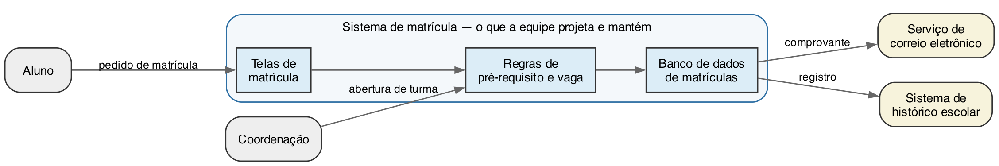
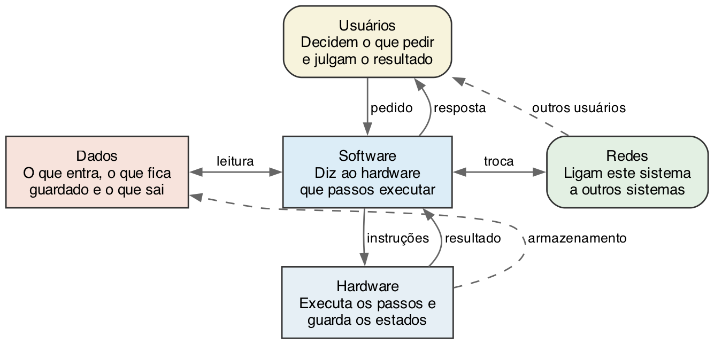
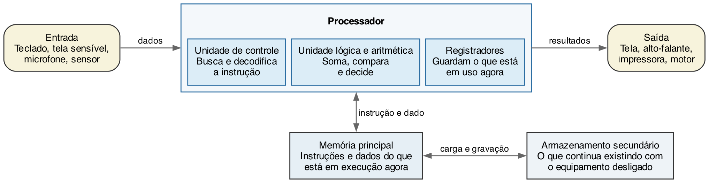
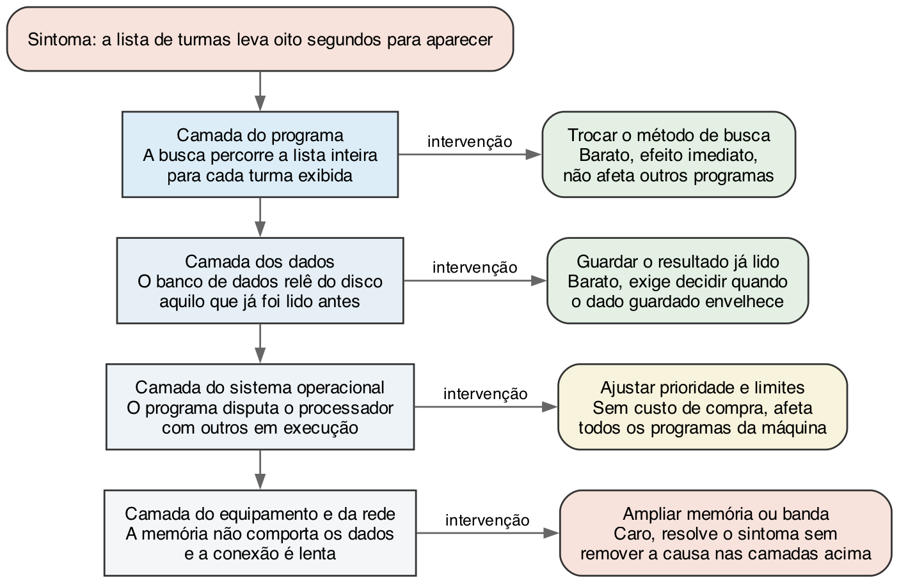

## Objetivos de aprendizagem

- Descrever um computador como um sistema com partes que interagem.
- Distinguir os papéis de hardware, software, dados, usuários e redes.
- Explicar o ciclo básico de funcionamento de um computador.
- Reconhecer que um mesmo problema pode ser resolvido em camadas diferentes
  do sistema.

## Conteúdo previsto

- A noção de sistema: partes, relações e fronteira.
- Hardware, software, dados, usuários e redes como componentes que interagem.
- Estrutura funcional básica: entrada, processamento, armazenamento e saída.
- O ciclo de busca e execução de instruções, em visão geral.
- Camadas de abstração e por que elas existem.

## Leituras recomendadas

Capítulos correspondentes em [@forouzan2011] e [@velloso2004]. Quem quiser a
mesma estrutura apresentada por camadas, do circuito ao aplicativo, encontra
esse percurso em [@brookshear2013].

## O propósito deste capítulo

A finalidade deste capítulo decide o que entra nele e o que fica de fora:

> Ser capaz de descrever um computador como um sistema, dizendo quais são as
> partes, o que passa entre elas e onde está a fronteira, e de usar essa
> descrição para decidir em que camada um problema deve ser atacado.

O diagnóstico do capítulo 1 abria com uma pergunta: o que acontece dentro do
computador entre apertar um botão e a tela mudar? A @tbl-diagnostico prometia
que este capítulo a responderia. Reparem no verbo do propósito: descrever. A
pergunta do diagnóstico é o material; a descrição é o que vocês levam daqui.

O capítulo 2 mostrou como o equipamento chegou à forma atual. Este mostra que
forma é essa. O capítulo 4 abre os blocos de hardware, e o capítulo 7 abre os
de software; aqui vocês vão ver os dois lados juntos, no nível em que eles se
encaixam.

### Parem aqui e escrevam

Antes de continuar a leitura, respondam por escrito. A resposta não vale nota,
não é entregue e não pode ser consultada no restante do capítulo.

Vocês tocam o ícone de um aplicativo de mensagens, digitam uma linha e enviam.
Alguns segundos depois, a mensagem aparece no telefone de um colega em outra
cidade.

Listem, em ordem, tudo o que vocês imaginam que aconteceu nesse intervalo.
Escrevam quantos passos conseguirem, mesmo os que vocês não sabem nomear
direito. Ao lado de cada passo, marquem se ele aconteceu no telefone de vocês,
no telefone do colega ou em outro lugar.

Guardem a folha. Ela será usada duas vezes: na próxima seção e no fim do
capítulo.

### Por que a lista não fecha

Comparem a lista de vocês com a de dois colegas. Em uma turma de trinta pessoas,
as listas costumam ter de quatro a trinta passos, e quase todas são defensáveis.

Quem escreveu quatro passos provavelmente pôs "o telefone envia pela internet"
como um passo só. Quem escreveu trinta abriu esse mesmo trecho em envio,
roteamento, chegada ao servidor, armazenamento e reenvio. Alguém marcou o
servidor como "outro lugar"; alguém não mencionou servidor nenhum, porque a
mensagem parecia ir de um telefone direto ao outro.

Nenhuma dessas listas está errada. E é exatamente aí que está o problema.

Cada uma corta o percurso em um lugar diferente e para de dividir em um ponto
diferente, sem dizer que critério usou. Como os cortes são diferentes, as listas
não competem entre si: elas descrevem coisas distintas que parecem a mesma
coisa. Duas pessoas que conheçam todos os fatos vão continuar discordando sobre
quantos passos existem enquanto não disserem onde estão cortando.

O que falta não é informação sobre telefones. É um jeito de descrever.

> Que descrição de um computador permite dizer, sem ambiguidade, quantas partes
> ele tem, o que cada uma faz e onde ele termina?

As três seções seguintes constroem essa descrição, e a última seção do capítulo
devolve a folha de vocês para a comparação final.

## A noção de sistema

Um **sistema** é um conjunto de partes que se relacionam para produzir um
resultado que nenhuma das partes produz sozinha. A definição serve ao corpo
humano, a uma escola, a um carro e a um computador, e é justamente essa largura
que a torna útil aqui. Ela obriga quem descreve a dizer três coisas: quais são
as partes, como elas se relacionam e onde o sistema termina.

Vocês já usam a palavra nesse sentido sem perceber. Quando alguém diz que o
sistema da secretaria caiu, está falando de um conjunto que inclui programas, um
banco de dados, uma rede, servidores e as pessoas que operam tudo isso, e que
deixou de entregar o resultado esperado. Nenhum equipamento específico precisa
ter quebrado para a frase fazer sentido.

### Partes, relações e fronteira

Uma descrição de sistema tem três elementos, e omitir qualquer um deles produz
uma descrição inútil.

As **partes** são os componentes que podem ser tratados separadamente. Em um
sistema de matrícula, são as telas, as regras de pré-requisito, o banco de
dados e o serviço que envia o comprovante. A escolha das partes não é única:
outra equipe poderia dividir o mesmo sistema de outro jeito, e essa divisão é
uma decisão de projeto, como a decomposição do capítulo 1.

As **relações** são as trocas entre as partes. A tela entrega um pedido às
regras; as regras consultam o banco de dados; o banco de dados devolve a
resposta. Uma lista de partes sem as relações descreve um monte de peças, e não
um sistema. É por isso que os diagramas deste livro sempre trazem as setas
rotuladas: a seta é a relação, e o rótulo diz o que passa por ela.

A **fronteira** separa o que pertence ao sistema do que está fora dele. Tudo o
que cruza a fronteira de fora para dentro é entrada; tudo o que cruza de dentro
para fora é saída. Sem fronteira declarada, ninguém sabe de quem é a
responsabilidade quando algo dá errado.

### A fronteira é uma decisão, não um fato

A fronteira não vem marcada no mundo. Quem descreve o sistema é quem a traça, e
traçá-la em outro lugar muda o que conta como defeito do sistema e o que conta
como problema de terceiros. A @fig-fronteira-sistema mostra uma escolha
possível para o sistema de matrícula.

{#fig-fronteira-sistema width=95% fig-alt="Uma caixa arredondada rotulada sistema de matrícula contém três blocos ligados em sequência: telas de matrícula, regras de pré-requisito e vaga, e banco de dados de matrículas. De fora da caixa, o aluno envia um pedido de matrícula às telas e a coordenação envia a abertura de turma às regras. De dentro para fora, o banco de dados envia um comprovante ao serviço de correio eletrônico e um registro ao sistema de histórico escolar."}

Na @fig-fronteira-sistema, o serviço de correio eletrônico está fora. A equipe
de matrícula não o escreveu, não o mantém e não decide quando ele sai do ar.
Ela apenas entrega uma mensagem e confia que ela será enviada. Se o comprovante
não chegar ao aluno, o defeito pode estar dentro ou fora da fronteira, e a
primeira pergunta do diagnóstico é exatamente essa.

Traçar a fronteira mais adiante muda o trabalho. Se a equipe decidir incluir o
envio de correio no próprio sistema, ela ganha controle sobre o formato da
mensagem e sobre a fila de envio, e passa a ter que cuidar de tudo o que o
serviço externo cuidava. Fronteira mais larga significa mais controle e mais
responsabilidade, sempre nas duas direções.

O caso da sonda Mars Climate Orbiter, apresentado no capítulo 1, é um problema
de fronteira. Dois programas trocavam valores de impulso, e cada equipe
considerou correto o que produzia dentro da própria fronteira: um escrevia no
sistema inglês, o outro lia como sistema métrico [@nasa1999]. A conversão não
estava dentro de nenhum dos dois sistemas, porque ninguém a colocou lá. O
defeito não morava em uma parte; morava na relação entre elas, que é o lugar
que a lista de peças não mostra.

### O que o sistema faz e nenhuma parte faz sozinha

Um sistema produz um resultado que não está em nenhum componente isolado. Essa
é a propriedade que justifica a palavra, e ela tem consequência prática
imediata: examinar as partes uma a uma, e aprovar cada uma, não garante que o
conjunto funcione.

Um teclado não escreve texto. Ele produz um sinal elétrico quando uma tecla
desce. Um processador não escreve texto: ele soma, compara e move valores. Uma
tela não escreve texto: ela acende pontos coloridos. O texto que aparece na
tela é resultado da relação entre os três, mais o programa que interpreta o
sinal como letra e a memória que guarda o que já foi digitado. Nenhuma peça
sabe o que é uma letra.

A recíproca também vale, e é a parte incômoda. Um sistema pode falhar sem que
nenhuma peça esteja com defeito. Todos os componentes cumprem a especificação
individual, e a combinação produz um resultado errado, como no caso da sonda.
Esse tipo de falha é difícil de encontrar porque o teste de cada parte passa.

### Realimentação

Alguns sistemas usam a própria saída para decidir o que fazer em seguida. Essa
volta chama-se **realimentação**, e ela aparece em quase todo sistema que se
mantém estável sem alguém o ajustando o tempo todo.

O ar-condicionado da sala é o exemplo mais direto. Ele mede a temperatura, que
é resultado da própria ação anterior, e decide se continua resfriando. Sem essa
medida, o aparelho só saberia ligar e desligar por horário, e a sala ficaria
fria demais ou quente demais quase sempre.

Em software, a realimentação aparece em todo lugar em que o sistema mede o
próprio comportamento e se ajusta. Um serviço que percebe que as respostas
estão demorando e passa a recusar novos pedidos está usando a própria saída
como entrada. O capítulo 4 mostra um caso em hardware: o processador que reduz
a própria velocidade quando a temperatura sobe.

A realimentação também explica um tipo de falha em cascata. Se um serviço
lento faz o cliente tentar de novo, e cada nova tentativa aumenta a carga, o
sistema se afunda sozinho: a saída piora a entrada, que piora a saída. Sistemas
Distribuídos, no sétimo período, trata desse comportamento com método próprio.

### O estado do sistema

Um sistema guarda o que já aconteceu com ele, e esse acumulado se chama
**estado**. O estado é o conjunto dos valores que o sistema mantém em um dado
instante: quem está autenticado, quais turmas têm vaga, o que já foi digitado no
formulário e quantas tentativas de envio falharam.

O estado explica um fato que incomoda quem começa a programar. A mesma entrada
nem sempre produz a mesma saída. Pedir matrícula na mesma turma produz uma
confirmação na primeira vez e uma recusa na segunda, e o programa é o mesmo nas
duas: o que mudou foi o estado, porque a primeira matrícula ocupou a vaga.

Daí sai uma consequência prática para o diagnóstico de defeitos. Um relato do
tipo "o sistema deu erro quando cliquei aqui" costuma ser insuficiente, porque
o clique não explica o resultado sozinho. A pergunta que falta é o que já tinha
sido feito antes, e ela é a diferença entre um defeito que se reproduz e um
defeito que ninguém consegue repetir.

O estado também separa duas categorias de defeito que exigem trabalho
diferente. O defeito que aparece sempre, com qualquer estado, é o mais fácil:
basta executar de novo para observá-lo. O defeito que só aparece com uma
combinação específica de estado é o que consome semanas, porque reproduzi-lo
exige recriar a combinação, e quem relatou o problema raramente sabe qual era
ela.

Nem todo componente do sistema guarda estado da mesma forma. A memória
principal guarda o estado do que está em execução e o perde ao desligar; o
armazenamento secundário guarda o estado que precisa durar; e o usuário guarda um estado
próprio, que é o que ele acredita que o sistema está fazendo. Quando o estado do
usuário e o estado do sistema divergem, o sistema funciona e a pessoa erra, e a
culpa costuma ser atribuída à pessoa. Interface Homem Computador, no terceiro
período, trata dessa divergência como problema de projeto.

### As quatro perguntas que descrevem um sistema

A pergunta "o que é um computador" recebe, com frequência, uma resposta que
lista componentes: processador, memória, disco, teclado, tela. A lista está
correta e não descreve nada. Ela não diz o que cada peça faz, o que passa entre
elas nem o que o conjunto entrega.

O que falta são quatro perguntas. Elas saem dos três elementos desta seção,
porque as partes rendem duas: o que elas são e o que elas fazem. A
@tbl-quatro-perguntas reúne as quatro, e é a elas que a tarefa desta semana vai
pedir que vocês respondam.

| **Pergunta** | **Elemento que ela levanta** | **Exemplo, no sistema de matrícula** |
|---|---|---|
| Quais são as partes? | Partes | Telas, regras de pré-requisito, banco de dados |
| O que cada uma faz? | Partes | A tela recebe o pedido; a regra confere a vaga |
| O que passa de uma para outra? | Relações | O pedido, a consulta e a resposta |
| Onde está a fronteira? | Fronteira | Dentro: telas, regras, banco. Fora: correio e histórico |

: As quatro perguntas de uma descrição de sistema, com um exemplo de resposta para cada uma. {#tbl-quatro-perguntas}

A coluna do exemplo usa o sistema de matrícula da @fig-fronteira-sistema, para
que vocês vejam a forma de uma resposta antes de escrever a de vocês. Responder
às quatro sobre um sistema qualquer é o que este capítulo chama de descrever um
sistema.

Vocês vão reencontrar essas quatro perguntas em Engenharia de Software, no
quarto período, e o hábito de fazê-las começa aqui.

## Os cinco componentes de um sistema computacional

Um sistema computacional em uso tem cinco componentes, e não dois. A resposta
que fica em hardware e software descreve o equipamento, não o sistema, e é
insuficiente na primeira vez que algo dá errado. @velloso2004 também conta as pessoas entre os
componentes de um sistema computacional, em uma divisão mais enxuta que a
adotada aqui. A @fig-cinco-componentes mostra os cinco e as relações
entre eles.

{#fig-cinco-componentes width=88% fig-alt="Cinco blocos ligados por setas rotuladas. No alto, usuários, que enviam um pedido ao software e recebem dele uma resposta. Ao centro, o software, ligado à esquerda aos dados por leitura e à direita às redes por troca. Embaixo, o hardware, que recebe instruções do software e devolve resultado. Uma seta tracejada liga o hardware aos dados, com o rótulo armazenamento, e outra liga as redes aos usuários, com o rótulo outros usuários."}

### Hardware

**Hardware** é a parte física do sistema: o que ocupa espaço, consome energia,
esquenta e pode ser derrubado no chão. Processador, memória, disco, tela,
teclado, cabo de rede e fonte de alimentação são hardware.

O hardware executa e guarda. Ele não decide nada: aplica a operação que
recebeu, sobre o valor que recebeu, e devolve um resultado. Toda a aparência de
decisão que um computador exibe vem do software, e o capítulo 4 mostra como
poucas operações elementares bastam para sustentar essa aparência.

Duas propriedades do hardware aparecem em quase todo capítulo deste livro. Ele
é finito: a memória tem tamanho, o disco tem tamanho, o processador executa um
número limitado de operações por segundo. E ele é físico: falha por desgaste,
por calor e por acidente, de forma imprevisível, o que o software não faz.

### Software

**Software** é o conjunto de instruções que diz ao hardware o que executar, e
os dados que essas instruções carregam junto. Ele existe como uma sequência de
valores guardada em algum lugar do hardware, sem corpo próprio, como o capítulo 2
mostrou ao tratar do programa armazenado.

O software é a parte do sistema que muda com frequência. Trocar o processador
de um equipamento é raro e caro; trocar o programa que roda nele é rotina
semanal. Essa diferença de custo de mudança é o motivo pelo qual tanta coisa
que poderia ser feita em hardware acaba sendo feita em software.

O capítulo 7 trata dos tipos de software e da diferença entre código-fonte,
programa executável e processo em execução. Por ora, basta a divisão em dois
grupos. O **software de sistema** administra o próprio equipamento e serve aos
outros programas; o sistema operacional é o exemplo central. O **software
aplicativo** atende diretamente a uma tarefa do usuário: editor de texto,
navegador, aplicativo de mensagens.

### Dados

**Dados** são os valores que o sistema recebe, guarda, transforma e entrega. Um
nome, uma nota, uma foto, a posição de um dedo na tela e a temperatura medida
por um sensor são dados.

Separar dados de software incomoda quem já programou, porque na memória os dois
são a mesma coisa: sequências de valores, indistinguíveis pelo formato. A
separação é feita por outro critério, e é o critério do uso. Software é o que
diz como transformar; dado é o que é transformado. A mesma sequência de valores
pode ser uma coisa ou outra conforme o papel que ela cumpre naquele momento,
e o capítulo 2 mostrou que essa ambiguidade é justamente o que o programa
armazenado tornou possível.

Os dados justificam o componente próprio por uma razão prática. Eles são a
parte do sistema que não se refaz. Um programa perdido é reinstalado a partir
de uma cópia; um equipamento queimado é substituído; os dados dos alunos
matriculados neste semestre, se forem perdidos sem cópia, não voltam. É por
isso que a proteção deles tem lei própria, tratada no capítulo 12.

Dados também são a parte que sobrevive às outras. Um sistema de matrícula será
reescrito duas ou três vezes ao longo de vinte anos, e os registros de
matrícula atravessam todas essas versões. Quem projeta um sistema decide o
formato dos dados com essa duração em mente.

### Usuários

**Usuários** são as pessoas que operam o sistema e que julgam o resultado. Elas
entram na lista como componente de pleno direito, porque o comportamento delas
determina o que o sistema recebe e o que se faz com o que ele entrega.

Incluir pessoas entre os componentes tem três efeitos sobre o projeto.

O primeiro é que a entrada é imprevisível. O sistema receberá data escrita fora
do formato, nome com erro de digitação, o mesmo pedido enviado três vezes
porque a resposta demorou, e o formulário preenchido pela metade. Um sistema
que só funciona com entrada bem-comportada não funciona.

O segundo é que o resultado precisa ser compreensível para quem o recebe. Uma
mensagem de erro tecnicamente exata e incompreensível para o usuário é uma
saída defeituosa, mesmo que o programa esteja correto. Interface Homem
Computador, no terceiro período, trata desse assunto.

O terceiro é que o usuário faz parte do procedimento, e não apenas do começo e
do fim. Muitos sistemas dependem de alguém conferir, aprovar ou corrigir em
algum ponto, e essa etapa é parte do sistema tanto quanto o banco de dados.
Quando uma equipe esquece disso, ela automatiza a parte fácil e deixa a parte
difícil sem apoio nenhum.

### Redes

**Redes** são as ligações que permitem a este sistema trocar dados com outros
sistemas. Praticamente nenhum sistema em uso hoje é isolado, e o capítulo 2
mostrou como a computação chegou a essa condição.

A rede acrescenta ao sistema três propriedades que nenhum dos outros
componentes tem, e as três aparecem no capítulo 13 com outro vocabulário.

A rede é lenta em comparação com o resto. Buscar um valor na memória e buscar o
mesmo valor em outro computador são operações de grandeza muito diferente, como
o capítulo 4 detalha. Um programa que trata as duas como equivalentes se
comporta bem no teste local e mal em uso real.

A rede falha de um jeito próprio. Ela não apenas funciona ou para: ela demora,
entrega pela metade, entrega fora de ordem e às vezes entrega duas vezes. Um
pedido enviado e sem resposta deixa o sistema em dúvida sobre se ele foi
executado do outro lado, e essa dúvida não tem solução perfeita.

A rede coloca partes do sistema fora do alcance de quem o mantém. Quando o
serviço remoto muda de comportamento, a equipe descobre pelo defeito, e não
pelo aviso. É a dependência de que o capítulo 13 trata, e ela existe desde a
primeira linha de projeto.

### Contar os cinco muda o diagnóstico

A @tbl-componentes reúne os cinco e mostra o que acontece quando cada um falha.
A coluna da direita é o motivo de contá-los separadamente: a falha tem cara
diferente conforme o componente, e reconhecer a cara encurta o diagnóstico.

| **Componente** | **O que é** | **Como a falha se apresenta** |
|---|---|---|
| Hardware | A parte física, que executa e guarda | Falha abrupta, às vezes intermitente, muitas vezes ligada a calor ou desgaste |
| Software | As instruções que dizem o que executar | Falha repetível: as mesmas condições produzem o mesmo resultado errado |
| Dados | Os valores recebidos, guardados e entregues | O programa funciona, e o resultado está errado ou incompleto |
| Usuários | Quem opera e julga o resultado | O sistema faz o que foi pedido, e não o que se queria |
| Redes | As ligações com outros sistemas | Lentidão, intermitência e resultado que depende de onde se está |

: Os cinco componentes e a forma característica de falha de cada um. {#tbl-componentes}

A falha de julho de 2024 tratada no capítulo 1 ilustra a diferença entre as
linhas. Nenhum equipamento quebrou: uma atualização de software travou os
computadores, e a Microsoft estimou 8,5 milhões de máquinas afetadas
[@microsoft2024]. Quem procurasse defeito no hardware não encontraria nada, em
nenhuma das 8,5 milhões. A pergunta certa era outra: o que mudou no sistema.

Essa é a utilidade prática da @tbl-componentes no primeiro período. Diante de
um sistema que não funciona, comecem perguntando em qual dos cinco componentes o
sintoma se encaixa, antes de perguntar o que está quebrado.

## A estrutura funcional básica

Descrito o sistema em componentes, falta descrever o equipamento por dentro.
@forouzan2011 apresenta o computador como uma máquina de processamento de
dados, e essa definição se abre em quatro funções: entrada, processamento,
armazenamento e saída. A @fig-estrutura-funcional mostra as quatro e a posição
de cada bloco.

{#fig-estrutura-funcional width=95% fig-alt="Três blocos lado a lado. À esquerda, entrada, com teclado, tela sensível, microfone e sensor. Ao centro, uma caixa rotulada processador, contendo três blocos internos em linha: unidade de controle, unidade lógica e aritmética, e registradores. À direita, saída, com tela, alto-falante, impressora e motor. A entrada envia dados ao processador, e o processador envia resultados à saída. Abaixo do processador, ligada a ele por uma seta de duas pontas rotulada instrução e dado, está a memória principal; ao lado da memória, ligada por uma seta de duas pontas rotulada carga e gravação, está o armazenamento secundário."}

A posição dos blocos na @fig-estrutura-funcional se repete no capítulo 4, com
mais detalhe dentro de cada um. Guardem o desenho, porque ele é a referência dos
capítulos 4 a 7.

### Entrada

A **entrada** é a função de trazer dados do mundo para dentro do sistema. Todo
dispositivo de entrada faz a mesma coisa: converte um fenômeno físico em uma
sequência de valores que o computador consegue guardar.

O teclado converte a descida de uma tecla em um código. A tela sensível ao
toque converte a posição de um dedo em um par de números. O microfone converte
variação de pressão do ar em uma sequência de medidas. A câmera converte luz em
medidas de intensidade por ponto. Em todos os casos, o mundo é contínuo e o
resultado é um conjunto finito de valores, e o capítulo 6 trata do que se perde
nessa conversão.

Um ponto costuma surpreender quem chega sem contato com a área. A rede também é
entrada. Uma mensagem que chega de outro computador entra no sistema pelo mesmo
caminho lógico que um dado digitado, e precisa ser conferida com a mesma
desconfiança. Tratar dado vindo da rede como confiável porque não foi digitado
por ninguém é a origem de uma família inteira de problemas de segurança.

### Processamento

O **processamento** é a função de transformar dados em outros dados, segundo as
instruções de um programa. Ele acontece no processador, o bloco central da
@fig-estrutura-funcional.

A @fig-estrutura-funcional mostra três partes dentro do processador, e as três
voltam no capítulo 4 com detalhe. A **unidade de controle** busca a próxima
instrução, descobre o que ela manda fazer e aciona quem vai fazer. A **unidade
lógica e aritmética** executa as operações elementares: somar, subtrair,
comparar dois valores, decidir se um é maior que o outro. Os **registradores**
são posições de memória muito pequenas e muito rápidas, dentro do próprio
processador, que guardam os valores em uso naquele instante.

O conjunto de operações elementares que um processador executa é pequeno e
pobre, e essa é uma das informações mais úteis deste capítulo. Não existe uma
instrução para exibir uma foto, nem para enviar uma mensagem, nem para ordenar
uma lista. Existem instruções para somar dois números, para comparar dois
valores, para copiar um valor de um lugar para outro e para pular para outra
posição do programa. Tudo o mais é combinação dessas operações, em quantidade.

### Armazenamento

O **armazenamento** é a função de guardar dados e programas. Ela é cumprida por
dois blocos distintos na @fig-estrutura-funcional, com nomes próprios, e a
distinção entre os dois é a segunda pergunta do diagnóstico do capítulo 1.

A **memória principal** guarda as instruções e os dados do que está em execução
naquele momento. Ela é rápida, é acessada diretamente pelo processador, tem
capacidade limitada e perde o conteúdo quando o equipamento é desligado.

O **armazenamento secundário** guarda o que precisa continuar existindo depois
de desligar. Ele tem capacidade muito maior, é muito mais lento e não é acessado
diretamente pelo processador: para usar um dado que está lá, o sistema primeiro
o copia para a memória principal. O "secundário" do nome se refere a esse
caminho: o processador chega ao bloco passando antes pela memória principal, e
nada ali indica menor importância.

### Memória principal e armazenamento secundário

A @tbl-memoria-armazenamento reúne a comparação. Ela responde à pergunta do
diagnóstico e é reaberta no capítulo 4, que acrescenta os níveis intermediários
entre os dois.

| **Aspecto** | **Memória principal** | **Armazenamento secundário** |
|---|---|---|
| O que guarda | O que está em execução agora | O que precisa durar |
| Ao desligar | Perde o conteúdo | Mantém o conteúdo |
| Acesso pelo processador | Direto | Indireto, passando pela memória |
| Velocidade | Alta | Baixa, em comparação |
| Capacidade | Menor | Maior |
| Nomes comuns | Memória, memória RAM | Disco, disco de estado sólido, cartão |

: Memória principal e armazenamento secundário, em comparação. {#tbl-memoria-armazenamento}

A confusão entre os dois é comum e tem uma origem clara: o uso cotidiano chama
os dois de memória. Um telefone anunciado com 8 GB de memória e 256 GB de
armazenamento traz os dois números, e quase ninguém sabe dizer qual faz o quê.

Duas experiências que vocês já tiveram vêm dessa diferença. Um documento que
não foi salvo desaparece quando o computador desliga, porque ele estava apenas
na memória principal. E um equipamento que fica lento com muitos programas
abertos está sem espaço na memória principal, e não sem espaço em disco: o
sistema operacional começa a mover para o armazenamento secundário aquilo que
não cabe, e o armazenamento secundário é lento.

### Saída

A **saída** é a função de levar dados de dentro do sistema para o mundo. Ela é
a inversa da entrada: converte uma sequência de valores em um fenômeno físico
que uma pessoa percebe ou que outro equipamento aproveita.

A tela converte valores em pontos coloridos. O alto-falante converte valores em
variação de pressão do ar. A impressora converte valores em marcas no papel. E o
motor de um portão converte valores em movimento, o que mostra que saída não
precisa ser dirigida a uma pessoa.

A saída para a rede é o caso que costuma escapar da lista, do mesmo modo que a
entrada pela rede escapa da outra. Uma mensagem enviada a outro computador é
saída, e vale para ela a mesma pergunta que vale para a tela: o que foi
entregue, em que formato, e o que o outro lado vai entender disso.

Saída, uma vez produzida, não se recolhe, e o capítulo 10 volta a esse ponto. Um valor errado exibido na tela pode
ser corrigido na tela seguinte; um valor errado impresso em um boleto, enviado
por mensagem ou gravado no histórico de outro sistema já saiu do alcance de
quem o produziu. A fronteira da @fig-fronteira-sistema é a linha depois da qual
o erro deixa de ser corrigível pela equipe.

### O programa armazenado, revisto

O capítulo 2 apresentou o programa armazenado como marco histórico. Aqui ele
volta como característica de funcionamento, porque é dele que sai o ciclo da
próxima seção.

Instruções e dados ficam na memória principal, no mesmo espaço e no mesmo
formato. Cada posição da memória tem um **endereço**, que é um número que a
identifica, e o processador lê ou escreve uma posição informando o endereço
dela. A @tbl-memoria-minima repete o exemplo do capítulo 2 com os endereços
explícitos.

| **Endereço** | **Conteúdo** | **Papel** |
|---|---|---|
| 0 | somar o conteúdo de 4 com o de 5 e guardar em 6 | Instrução |
| 1 | comparar o conteúdo de 6 com o de 7 | Instrução |
| 2 | se o resultado da comparação for maior, pular para 0 | Instrução |
| 3 | parar | Instrução |
| 4 | 12 | Dado |
| 5 | 30 | Dado |
| 6 | 0 | Dado |
| 7 | 100 | Dado |

: Uma memória minúscula com instruções e dados no mesmo espaço de endereços. {#tbl-memoria-minima}

Nada na @tbl-memoria-minima marca as quatro primeiras posições como instrução e
as quatro últimas como dado. A separação existe apenas no uso: as posições de
$0$ a $3$ são instrução porque o processador vai buscá-las para executar, e as
de $4$ a $7$ são dado porque as instruções as tratam assim. Trocar o conteúdo
da posição $0$ muda o programa sem trocar nenhum cabo, e essa é a ideia inteira.

O texto das instruções da @tbl-memoria-minima está em português para que vocês
possam lê-lo. Na memória real, cada instrução é uma sequência de valores em
base dois, assunto do capítulo 5, e a tradução entre a forma legível e a forma
executável é assunto do capítulo 7.

### O barramento, em uma frase

Os blocos da @fig-estrutura-funcional precisam de um caminho físico para trocar
valores, e esse caminho chama-se **barramento**: um conjunto de ligações
compartilhadas por onde passam os endereços, os dados e os sinais de controle.

O barramento é compartilhado, e daí vem a consequência que interessa agora.
Duas trocas não podem ocupá-lo ao mesmo tempo, e uma delas espera. Quando um
sistema não vai mais rápido por mais que se troque o processador, a fila do
barramento costuma ser um dos motivos. O capítulo 4 abre esse assunto.

### Onde cada bloco é retomado no curso

Este capítulo apresenta os blocos e para. Cada um deles é aberto depois, em
disciplina própria, e a @tbl-retomada indica onde. Ela serve para vocês
localizarem o que este livro deixa em panorama de propósito.

| **Bloco** | **Retomado neste livro** | **Retomado no curso** |
|---|---|---|
| Entrada e saída | Capítulos 5 e 6, na representação dos dados | Organização de Computadores, 5º período |
| Processador | Capítulo 4, nos blocos internos | Sistemas Digitais, 4º período; Organização de Computadores, 5º |
| Memória e armazenamento secundário | Capítulo 4, na hierarquia completa | Organização de Computadores, 5º período |
| Software de sistema | Capítulo 7, nos tipos de software | Sistemas Operacionais, 7º período |
| Redes | Capítulo 13, na dependência que produzem | Redes de Computadores, 5º período |

: Onde cada bloco deste capítulo é aberto com mais detalhe. {#tbl-retomada}

A @tbl-retomada responde a uma pergunta que a turma faz com frequência nesta
altura do semestre: se a explicação para aqui, quando ela continua? A resposta é
que ela continua três ou quatro vezes, com profundidade crescente, e o que este
capítulo entrega é o vocabulário que torna as próximas passagens possíveis.

## Um sistema que não parece um computador

A estrutura da @fig-estrutura-funcional foi apresentada com um equipamento de
mesa em mente, e ela não depende disso. A mesma descrição vale para
equipamentos que ninguém chama de computador, e reconhecer isso é o teste de
que vocês entenderam o modelo, e não decoraram um desenho.

O elevador do prédio tem entrada, e ela são os botões do painel e os sensores
de porta e de andar. Tem processamento, e ele decide a ordem de atendimento das
chamadas. Tem armazenamento, e nele estão a lista de chamadas pendentes e a
configuração do equipamento. Tem saída, e ela é o motor, a porta e o número no
visor. O elevador é um computador com um programa só.

A @tbl-quatro-sistemas aplica as quatro funções a sistemas de aparência bem
diferente.

| **Sistema** | **Entrada** | **Processamento** | **Armazenamento** | **Saída** |
|---|---|---|---|---|
| Elevador | Botões, sensor de andar e de porta | Ordem de atendimento das chamadas | Chamadas pendentes e configuração | Motor, porta e visor |
| Máquina de cartão | Cartão, senha, valor digitado | Conferência e montagem da transação | Transações pendentes de envio | Impressão do comprovante e mensagem à rede |
| Semáforo de cruzamento | Sensor de fila e relógio | Cálculo do tempo de cada fase | Programação horária | Sinais das lâmpadas |
| Telefone | Tela sensível, microfone, câmera, sensores | Milhares de programas em execução | Memória e armazenamento interno | Tela, alto-falante e rede |

: As quatro funções em sistemas de aparência muito diferente. {#tbl-quatro-sistemas}

Duas coisas separam as linhas da @tbl-quatro-sistemas, e nenhuma delas é a
estrutura.

A primeira é a quantidade de programas. O elevador executa um programa só, que
foi gravado na fábrica e não muda. O telefone executa dezenas ao mesmo tempo, e
recebe programas novos toda semana. Essa diferença muda tudo o que o sistema
operacional precisa fazer, e é por isso que o elevador quase não tem um e o
telefone tem um grande.

A segunda é a consequência da falha. Um aplicativo que trava é fechado e
reaberto. Um elevador que trava com gente dentro é outro tipo de problema, e o
programa dele é escrito, testado e certificado sob regras que não se aplicam a
um aplicativo comum. O capítulo 10 trata da responsabilidade profissional que
essa diferença impõe.

Um sistema desse tipo, projetado para uma função e embutido em um equipamento
maior, chama-se **sistema embarcado**. Vocês estão cercados deles: o carro, a
geladeira, o roteador de rede, a fechadura eletrônica e a máquina de lavar. Em
número de unidades, os sistemas embarcados são a maior parte dos computadores
em funcionamento no mundo, e quase nenhum deles tem tela ou teclado.

A conclusão que interessa ao primeiro período é sobre o alcance do que vocês
estão aprendendo. O modelo deste capítulo não descreve um tipo de aparelho: ele
descreve uma forma de organizar máquinas que processam dados. Quando o capítulo
15 apresentar assuntos atuais, e quando o capítulo 13 tratar da dependência da
sociedade em relação a esses sistemas, é dessa quantidade que se estará
falando.

## O ciclo de busca e execução

O computador faz uma coisa só, e a repete. Ele busca uma instrução na memória,
descobre o que ela manda fazer, faz, e vai buscar a próxima. Esse é o **ciclo
de busca e execução**, e ele é a resposta técnica ao terceiro objetivo de
aprendizagem deste capítulo.

Toda a variedade do que um computador faz, do jogo à videochamada, sai da
repetição desse ciclo com instruções diferentes na memória. @forouzan2011 e
@brookshear2013 apresentam o ciclo com esse mesmo recorte.

### O que é uma instrução

Uma **instrução** é uma ordem elementar que o processador sabe executar. Ela
tem duas partes: o que fazer e sobre o que fazer.

A parte que diz o que fazer é a operação: somar, comparar, copiar, pular. A
parte que diz sobre o que fazer são os operandos, que costumam ser endereços de
memória ou registradores. A instrução da posição $0$ da @tbl-memoria-minima tem
a operação somar e três operandos: os endereços $4$, $5$ e $6$.

O conjunto de instruções que um processador reconhece é fixo e vem gravado nele
de fábrica. Trocar de família de processador significa trocar o conjunto de
instruções, e é por isso que um programa executável preparado para uma família
não roda em outra. O capítulo 2 mostrou o que aconteceu quando essa
compatibilidade passou a ser tratada como produto.

### Buscar, decodificar, executar

O ciclo tem três passos, e a @fig-ciclo-instrucao mostra a repetição.

```{mermaid}
%%| label: fig-ciclo-instrucao
%%| fig-cap: "O ciclo de busca e execução, com os desvios que alteram a próxima instrução."
%%| fig-width: 6
%%| echo: false
flowchart LR
  A["Buscar<br/>Ler da memória a instrução<br/>do endereço apontado"] --> B["Decodificar<br/>Descobrir qual é a operação<br/>e quais são os operandos"]
  B --> C["Executar<br/>Realizar a operação e<br/>guardar o resultado"]
  C --> D{"A instrução<br/>alterou o<br/>apontador?"}
  D -->|"não"| E["Avançar para o<br/>endereço seguinte"]
  D -->|"sim"| F["Ir para o endereço<br/>indicado pela instrução"]
  E --> A
  F --> A
```

No passo de **busca**, a unidade de controle lê da memória a instrução que está
no endereço apontado e a traz para dentro do processador.

No passo de **decodificação**, a unidade de controle examina essa instrução e
descobre qual é a operação e quais são os operandos. É aqui que a sequência de
valores deixa de ser uma sequência qualquer e passa a ser uma ordem.

No passo de **execução**, a operação é realizada. Se ela for aritmética ou
lógica, quem a realiza é a unidade lógica e aritmética. Se for uma cópia entre
posições, quem a realiza é a própria unidade de controle. O resultado vai para
um registrador ou para uma posição de memória.

Terminado o terceiro passo, o ciclo recomeça. É a repetição, e não a
complexidade de cada passo, que produz tudo o que vocês veem na tela.

### O contador de programa

O processador precisa saber qual é a próxima instrução, e essa informação fica
em um registrador especial: o **contador de programa**, que guarda o endereço
da próxima instrução a buscar.

O funcionamento normal é simples. Ao terminar um ciclo, o contador de programa
avança para o endereço seguinte, e a próxima busca traz a instrução que está
lá. É por isso que as instruções de um programa ficam em posições consecutivas
da memória: a ordem de execução é a ordem dos endereços, salvo quando alguém a
altera de propósito.

Alterar o contador de programa de propósito é o que produz tudo o que não é
sequência reta. Uma instrução de desvio, como a da posição $2$ da
@tbl-memoria-minima, escreve outro endereço no contador de programa, e a
próxima busca acontece em outro ponto. Repetição e decisão, que vocês estão
vendo em Lógica de Programação com outro nome, são feitas assim na base.

### Um ciclo percorrido passo a passo

A @tbl-tracado percorre a memória da @tbl-memoria-minima desde o início. Cada
linha é um ciclo completo, e a coluna da direita mostra o que ficou diferente
na memória ao final dele.

| **Ciclo** | **Contador de programa** | **Instrução buscada** | **O que ficou diferente** |
|---:|---:|---|---|
| 1 | 0 | somar 4 e 5, guardar em 6 | A posição 6 passa de 0 para 42 |
| 2 | 1 | comparar 6 com 7 | O processador registra que 42 é menor que 100 |
| 3 | 2 | se maior, pular para 0 | Nada: a comparação não deu maior, e o contador avança |
| 4 | 3 | parar | A execução termina |

: Quatro ciclos percorridos sobre uma memória com quatro instruções e quatro dados. {#tbl-tracado}

Três observações saem da @tbl-tracado, e as três valem para qualquer programa.

A primeira é que o processador executa sem saber o que está calculando. Ele somou
$12$ com $30$ porque a instrução da posição $0$ mandava somar o conteúdo de dois
endereços. Se aqueles valores eram reais, gramas ou minutos, o processador não
sabe, e o caso da sonda do capítulo 1 mostra o preço de a equipe também não
saber.

A segunda é que o ciclo 3 gastou trabalho e não mudou nada. A instrução foi
buscada, decodificada e executada, e o resultado foi seguir em frente. Boa parte
do tempo de qualquer programa é gasta em ciclos assim, que só decidem o que
fazer depois.

A terceira é que trocar o conteúdo da posição $7$ de $100$ para $10$ muda o
comportamento do programa sem alterar nenhuma instrução. Com $10$ ali, a
comparação do ciclo 2 daria maior, o desvio do ciclo 3 levaria de volta à
posição $0$, e o programa somaria de novo. E de novo, sem parar: a posição $6$
recebe $12 + 30$ a cada volta, sempre o mesmo $42$, e a comparação nunca muda de
resposta. Trocar um dado transformou um programa que termina em um que não
termina, e o capítulo 1 registrou que nenhum procedimento decide essa pergunta
em todos os casos [@turing1937]. Dado e instrução dividem o mesmo espaço, e o
comportamento depende dos dois.

### Um laço, do jeito que a máquina faz

O programa da @tbl-memoria-minima anda em linha reta e para. Falta ver a
repetição acontecer, porque é nela que aparece a afirmação de que as operações
elementares se combinam. A @tbl-programa-laco traz um segundo programa,
menor, que conta de $1$ até $3$.

| **Endereço** | **Conteúdo** | **Papel** |
|---|---|---|
| 0 | somar o conteúdo de 5 ao de 4 e guardar em 4 | Instrução |
| 1 | comparar o conteúdo de 4 com o de 6 | Instrução |
| 2 | se o resultado da comparação for menor, pular para 0 | Instrução |
| 3 | parar | Instrução |
| 4 | 0 | Dado, o contador |
| 5 | 1 | Dado, o passo |
| 6 | 3 | Dado, o limite |

: Um programa de quatro instruções que repete. {#tbl-programa-laco}

A diferença para o programa anterior está na posição $0$: ali o resultado da
soma volta para a mesma posição $4$ que entrou na conta, e por isso o valor
cresce a cada passagem. A @tbl-tracado-laco traz as duas primeiras voltas.

| **Ciclo** | **Contador de programa** | **Instrução buscada** | **O que ficou diferente** |
|---:|---:|---|---|
| 1 | 0 | somar 5 em 4 | A posição 4 passa a 1 |
| 2 | 1 | comparar 4 com 6 | 1 é menor que 3 |
| 3 | 2 | se menor, pular para 0 | O contador volta a 0 |
| 4 | 0 | somar 5 em 4 | A posição 4 passa a 2 |
| 5 | 1 | comparar 4 com 6 | 2 é menor que 3 |
| 6 | 2 | se menor, pular para 0 | O contador volta a 0 |
| 7 | 0 | | |
| 8 | 1 | | |
| 9 | 2 | | |
| 10 | 3 | | |

: As duas primeiras voltas do programa da @tbl-programa-laco. Os quatro últimos ciclos ficam para vocês. {#tbl-tracado-laco}

Completem vocês os ciclos $7$ a $10$. A coluna do contador de programa já está
preenchida, e ela diz qual instrução é buscada em cada um; falta dizer o que
cada uma faz com a posição $4$ e por que a execução termina no ciclo $10$ em vez
de voltar para o $0$ pela terceira vez.

Confiram depois de escrever. Na terceira volta a posição $4$ chega a $3$, a
comparação do ciclo $8$ deixa de dar menor, o desvio do ciclo $9$ não desvia e o
contador avança até a instrução de parada. O laço deu três voltas porque o
limite da posição $6$ vale $3$ e o passo da posição $5$ vale $1$.

Reparem no que a @tbl-tracado-laco tem e o processador não tem. Nenhuma
instrução ali se chama "repetir". O laço saiu de duas instruções banais,
comparar e pular, mais o contador de programa voltando a um endereço já
visitado. É essa a combinação que a seção sobre o processamento anunciou ao
dizer que o repertório é pobre e que tudo o mais é combinação.

Os ciclos $1$, $4$ e $7$ são a mesma instrução, executada três vezes, com
resultado diferente em cada uma, porque o dado da posição $4$ mudou entre elas.
É por isso que dois deles cabem na tabela e o terceiro pode ser deduzido: o
padrão se repete.
Programa igual, estado diferente, resultado diferente: é a mesma afirmação da
seção sobre o estado do sistema, agora no nível da máquina.

O que Lógica de Programação chama de laço, e escreve em uma linha, é isto
embaixo. A linguagem esconde as três instruções e o contador de programa, e o
capítulo 7 mostra quem faz esse trabalho de esconder.

### O que quebra a sequência

Duas coisas tiram o processador da sequência de endereços, e é útil saber
diferenciá-las desde já.

A primeira é o **desvio**, e ele vem do próprio programa. Uma instrução manda
continuar em outro endereço, condicionalmente ou não. O desvio é previsto por
quem escreveu o programa e acontece porque a instrução mandou.

A segunda é a **interrupção**, e ela vem de fora do programa. Um dispositivo
avisa o processador de que algo aconteceu, e o processador guarda onde estava,
atende o aviso e depois volta ao ponto guardado. Esse "onde estava" é o estado
da máquina: o contador de programa, o conteúdo dos registradores e o da memória.
É a mesma noção de estado da seção sobre o sistema, uma escala abaixo, e a
interrupção só funciona porque esse conjunto cabe em algum lugar enquanto o
aviso é atendido. A tecla que desce, o pacote de
rede que chega e o relógio que marca a passagem de tempo produzem interrupções.

A diferença prática é grande. O desvio é parte do programa; a interrupção
acontece no meio dele, sem que o programa tenha pedido, e pode acontecer entre
duas instruções quaisquer. É a interrupção que permite ao equipamento reagir ao
mundo sem ficar perguntando o tempo todo se alguém tocou na tela, e ela é uma
das peças que o capítulo 7 usa para explicar como vários programas parecem
executar ao mesmo tempo.

### O que o processador faz enquanto espera

O ciclo descrito até aqui não tem pausa: buscar, decodificar, executar,
recomeçar. O sistema real tem pausa o tempo todo, e entender de onde ela vem
explica boa parte do desempenho que vocês observam.

Uma instrução que pede um dado ao armazenamento secundário não recebe resposta no ciclo
seguinte. Ela recebe resposta muito depois, em uma escala de tempo em que
caberiam milhões de ciclos, pelo motivo da @tbl-memoria-armazenamento. O mesmo
vale, com folga ainda maior, para um dado pedido pela rede.

Deixar o processador parado nesse intervalo seria desperdício, e nenhum sistema
faz isso. O sistema operacional guarda o estado do programa que ficou
esperando, entrega o processador a outro programa e devolve o processador ao
primeiro quando o dado chega, avisado por interrupção. O capítulo 7 trata do
mecanismo; o que interessa aqui é a consequência.

A consequência é que "o programa está executando" e "o programa está avançando"
são coisas diferentes. Um programa pode passar a maior parte do tempo
esperando, sem consumir processador nenhum, e ainda assim demorar. Quem tenta
acelerar esse programa trocando o processador não muda nada, porque o
processador não era o gargalo, e essa é a situação da última seção deste
capítulo.

### Por que a repetição não é visível

O ciclo descrito acima parece pobre demais para produzir uma videochamada, e a
diferença entre a descrição e a experiência de vocês está em uma coisa só: a
quantidade.

Quem marca o compasso é o **relógio** do processador, um sinal que alterna em
intervalos fixos e a cada alternância libera o passo seguinte do ciclo. A ordem
de grandeza desse compasso já era de bilhões por segundo quando @forouzan2011
foi publicado, e de lá para cá ela não caiu. Vocês não precisam do
número exato para tirar a conclusão que importa, e o capítulo 2 explica por que
uma afirmação sobre o estado atual pede fonte recente e datada. Entre dois quadros de vídeo, separados por
uma fração de segundo, cabem dezenas de milhões de ciclos, e é essa quantidade
que transforma somas e comparações em imagem em movimento.

A escala também explica por que uma diferença pequena por ciclo se torna
enorme no total, que é o argumento do custo apresentado no capítulo 1. Um passo
desnecessário dentro de uma repetição executada um bilhão de vezes é um bilhão
de passos desnecessários.

## Do toque na tela à mudança do pixel

Reunidos os componentes, a estrutura funcional e o ciclo, é possível responder
à pergunta da abertura. A @fig-toque-a-tela percorre o caminho completo entre o
dedo de vocês e a mensagem na tela do colega.

```{mermaid}
%%| label: fig-toque-a-tela
%%| fig-cap: "O percurso de uma mensagem, do toque na tela até a exibição no outro telefone."
%%| fig-width: 6
%%| echo: false
sequenceDiagram
  autonumber
  participant T as Tela sensível
  participant SO as Sistema operacional
  participant A as Aplicativo
  participant R as Rede
  participant S as Servidor
  T->>SO: interrupção com a posição do toque
  SO->>A: entrega o toque à janela ativa
  A->>A: monta a mensagem na memória
  A->>SO: pede o envio
  SO->>R: entrega os dados à placa de rede
  R->>S: transporta a mensagem
  S->>R: encaminha ao destinatário
  R-->>A: confirmação de entrega
  A->>SO: pede a atualização da tela
  SO->>T: escreve os pontos da imagem
```

### O percurso completo

O toque começa como fenômeno físico. O dedo altera uma medida elétrica na
superfície da tela, o controlador do dispositivo converte essa alteração em um
par de números e avisa o processador por interrupção.

O sistema operacional atende a interrupção, descobre a qual janela aquela
posição pertence e entrega o evento ao aplicativo correspondente. Esse passo é
o motivo pelo qual o toque acerta o aplicativo certo quando há vários abertos, e
o capítulo 7 mostra como o sistema operacional mantém esse controle.

O aplicativo trata o evento. Ele descobre que o toque caiu sobre o botão de
enviar, monta a mensagem na memória com o texto digitado e os dados do
destinatário, e pede ao sistema operacional que a envie. Tudo isso é feito pelo
ciclo da seção anterior, com milhões de instruções executadas sem que nada
apareça na tela.

O sistema operacional entrega os dados à placa de rede, que os converte em
sinal e os coloca no caminho. A mensagem atravessa equipamentos que não
pertencem nem ao telefone de vocês nem ao do colega, chega a um servidor, e de
lá segue para o destinatário. Redes de Computadores, no quinto período, é a
disciplina desse trecho.

O caminho de volta refaz a mesma sequência em ordem inversa. Uma confirmação
chega pela rede, produz interrupção, o sistema operacional a entrega ao
aplicativo, e o aplicativo pede a atualização da tela. O sistema operacional
escreve os pontos da imagem, e o visto de entrega aparece.

### Onde o tempo é gasto

A parte contraintuitiva do percurso é a distribuição do tempo. O processamento
propriamente dito, feito pelo aplicativo, é a parte mais rápida de todas.
Praticamente todo o tempo que vocês esperam é gasto na rede e no armazenamento
secundário, que são as partes que envolvem distância física ou movimento de meio
físico.

Essa distribuição tem consequência direta sobre onde vale a pena melhorar um
sistema, e é o assunto da última seção deste capítulo. Otimizar a parte que
consome 2% do tempo produz um ganho de, no máximo, 2%.

### O que esse percurso ensina

Recuperem agora a folha da abertura do capítulo. Comparem a lista de vocês com
a @fig-toque-a-tela e contem quantos passos vocês não tinham previsto.

A resposta típica omite o sistema operacional inteiro e trata a rede como um
único passo. Isso é esperado, e é exatamente o efeito que as camadas de abstração
produzem, que é o assunto da próxima seção. O sistema foi
construído para que vocês não precisassem saber disso ao enviar uma mensagem.

## Camadas de abstração

O percurso da @fig-toque-a-tela atravessa partes escritas por equipes que nunca
conversaram entre si. Quem escreveu o aplicativo de mensagens não escreveu o
sistema operacional, não projetou a placa de rede e não sabe qual é a marca da
tela. Que isso funcione é resultado de uma decisão de projeto: organizar o
sistema em camadas.

O capítulo 1 apresentou a abstração como decisão sobre o que ignorar, e mostrou
na @fig-camadas-abstracao a pilha que vai do aplicativo à física dos materiais.
Aqui a mesma ideia aparece como técnica de construção de sistemas.

### O que é uma camada

Uma **camada** é uma parte do sistema que oferece um conjunto de serviços às
partes acima dela e esconde como esses serviços são realizados. Quem está acima
usa o serviço pela descrição, e não pela implementação.

O aplicativo de mensagens pede ao sistema operacional que envie um conjunto de
dados a um endereço. Ele não sabe se a saída é por rede sem fio ou por cabo,
não sabe qual é o fabricante da placa e não sabe quantos equipamentos a
mensagem vai atravessar. A camada abaixo resolve tudo isso e devolve uma
resposta.

A relação entre camadas é assimétrica. A camada de cima conhece a de baixo pelo
serviço que ela oferece; a de baixo não conhece quem está acima. O sistema operacional não sabe que aquele conjunto de dados é
uma mensagem de texto, e a placa de rede sabe menos ainda.

### Por que as camadas existem

Três motivos sustentam essa organização, e nenhum deles é elegância.

O primeiro é a possibilidade de trocar a implementação. Enquanto o serviço
oferecido continuar o mesmo, a camada de baixo pode ser inteiramente reescrita
sem que a de cima perceba. O aplicativo de mensagens de vocês funciona por rede
sem fio e por rede móvel, sem uma linha diferente, porque a troca acontece
abaixo dele.

O segundo é a divisão do trabalho. Nenhuma pessoa domina o sistema inteiro, do
circuito ao aplicativo, e nenhuma equipe é grande o bastante para construí-lo
sozinha. As camadas dividem o sistema em partes que podem ser construídas e
mantidas por gente diferente, com conhecimento diferente.

O terceiro é o limite do que é preciso saber para trabalhar. Vocês vão escrever
programas neste semestre sem saber como o processador executa uma soma, e isso
é possível porque as camadas abaixo entregam a soma pronta. Um curso que
exigisse a pilha inteira antes da primeira linha de código não caberia em oito
períodos.

### O preço da camada

Camada não é de graça, e apresentar só a vantagem produz uma visão ingênua do
assunto. Cada camada cobra três preços.

O primeiro é o **esforço adicional**: a passagem por uma camada consome tempo e
memória que a chamada direta não consumiria. Em software comum, o preço é
aceitável e ninguém o percebe. Em software que precisa responder em prazo
rígido, como o de um equipamento médico ou o de um jogo, ele é medido e às
vezes recusado.

O segundo é a distância entre o defeito e o sintoma. Quando algo dá errado três
camadas abaixo, o sintoma aparece em cima, deformado. Uma mensagem de erro que
diz apenas que a operação falhou é o resultado normal de um defeito que
atravessou camadas, e diagnosticá-lo exige descer.

O terceiro é a ilusão de que o que a camada esconde não existe. É o preço mais
caro, e a próxima seção trata dele.

### Quando a abstração deixa de esconder

Uma camada esconde o funcionamento interno até o ponto em que ele começa a
importar. Passado esse ponto, quem está acima precisa saber o que existe
embaixo, e a camada deixou de cumprir a promessa.

O exemplo mais comum é a diferença entre buscar um dado na memória e buscá-lo
em outro computador. As duas operações são oferecidas ao programador de forma
parecida, e o tempo delas difere em várias ordens de grandeza. Um programa
escrito como se as duas fossem equivalentes funciona no teste e falha em uso
real, e nenhuma mensagem de erro aponta a causa.

Outro exemplo é a memória finita. A camada de software oferece a impressão de
que sempre há espaço, e o hardware embaixo tem tamanho fixo. Enquanto os dados
couberem, a impressão se sustenta; quando não couberem, o sistema fica lento
sem aviso, pelo motivo tratado na comparação da @tbl-memoria-armazenamento.

A conclusão prática para vocês é curta. Usar uma camada sem conhecer a de baixo
é normal e é o objetivo do projeto. Depender de uma camada sem saber que
existe algo embaixo é o que produz defeito que ninguém explica, e este livro
existe em boa parte para que vocês saibam que existe algo embaixo.

## Um mesmo problema em camadas diferentes

O quarto objetivo de aprendizagem deste capítulo é o mais difícil de exercitar
e o mais usado na vida profissional. Um mesmo sintoma pode ser atacado em
camadas diferentes do sistema, com custos e efeitos diferentes, e escolher a
camada é uma decisão de projeto.

### Quatro respostas para o mesmo sintoma

A lista de turmas do sistema de matrícula leva oito segundos para aparecer. A
@fig-camada-da-solucao mostra quatro camadas em que esse sintoma pode ser
atacado e o que cada intervenção custa.

{#fig-camada-da-solucao width=88% fig-alt="Um bloco de sintoma no alto, com a lista de turmas que leva oito segundos para aparecer, ligado por setas verticais a quatro camadas empilhadas: camada do programa, camada dos dados, camada do sistema operacional e camada do equipamento e da rede. Cada camada tem, à direita, um bloco de intervenção: trocar o método de busca, guardar o resultado já lido, ajustar prioridade e limites, e ampliar memória ou banda. Os blocos de intervenção mudam de cor de verde no topo a vermelho embaixo, indicando aumento de custo."}

Na camada do programa, a equipe troca o método de busca. Se o programa percorre
a lista inteira para cada turma exibida, ele faz um trabalho que cresce muito
mais rápido que a lista, pelo motivo apresentado no capítulo 1. Trocar o método
é a intervenção mais barata e a que não afeta ninguém além daquele programa.

Na camada dos dados, a equipe guarda o resultado já lido em vez de buscá-lo de
novo. A intervenção também é barata e traz uma decisão nova: quanto tempo o
valor guardado continua válido. Um dado guardado por tempo demais faz o sistema
responder rápido e errado, e essa é a troca que se aceita ao adotar essa
solução.

Na camada do sistema operacional, a equipe ajusta prioridades e limites, para
que o programa dispute melhor o processador com os outros em execução. Não há
custo de compra, e o efeito atinge todos os programas da máquina, inclusive os
que ninguém pretendia alterar.

Na camada do equipamento e da rede, a equipe amplia a memória ou contrata mais
banda. É a intervenção mais cara, é a mais rápida de executar e é a única que
não remove a causa: o método de busca ruim continua ruim, apenas rodando em
equipamento melhor. Quando a lista de turmas dobrar, o sintoma volta.

### Como escolher a camada

A @tbl-escolha-camada resume os critérios que separam as quatro opções. Nenhuma
linha é sempre a resposta certa, e é por isso que a escolha exige critério e não
regra.

| **Critério** | **O que perguntar** |
|---|---|
| Causa | A intervenção remove a causa ou apenas alivia o sintoma? |
| Alcance | Quem mais é afetado por essa mudança, além do sistema em questão? |
| Custo | O que a intervenção exige de dinheiro, de tempo e de gente? |
| Reversibilidade | Se a mudança piorar as coisas, quanto custa desfazê-la? |
| Durabilidade | A solução continua valendo quando o volume dobrar? |

: Critérios para escolher em que camada atacar um problema. {#tbl-escolha-camada}

A ordem sensata de investigação vai de cima para baixo, e por um motivo
econômico. As camadas de cima são mais baratas de mudar, afetam menos gente e
são mais fáceis de desfazer. Descer antes de ter esgotado o que está em cima é
gastar mais para resolver menos.

Há uma exceção, e ela é importante. Quando a medição mostra que o gargalo está
embaixo, começar por cima é perder tempo. A regra prática é medir antes de
mudar, e essa é a diferença entre resolver o problema e adivinhar.

### O erro de resolver na camada errada

Duas formas de errar a camada aparecem com regularidade, e vocês vão reconhecer
as duas no estágio.

A primeira é resolver embaixo o que é problema de cima. Comprar equipamento
mais rápido para compensar um programa mal construído funciona uma vez, custa
caro e adia o problema até o próximo crescimento. É a solução mais tentadora
porque não exige entender o sistema.

A segunda é resolver em cima o que é problema de baixo. Reescrever um programa
inteiro para ganhar desempenho quando a lentidão vem de uma conexão saturada
consome semanas e não muda o resultado. É a solução mais tentadora para quem
gosta de programar.

As duas têm a mesma origem: agir antes de medir. A pergunta que evita ambas é
onde o tempo está sendo gasto, e respondê-la é trabalho de investigação, com
método, e não de palpite.

## A tarefa desta semana

As três partes cobrem operações diferentes: aplicar o modelo ao caso trabalhado,
aplicá-lo a um caso novo e verificar o que mudou na compreensão de vocês. As três
compõem o piso definido na @tbl-piso-extensao do capítulo 1, e cada uma traz ao
fim uma extensão para quem terminou sem esforço.

### Aplicação: descrever um sistema conhecido

Escolham um sistema que vocês usam e que não seja o aplicativo de mensagens da
abertura. Serve o aplicativo do banco, o sistema de matrícula da universidade,
uma plataforma de vídeo ou um jogo em rede.

Descrevam esse sistema respondendo às quatro perguntas da @tbl-quatro-perguntas:
quais são as partes, o que cada uma faz, o que passa de uma para outra e onde
está a fronteira. A terceira coluna daquela tabela mostra a forma de uma
resposta, com o sistema de matrícula no lugar do sistema de vocês.

Depois, identifiquem nesse sistema os cinco componentes da
@fig-cinco-componentes, que são hardware, software, dados, usuários e redes, com
um exemplo concreto de cada um.

Fechem esta parte com uma pergunta respondida em duas frases: qual componente,
se falhar, deixa o sistema completamente inutilizável, e qual componente, se
falhar, apenas o degrada? A coluna da direita da @tbl-componentes descreve como
cada um falha, e é de lá que sai a resposta.

Extensão: desloquem a fronteira do sistema para um lugar diferente, incluindo
dentro dela algo que vocês tinham deixado fora. Escrevam, em três frases, o que a
equipe ganha em controle e o que ela passa a ter que manter.

### Transferência: três queixas, e o instrumento serve para todas?

Estas três queixas chegaram à equipe que mantém o sistema de matrícula. Nenhuma
delas menciona camada, e é de vocês a decisão sobre o que fazer com cada uma.

1.  "A lista de turmas demora demais para abrir."
2.  "O sistema me deixou matricular em duas disciplinas com aula no mesmo
    horário."
3.  "Só consigo usar o sistema de madrugada; de dia ele não responde."

Para cada queixa, respondam duas perguntas, nesta ordem. A primeira é se o
instrumento das camadas ajuda: o sintoma pode nascer em mais de uma camada, ou
ele tem uma causa só? A segunda vale apenas para as queixas em que o instrumento
ajuda, e é enumerar as camadas possíveis e dizer por qual vocês começariam, com
os critérios da @tbl-escolha-camada.

Uma das três não é problema de camada nenhuma, e reconhecer isso é o objetivo do
exercício. Aplicar o instrumento onde ele não cabe custa tempo e leva a equipe a
procurar no lugar errado.

Extensão: para a queixa que sobrou, digam o que ela é, se não é lentidão de
camada, e o que a equipe precisa examinar para tratá-la.

### Integração: comparem com o que vocês escreveram

Recuperem a folha da abertura do capítulo, com a lista de passos entre o toque
na tela e a mensagem no telefone do colega.

Escrevam abaixo, sem apagar o que estava lá, as respostas a três perguntas.
Quantos passos vocês previram, e quantos a @fig-toque-a-tela acrescentou? Quais
dos passos que vocês omitiram pertencem a camadas que o sistema esconde de
propósito? E qual passo vocês colocaram no lugar errado, atribuindo ao telefone
algo que acontece fora dele, ou o contrário?

A segunda pergunta é a que fecha o capítulo. A lista de vocês estava incompleta
porque o sistema foi projetado para que ela pudesse estar, e reconhecer o que
uma camada esconde é diferente de saber o que ela faz. O capítulo 4 desce uma
camada e abre os blocos de hardware que aqui apareceram como caixas fechadas.

Guardem as duas folhas.

Extensão: escrevam uma frase dizendo o que vocês diriam hoje, e não conseguiriam
dizer na primeira página, sobre o que acontece entre apertar um botão e a tela
mudar.
