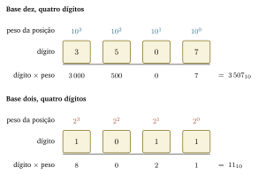
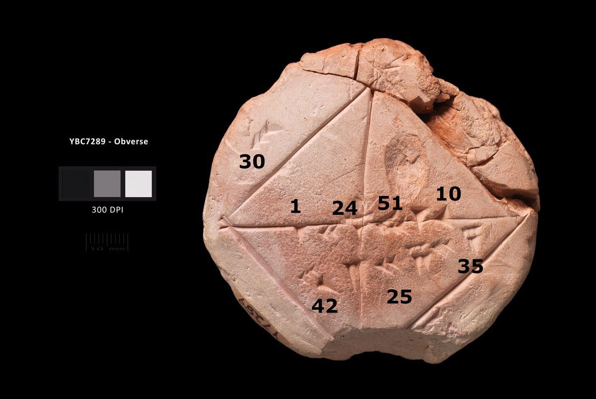
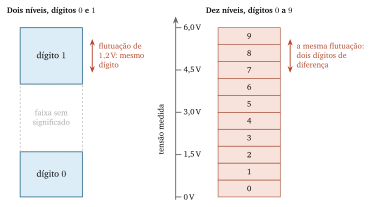
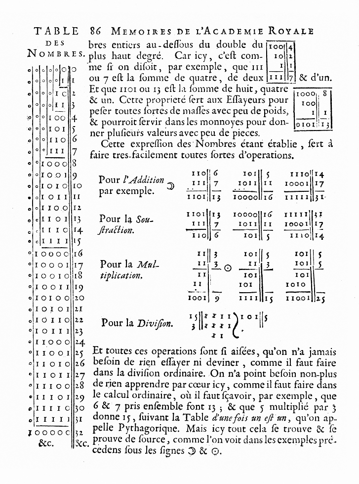
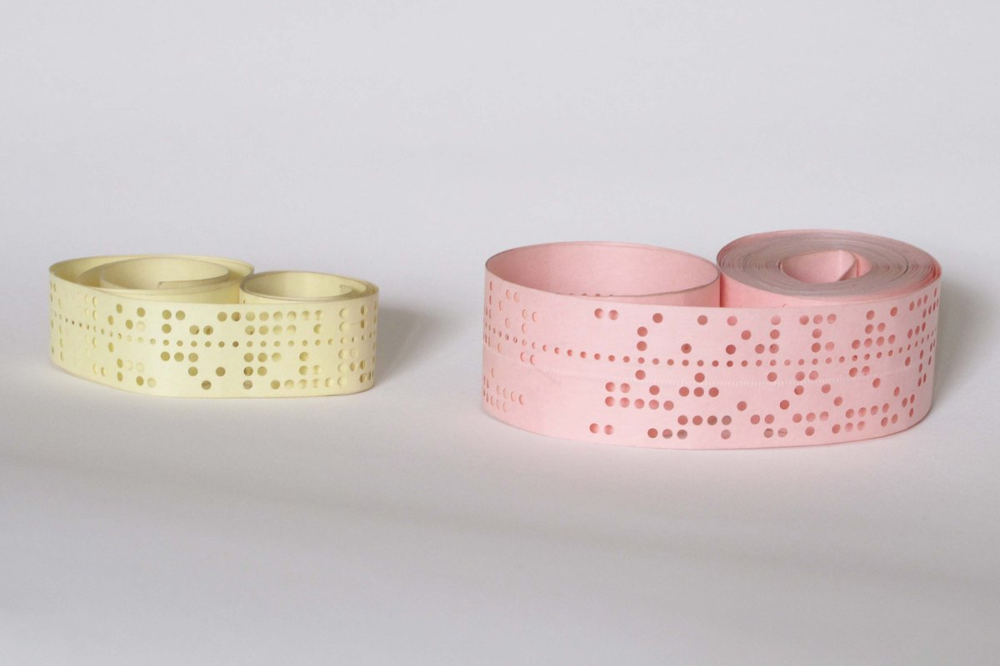
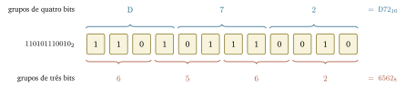

## Objetivos de aprendizagem

- Explicar o que caracteriza um sistema de numeração posicional.
- Converter valores entre as bases decimal, binária, octal e hexadecimal.
- Justificar por que o sistema binário é o adotado nos computadores.
- Escolher a base adequada para representar um valor conforme o contexto.
- Reconhecer quando a parte fracionária de um valor não cabe na
  representação escolhida.

## Conteúdo previsto

- Sistemas de numeração posicionais e a noção de base.
- Sistema decimal, binário, octal e hexadecimal.
- Conversão de uma base qualquer para decimal.
- Conversão de decimal para uma base qualquer, por divisões sucessivas.
- Conversões diretas entre binário, octal e hexadecimal.
- Representação de parte fracionária.

## Leituras recomendadas

Capítulos correspondentes em [@forouzan2011] e [@brookshear2013]. Os dois
apresentam o mesmo procedimento de conversão com exemplos diferentes dos
daqui, e refazer um exemplo já resolvido em outra fonte é a maneira mais barata
de conferir se vocês entenderam o método.

Quem quiser a definição formal de sistema posicional, com as demonstrações que
este capítulo deixa de fora, encontra o assunto tratado com rigor em
[@knuth1997]. Sobre a história dos algarismos e do zero, @ifrah1997 é a
referência mais completa em português.

## O propósito deste capítulo

A finalidade deste capítulo decide o que entra nele e o que fica de fora:

> Ser capaz de escrever o mesmo valor em qualquer das quatro bases usadas na
> área, converter entre elas com procedimento conferível, e dizer o que a
> escolha da base muda e o que ela não muda.

O capítulo 4 movimentou valores entre registradores, memória e disco sem dizer
em que forma esses valores estavam escritos. A @tbl-soma-passos mostrou os
números $12$, $30$ e $42$ como vocês os leem no papel, e o equipamento não
guarda nenhum deles assim. Este capítulo trata da forma em que eles estão
guardados.

Reparem no verbo do propósito: converter. A conversão é um procedimento
mecânico, com passos fixos e resultado conferível, e é isso que a avaliação
verifica. A parte conceitual do capítulo existe para que vocês saibam o que
estão convertendo.

### Parem aqui e escrevam

Antes de continuar a leitura, respondam por escrito. A resposta não vale nota,
não é entregue e não pode ser consultada no restante do capítulo.

Escrevam a sequência $1011$. Depois, escrevam quanto vale essa sequência, e
digam por que ela vale isso.

Na mesma folha, respondam a mais duas perguntas. Quantos valores diferentes
vocês conseguem escrever com três dígitos, se cada dígito pode ser apenas $0$
ou $1$? E qual é o maior deles?

Guardem a folha. Ela volta na última seção do capítulo.

### Por que a resposta de vocês depende de uma convenção

A sequência $1011$ vale mil e onze, e vale onze, e vale quinhentos e vinte e
um, e vale quatro mil cento e treze. As quatro respostas estão certas,
cada uma em uma base diferente, e nada na sequência escrita informa qual delas
foi a pretendida.

Esse é o ponto de partida do capítulo. Uma sequência de dígitos não carrega o
próprio valor; ela carrega o valor **junto com a convenção** de leitura que se
aplica a ela. Quando a convenção é sempre a mesma, ela desaparece de vista, e é
por isso que a pergunta acima parece estranha à primeira leitura.

O equipamento do capítulo 4 usa uma convenção diferente da que vocês usam desde
a escola. Trabalhar com computadores exige conhecer as duas, saber dizer em qual
delas um valor está escrito e passar de uma para a outra sem errar.

> O que faz uma sequência de dígitos significar um valor, que convenções
> existem além da decimal, e como se passa de uma para a outra?

As seções seguintes respondem a essas três perguntas nessa ordem: primeiro o
mecanismo comum a todas as bases, depois as quatro bases que a área usa, e por
fim os procedimentos de conversão.

## O que faz um sistema ser posicional

Um **sistema de numeração posicional** é aquele em que o valor de um dígito
depende da posição que ele ocupa na sequência [@knuth1997]. O mesmo dígito $3$
vale três em $3$, trinta em $30$ e trezentos em $300$.

Três elementos definem um sistema posicional. A **base** é a quantidade de
dígitos distintos disponíveis. O **repertório de dígitos** é o conjunto desses
símbolos. E o **peso** de cada posição é a potência da base correspondente à
distância daquela posição até a vírgula, que em um valor inteiro fica logo
depois do dígito mais à direita, mesmo sem estar escrita.

### O peso de cada posição

A @fig-decomposicao-posicional mostra a decomposição de duas sequências, uma em
base dez e outra em base dois. As duas linhas têm a mesma estrutura, e a única
diferença entre elas é a base de que os pesos são potência.

{#fig-decomposicao-posicional width=92% fig-alt="Duas linhas com a mesma estrutura. Na primeira, rotulada base dez, quatro caixas trazem os dígitos 3, 5, 0 e 7; acima de cada caixa está o peso da posição, dez elevado a três, dez elevado a dois, dez elevado a um e dez elevado a zero; abaixo, os produtos 3000, 500, 0 e 7, somados à direita em 3507. Na segunda linha, rotulada base dois, quatro caixas trazem os dígitos 1, 0, 1 e 1; os pesos acima são dois elevado a três, dois elevado a dois, dois elevado a um e dois elevado a zero; os produtos abaixo são 8, 0, 2 e 1, somados à direita em 11."}

A posição mais à direita tem peso $1$, que é a base elevada a zero. Cada
posição à esquerda dela tem peso igual ao da anterior multiplicado pela base.
Essa é a regra inteira, e ela vale em qualquer base.

O valor da sequência é a soma dos produtos entre cada dígito e o peso da sua
posição. Em base dez, $3507_{10}$ é $3 \times 1\,000$ mais $5 \times 100$ mais
$0 \times 10$ mais $7 \times 1$. Em base dois, $1011_2$ é $1 \times 8$ mais
$0 \times 4$ mais $1 \times 2$ mais $1 \times 1$, que dá $11_{10}$.

Vocês aplicam essa regra desde a alfabetização, sem enunciá-la. Enunciá-la é o
que permite trocar a base sem trocar o método.

### Um sistema sem posição

Nem todo sistema de numeração é posicional. Os algarismos romanos usam símbolos
de valor fixo, que o lugar na sequência não altera. O X vale dez em XIV, em LXX
e em MMX [@ifrah1997].

A @tbl-romano-decimal compara os dois sistemas em quatro valores.

| **Valor** | **Romano** | **Decimal** |
|---|---|---|
| catorze | XIV | $14$ |
| quarenta e um | XLI | $41$ |
| cento e quatro | CIV | $104$ |
| mil e quarenta | MXL | $1\,040$ |

: Quatro valores escritos em um sistema sem posição e em um sistema posicional. {#tbl-romano-decimal}

Duas consequências aparecem na @tbl-romano-decimal. A quantidade de símbolos
romanos cresce com o valor, e não com a quantidade de posições, de modo que não
há relação fixa entre o tamanho da escrita e a grandeza do número. E o sistema
romano precisa de um símbolo novo a cada nova ordem de grandeza, enquanto o
posicional acrescenta apenas uma posição.

A terceira consequência é a que interessa a este livro. Somar dois números
romanos exige um procedimento diferente do de somar dois números decimais, e
esse procedimento não é o mesmo para quaisquer dois números. Em um sistema
posicional, a soma é o mesmo algoritmo em qualquer base, e é isso que o capítulo
6 explora.

### O zero como posição vazia

Um sistema posicional precisa de um símbolo para a posição sem dígito. Sem ele,
$307$ e $37$ ficam indistinguíveis, porque a informação que separa os dois casos
está justamente na posição que ficou vazia [@ifrah1997].

O zero, nesse uso, marca posição. O uso do zero como quantidade nula veio depois
e é uma ideia distinta, embora hoje o mesmo símbolo cumpra as duas funções.

Essa distinção volta no capítulo 6. Uma posição de memória que guarda o valor
zero está ocupada, e uma posição de memória que nunca foi escrita também contém
alguma coisa; nenhuma das duas está vazia no sentido em que a coluna das
dezenas de $307$ está.

### Exemplo: a base sessenta em um tablete de argila

A @fig-tablete-ybc mostra o tablete YBC 7289, da coleção babilônica da
Universidade de Yale, com cerca de sete centímetros de diâmetro. Ele traz um
quadrado com as duas diagonais traçadas e três números escritos em cunha, e é
um exercício de escola: dado o lado do quadrado, achar a diagonal.

{#fig-tablete-ybc width=78% fig-alt="Fotografia de um tablete de argila arredondado, de cor clara, com um quadrado gravado e as duas diagonais traçadas. Números transcritos em algarismos decimais aparecem sobrepostos à fotografia, junto dos grupos de cunhas correspondentes: 30 no lado superior esquerdo do quadrado; 1, 24, 51 e 10 alinhados sobre a diagonal; 42, 25 e 35 abaixo dela."}

Os babilônios usavam base sessenta, com um repertório de sessenta dígitos
formados por combinações de duas cunhas [@ifrah1997]. Os grupos transcritos
sobre a diagonal da @fig-tablete-ybc são $1$, $24$, $51$ e $10$, e cada um
deles é um único dígito daquele sistema.

Lidos como uma sequência posicional com parte fracionária, esses quatro dígitos
valem $1$ mais $\frac{24}{60}$ mais $\frac{51}{3\,600}$ mais
$\frac{10}{216\,000}$, o que dá aproximadamente $1{,}41421$. É a raiz quadrada
de dois com cinco casas decimais corretas, escrita há quase quatro mil anos.

Os outros números do tablete confirmam a leitura. O lado do quadrado é $30$, e o
grupo abaixo da diagonal, $42$, $25$ e $35$, é o produto de $30$ pela
aproximação da raiz de dois, escrito na mesma base sessenta.

Duas coisas ficam desse exemplo. A base dez não tem nada de especial além do
costume, e a escolha da base é independente da matemática que se faz com ela.
E a base sessenta sobreviveu: os sessenta minutos da hora e os sessenta segundos
do minuto são o que restou dela no uso diário de vocês.

## As quatro bases deste livro

A área usa quatro bases, e cada uma existe por um motivo diferente. A decimal é
a de vocês. A binária é a do equipamento. A octal e a hexadecimal são formas
abreviadas de escrever binário, e existem para conveniência de quem lê.

### A base decide o repertório de dígitos

Uma base $b$ tem exatamente $b$ dígitos, de $0$ até $b-1$. Não existe o dígito
$b$ em nenhuma base: em base dez, o dígito dez seria escrito $10$, que já são
duas posições.

A @tbl-quatro-bases resume as quatro.

| **Nome** | **Base** | **Dígitos** | **Onde aparece** |
|---|---|---|---|
| Decimal | $10$ | $0$ a $9$ | Uso diário, entrada e saída de programas |
| Binária | $2$ | $0$ e $1$ | Interior do equipamento, quando cada bit importa |
| Octal | $8$ | $0$ a $7$ | Permissões de arquivo em sistemas Unix, como o Linux e o macOS |
| Hexadecimal | $16$ | $0$ a $9$ e A a F | Endereços de memória, cores, identificadores |

: As quatro bases usadas neste livro, com o repertório de dígitos de cada uma. {#tbl-quatro-bases}

A base dezesseis precisa de dezesseis dígitos, e o repertório decimal só tem
dez símbolos. Os seis que faltam são as letras A, B, C, D, E e F, que valem
respectivamente dez, onze, doze, treze, catorze e quinze. A escolha de letras é
convenção, e não tem significado próprio.

Escrevam os dígitos hexadecimais em maiúsculas, como neste livro. O valor não
muda com a caixa da letra, e a uniformidade evita confundir a letra $\mathrm{B}$
com o dígito $8$ em anotação manuscrita.

### Contar até dezesseis nas quatro bases

A @tbl-contagem mostra os primeiros dezessete valores nas quatro bases. Vale
mais lê-la em coluna que decorá-la: cada coluna é a mesma contagem, e o que muda
é o momento em que a coluna precisa de uma posição nova.

| **Decimal** | **Binária** | **Octal** | **Hexadecimal** |
|---|---|---|---|
| $0$ | $0$ | $0$ | $0$ |
| $1$ | $1$ | $1$ | $1$ |
| $2$ | $10$ | $2$ | $2$ |
| $3$ | $11$ | $3$ | $3$ |
| $4$ | $100$ | $4$ | $4$ |
| $5$ | $101$ | $5$ | $5$ |
| $6$ | $110$ | $6$ | $6$ |
| $7$ | $111$ | $7$ | $7$ |
| $8$ | $1000$ | $10$ | $8$ |
| $9$ | $1001$ | $11$ | $9$ |
| $10$ | $1010$ | $12$ | $\mathrm{A}$ |
| $11$ | $1011$ | $13$ | $\mathrm{B}$ |
| $12$ | $1100$ | $14$ | $\mathrm{C}$ |
| $13$ | $1101$ | $15$ | $\mathrm{D}$ |
| $14$ | $1110$ | $16$ | $\mathrm{E}$ |
| $15$ | $1111$ | $17$ | $\mathrm{F}$ |
| $16$ | $10000$ | $20$ | $10$ |

: Os dezessete primeiros valores escritos nas quatro bases. {#tbl-contagem}

A regra da contagem é a mesma nas quatro colunas. Incrementa-se o dígito da
direita; quando ele passa do último símbolo do repertório, ele volta a zero e o
dígito à esquerda é incrementado. A base decide apenas onde está esse limite.

Reparem na linha do valor onze. A sequência $1011$ da folha de vocês aparece
nela, na coluna binária, e o valor correspondente é $11$. A mesma sequência lida
como octal daria $521_{10}$, e lida como hexadecimal daria $4\,113_{10}$.

### Como escrever a base sem ambiguidade

Neste livro, a base vai em subscrito, sempre escrita em algarismos decimais:
$1011_2$, $234_8$, $9\mathrm{C}_{16}$, $156_{10}$. Um valor sem subscrito é
decimal.

Fora do livro, vocês vão encontrar outras notações, quase todas herdadas de
linguagens de programação: `0b1011` para binário, `0o234` ou `0234` para octal,
`0x9C` para hexadecimal. Elas aparecem em código, e o capítulo 7 as retoma
quando tratar de linguagens; no texto corrido deste livro, a notação é a do
subscrito.

## Por que o computador usa a base dois

A escolha da base dois vem do circuito, e não da matemática. Qualquer base
funciona igualmente bem no papel, e a diferença aparece quando é preciso
construir o dispositivo que guarda o dígito.

### Dois estados são o que o circuito distingue com folga

Guardar um dígito exige um dispositivo com tantos estados quanto o repertório
da base. Um dígito decimal exigiria distinguir dez níveis de tensão em um
mesmo fio, e um dígito binário exige distinguir dois.

A @fig-dois-niveis mostra o que essa diferença significa na prática. As duas
colunas cobrem o mesmo intervalo de tensão, e a mesma flutuação está desenhada
nas duas.

{#fig-dois-niveis width=88% fig-alt="Duas colunas verticais cobrindo o mesmo eixo de tensão, de zero a seis volts, com o eixo entre elas. A coluna da esquerda tem duas faixas largas: uma na parte de baixo, rotulada dígito zero, e outra na parte de cima, rotulada dígito um, separadas por uma faixa larga tracejada rotulada faixa sem significado. A coluna da direita está dividida em dez faixas estreitas iguais, numeradas de zero a nove. Uma seta de duas pontas do mesmo tamanho aparece ao lado de cada coluna: junto à esquerda, a legenda diz que a flutuação de 1,2 volt mantém o mesmo dígito; junto à direita, que a mesma flutuação atravessa dois dígitos."}

Com dois níveis, sobra uma faixa larga entre eles que não corresponde a dígito
nenhum. Uma tensão que caia nessa faixa é ruído, e o circuito a descarta. Uma
flutuação de mais de um volt não muda o dígito lido.

Com dez níveis, as faixas ficam estreitas e encostadas umas nas outras. A mesma
flutuação atravessa duas fronteiras e troca o dígito, e não existe faixa
intermediária que permita reconhecer o erro.

Essa folga é o motivo pelo qual a base dois se impôs. Ela permite construir
circuito rápido e barato com componentes imprecisos, porque o dispositivo apenas
decide de que lado da faixa a tensão está, sem precisar medi-la.

@shannon1938 mostrou que os circuitos de chaves e relés executam a álgebra de
dois valores que o capítulo 2 apresentou, e a história dessa aproximação entre
lógica e circuito está contada lá. A consequência para este capítulo é uma só:
quando a eletrônica precisou de uma representação, a base dois e a álgebra que
opera sobre ela já estavam prontas. É desse ponto que parte Sistemas Digitais,
no quarto período.

### O que dizia o projeto de 1946

O ENIAC, apresentado no capítulo 2, era decimal. Cada dígito era guardado em um
anel de dez posições, com uma delas ativa por vez, e cada dígito consumia trinta
e seis válvulas [@weik1955]. Funcionava, e custava caro em componentes.

O relatório que definiu o projeto do computador seguinte tratou dessa escolha
explicitamente. @burks1946 recomendam a base dois por três razões. Ela alcança a
mesma precisão com menos dígitos e menos equipamento; ela simplifica a
multiplicação, porque multiplicar por um dígito binário devolve o próprio
multiplicando ou zero, enquanto em decimal há dez casos possíveis; e a lógica,
que opera com sim e não, já é binária, de modo que uma máquina binária fica mais
homogênea.

O argumento tem um custo declarado no próprio relatório. As pessoas escrevem em
decimal, então a máquina precisa converter na entrada e na saída, e os autores
mostram que essa conversão é barata o bastante para compensar. Os procedimentos
das duas seções seguintes deste capítulo são exatamente essa conversão, feita à
mão.

### A base dois em papel, três séculos antes

A aritmética binária foi descrita muito antes de existir circuito que a
executasse. A @fig-leibniz reproduz a página em que Leibniz apresentou o
sistema à Academia Real de Ciências, em 1703 [@leibniz1703].

{#fig-leibniz width=64% fig-alt="Reprodução de uma página impressa antiga, em francês, com o cabeçalho Mémoires de l'Académie Royale. Na coluna da esquerda, uma tabela de duas colunas lista sequências de zeros e uns ao lado dos valores 0 a 32 em algarismos decimais. No corpo da página, quatro blocos rotulados Addition, Soustraction, Multiplication e Division mostram contas armadas com sequências de zeros e uns, cada uma com o valor decimal correspondente ao lado."}

A coluna da esquerda da @fig-leibniz é a mesma contagem da @tbl-contagem,
estendida até trinta e dois. Os quatro blocos do corpo da página são as contas
armadas de adição, subtração, multiplicação e divisão em base dois, com o
resultado decimal ao lado de cada linha, e são o assunto do capítulo 6.

Leibniz observou na mesma página que a multiplicação binária dispensa a tabuada
decorada, porque multiplicar por $0$ ou por $1$ é o caso trivial [@leibniz1703].
É o mesmo argumento que @burks1946 retomam duzentos e quarenta e três anos
depois, com uma finalidade que Leibniz não tinha.

### O que uma fita perfurada mostra

A @fig-fita-perfurada é uma fotografia de fitas de papel perfurado, usadas para
guardar programas e dados antes do armazenamento magnético se generalizar. Cada
linha transversal da fita guarda um caractere, e cada posição da linha guarda um
bit: furo é um estado, papel intacto é o outro.

{#fig-fita-perfurada width=76% fig-alt="Fotografia de dois rolos de fita de papel sobre fundo claro. O rolo da esquerda, amarelo, é estreito e tem cinco posições de furo por linha; o da direita, rosa, é mais largo e tem oito posições por linha. Nos dois, uma fileira contínua de furos pequenos e igualmente espaçados corre ao longo da fita, e furos maiores aparecem em padrões irregulares acima e abaixo dela."}

A fita mostra a base dois em uma forma que se vê a olho nu. A fileira contínua
de furos pequenos é a tração, e não guarda dado; as demais posições guardam os
bits, e a leitura de cada linha é uma sequência binária como as da
@tbl-contagem.

A fita larga da @fig-fita-perfurada tem oito posições de dado por linha, e a
estreita tem cinco. Essa quantidade decide quantos caracteres distintos o
código consegue representar, e é a mesma conta da próxima seção: com $n$ bits,
$2^n$ valores diferentes.

### As potências de dois

Converter entre bases exige reconhecer as potências de dois de imediato, do
mesmo modo que somar exige a tabuada. A @tbl-potencias-dois traz as que aparecem
com mais frequência.

| **Expoente** | **Potência** | **Onde vocês vão encontrar** |
|---|---|---|
| $2^0$ | $1$ | Peso da posição mais à direita |
| $2^1$ | $2$ | |
| $2^2$ | $4$ | |
| $2^3$ | $8$ | Um dígito octal |
| $2^4$ | $16$ | Um dígito hexadecimal |
| $2^5$ | $32$ | |
| $2^6$ | $64$ | |
| $2^7$ | $128$ | Peso do bit mais à esquerda de um byte |
| $2^8$ | $256$ | Valores distintos de um byte |
| $2^{10}$ | $1\,024$ | O "K" de kilobyte na contagem binária |
| $2^{16}$ | $65\,536$ | Valores de dois bytes |
| $2^{20}$ | $1\,048\,576$ | O "M" de megabyte na contagem binária |
| $2^{32}$ | $4\,294\,967\,296$ | Endereços de uma máquina de 32 bits |

: As potências de dois que aparecem com mais frequência no material. {#tbl-potencias-dois}

A relação entre a quantidade de bits e a quantidade de valores é a que sustenta
quase todo o resto. Com $n$ bits existem $2^n$ sequências distintas, e portanto
$2^n$ valores representáveis, de $0$ até $2^n - 1$.

A pergunta da folha de vocês era essa. Com três bits, existem $2^3$, ou oito,
sequências distintas, e elas representam os valores de $0$ a $7$; o maior deles
é $111_2$, que vale $7_{10}$. O erro mais comum é responder oito, por esquecer
que a contagem começa em zero.

O capítulo 4 mostrou, na @tbl-largura-endereco, que um barramento de endereços
de $32$ vias alcança $4\,294\,967\,296$ posições, e a linha de $2^{32}$ da
@tbl-potencias-dois é de onde esse número vem. O capítulo 6 retoma a mesma tabela para tratar do intervalo de valores com
sinal.

## De qualquer base para a decimal

A conversão para decimal é a aplicação direta da @fig-decomposicao-posicional.
Ela funciona a partir de qualquer base, e o procedimento é sempre o mesmo.

### O procedimento

Escrevam os dígitos em ordem, da direita para a esquerda, e atribuam a cada um o
peso da sua posição: $b^0$, $b^1$, $b^2$, e assim por diante, em que $b$ é a
base de origem. Multipliquem cada dígito pelo seu peso e somem os produtos.

O resultado sai em decimal porque as multiplicações e a soma são feitas em
decimal. A conversão inteira acontece na aritmética que vocês já dominam, e a
base de origem entra apenas na escolha dos pesos.

### Exemplo: $10011100_2$ em decimal

A sequência tem oito dígitos, e os pesos vão de $2^7$ a $2^0$. Só as posições
com dígito $1$ contribuem para a soma, o que torna a conta curta em base dois.

$$
10011100_2 = 128 + 0 + 0 + 16 + 8 + 4 + 0 + 0 = 156_{10}
$$

Os quatro valores somados são os pesos das posições $7$, $4$, $3$ e $2$,
contadas da direita e a partir de zero. Em base dois, converter para decimal é
somar as potências de dois correspondentes aos dígitos $1$, e a
@tbl-potencias-dois basta para fazer isso de cabeça em sequências curtas.

### Exemplo: $234_8$ e $9\mathrm{C}_{16}$ em decimal

O procedimento não muda com a base. O que muda são os pesos e o valor de cada
dígito.

$$
234_8 = 2 \times 64 + 3 \times 8 + 4 \times 1 = 128 + 24 + 4 = 156_{10}
$$

$$
9\mathrm{C}_{16} = 9 \times 16 + 12 \times 1 = 144 + 12 = 156_{10}
$$

No segundo caso, o dígito $\mathrm{C}$ entra na conta com o valor doze, tirado
da @tbl-contagem. É o único passo em que a base dezesseis exige atenção
adicional, e é onde nascem quase todos os erros de conversão hexadecimal.

Os três exemplos desta seção deram o mesmo resultado, e isso não foi acaso.
$10011100_2$, $234_8$, $9\mathrm{C}_{16}$ e $156_{10}$ são o mesmo valor escrito
em quatro convenções, e o capítulo volta a esse valor nas seções seguintes.

## Da decimal para qualquer base

O sentido inverso usa outro procedimento, e é o que a maioria dos alunos erra na
primeira semana. A conversão para decimal soma produtos; a conversão a partir de
decimal divide e guarda restos.

### Divisões sucessivas

Dividam o valor pela base de destino e anotem o quociente e o resto. Repitam a
divisão sobre o quociente, até que ele chegue a zero. Os restos, lidos do último
para o primeiro, são os dígitos do valor na base de destino.

O resto de uma divisão por $b$ é sempre menor que $b$, e por isso ele é sempre
um dígito válido na base de destino. Essa é a razão de o procedimento funcionar,
e ela explica também por que o último resto nunca é zero, exceto quando o valor
de partida é zero.

### Exemplo: $156_{10}$ em base dois

A @tbl-divisoes-binario mostra as oito divisões. A leitura dos restos é de baixo
para cima, e a seta da última coluna marca esse sentido.

| **Divisão** | **Quociente** | **Resto** | **Ordem de leitura** |
|---|---|---|---|
| $156 \div 2$ | $78$ | $0$ | oitavo dígito |
| $78 \div 2$ | $39$ | $0$ | sétimo dígito |
| $39 \div 2$ | $19$ | $1$ | sexto dígito |
| $19 \div 2$ | $9$ | $1$ | quinto dígito |
| $9 \div 2$ | $4$ | $1$ | quarto dígito |
| $4 \div 2$ | $2$ | $0$ | terceiro dígito |
| $2 \div 2$ | $1$ | $0$ | segundo dígito |
| $1 \div 2$ | $0$ | $1$ | primeiro dígito |

: As divisões sucessivas que convertem $156_{10}$ para base dois. {#tbl-divisoes-binario}

Lidos de baixo para cima, os restos formam $10011100_2$. É o mesmo valor que a
seção anterior converteu no sentido contrário, e essa coincidência é a
conferência do resultado.

O erro mais frequente aqui é ler os restos na ordem em que foram escritos, o que
produziria $00111001_2$, ou $57_{10}$. Anotem o sentido da leitura na própria
folha, como faz a última coluna da @tbl-divisoes-binario, enquanto o
procedimento não estiver automático.

### Exemplo: $156_{10}$ em octal e em hexadecimal

O mesmo procedimento, com outra base no divisor. A @tbl-divisoes-octal-hexa traz
as duas conversões lado a lado.

| **Base** | **Divisões** | **Restos, na ordem obtida** | **Resultado** |
|---|---|---|---|
| Octal | $156 \div 8 = 19$, resto $4$; $19 \div 8 = 2$, resto $3$; $2 \div 8 = 0$, resto $2$ | $4$, $3$, $2$ | $234_8$ |
| Hexadecimal | $156 \div 16 = 9$, resto $12$; $9 \div 16 = 0$, resto $9$ | $12$, $9$ | $9\mathrm{C}_{16}$ |

: As mesmas divisões sucessivas para as bases oito e dezesseis. {#tbl-divisoes-octal-hexa}

Na linha do hexadecimal, o resto $12$ vira o dígito $\mathrm{C}$ na hora de
escrever o resultado. A conversão do resto para o símbolo do repertório é um
passo à parte, e é o que distingue a base dezesseis das outras três no
procedimento.

Quanto maior a base de destino, menos divisões o procedimento exige e menos
dígitos o resultado tem. O mesmo valor precisou de oito divisões em base dois e
de duas em base dezesseis, e essa é a economia que justifica o uso do
hexadecimal por quem lê endereços e conteúdos de memória.

### Conferir pelo caminho inverso

Toda conversão feita por divisões sucessivas se confere pela conversão de
volta, que usa o outro procedimento. Se os dois caminhos não derem o mesmo
valor, um dos dois tem erro, e refazer a soma dos pesos costuma ser mais rápido
que refazer as divisões.

Façam essa conferência sempre, inclusive na avaliação. Ela custa menos de um
minuto em sequências curtas e pega os dois erros mais comuns, que são a ordem
dos restos e o valor de um dígito hexadecimal.

## Entre binário, octal e hexadecimal

Converter de binário para hexadecimal passando pelo decimal funciona, e é
trabalho desperdiçado. Existe caminho direto entre essas três bases, e ele não
usa divisão nem multiplicação.

### Grupos de três e de quatro bits

O caminho direto existe porque oito e dezesseis são potências de dois:
$8 = 2^3$ e $16 = 2^4$. Cada dígito octal corresponde a exatamente três bits, e
cada dígito hexadecimal, a exatamente quatro, e a correspondência é a das
primeiras oito e dezesseis linhas da @tbl-contagem.

A @fig-agrupamento-bits mostra a mesma sequência de doze bits lida das duas
formas.

{#fig-agrupamento-bits width=98% fig-alt="Uma fileira central de doze caixas com os bits 1, 1, 0, 1, 0, 1, 1, 1, 0, 0, 1, 0, rotulada como a sequência binária. Acima dela, três chaves agrupam os bits de quatro em quatro e produzem os dígitos D, 7 e 2, com o resultado D72 em hexadecimal indicado à direita. Abaixo, quatro chaves agrupam os mesmos bits de três em três e produzem os dígitos 6, 5, 6 e 2, com o resultado 6562 em octal indicado à direita."}

O agrupamento começa pela direita, e não pela esquerda. Quando os bits não
completam o último grupo, acrescentem zeros à esquerda até completá-lo; zero à
esquerda não altera o valor, pelo mesmo motivo que $007$ e $7$ são o mesmo
número em decimal.

### Exemplo: os dois sentidos

De binário para hexadecimal, com $10011100_2$: os grupos de quatro, a partir da
direita, são $1001$ e $1100$, que valem $9$ e $\mathrm{C}$. O resultado é
$9\mathrm{C}_{16}$, e coincide com o obtido pelas divisões sucessivas.

De binário para octal, com o mesmo valor: os grupos de três, a partir da
direita, são $100$, $011$ e $10$. O último grupo está incompleto e recebe um
zero à esquerda, virando $010$. Os três grupos valem $4$, $3$ e $2$, e o
resultado é $234_8$.

No sentido inverso, cada dígito vira o seu grupo de bits, e os grupos são
justapostos. O dígito $\mathrm{F}_{16}$ vira $1111$, o dígito $7_8$ vira $111$,
e a única atenção necessária é escrever os zeros à esquerda dentro de cada
grupo: $2_{16}$ vira $0010$, e não $10$.

### Por que o hexadecimal aparece tanto

Um byte tem oito bits e, portanto, exatamente dois dígitos hexadecimais. Essa
correspondência exata é o motivo de o hexadecimal ser a forma usual de mostrar
conteúdo de memória, endereço e qualquer sequência de bytes [@patterson2014].

Vocês já encontraram hexadecimal fora deste livro, provavelmente sem reparar. A
cor `#1E90FF` de uma página web é um trio de bytes, um para cada componente de
cor: `1E` de vermelho, `90` de verde e `FF` de azul, cada um entre $0$ e $255$.
O endereço físico de uma placa de rede é escrito em seis bytes separados por
dois-pontos, como `00:1A:2B:3C:4D:5E`.

O octal aparece bem menos, e onde aparece é por razão histórica. As máquinas em
que ele se firmou trabalhavam com **palavras** de tamanho múltiplo de três bits,
sendo a palavra o bloco de bits que o processador move e opera de uma vez.

O uso mais comum hoje são as permissões de arquivo em sistemas Unix. Cada
arquivo tem três grupos de três bits, um para o dono, um para o grupo e um para
os demais, e dentro de cada grupo os bits dizem se é permitido ler, escrever e
executar, nessa ordem. Um arquivo que o dono lê e escreve, e que os outros
apenas leem, tem os bits $110\,100\,100$, que agrupados de três em três dão
$644_8$. É essa a forma em que a permissão aparece nos comandos e na
documentação desses sistemas, e ela é o agrupamento da @fig-agrupamento-bits
aplicado a um caso real.

## A parte fracionária

Tudo o que este capítulo fez até aqui trata de valores inteiros. A parte
fracionária usa o mesmo mecanismo posicional, com pesos que continuam à direita
da vírgula.

### Os pesos à direita da vírgula

As posições à direita da vírgula têm pesos $b^{-1}$, $b^{-2}$, $b^{-3}$, e assim
por diante, o que em base dez dá os décimos, centésimos e milésimos que vocês já
usam. Em base dois, os pesos são $\frac{1}{2}$, $\frac{1}{4}$, $\frac{1}{8}$ e
seguem dividindo por dois.

A conversão para decimal continua sendo a soma dos produtos:

$$
0{,}101_2 = 1 \times \tfrac{1}{2} + 0 \times \tfrac{1}{4} +
            1 \times \tfrac{1}{8} = 0{,}5 + 0{,}125 = 0{,}625_{10}
$$

### Multiplicações sucessivas

Para converter uma fração decimal em outra base, o procedimento inverte a
divisão da parte inteira. Multipliquem a parte fracionária pela base e anotem a
parte inteira do produto, que é o próximo dígito. Repitam sobre a parte
fracionária que restou, até ela chegar a zero.

A @tbl-multiplicacoes converte $0{,}625$ para base dois. Os dígitos são lidos de
cima para baixo, ao contrário dos restos da divisão.

| **Multiplicação** | **Produto** | **Dígito** | **Resto fracionário** |
|---|---|---|---|
| $0{,}625 \times 2$ | $1{,}25$ | $1$ | $0{,}25$ |
| $0{,}25 \times 2$ | $0{,}5$ | $0$ | $0{,}5$ |
| $0{,}5 \times 2$ | $1{,}0$ | $1$ | $0$ |

: As multiplicações sucessivas que convertem $0{,}625_{10}$ para base dois. {#tbl-multiplicacoes}

O resultado é $0{,}101_2$, o mesmo valor que a subseção anterior converteu no
sentido contrário. Um valor com parte inteira e parte fracionária é convertido
em duas etapas independentes, e as duas partes são reunidas no fim:
$156{,}625_{10}$ vira $10011100{,}101_2$.

### Quando a conta não termina

O procedimento da @tbl-multiplicacoes terminou porque o resto fracionário chegou
a zero. Isso nem sempre acontece. A conversão de $0{,}1_{10}$ para base dois
produz $0{,}0001100110011\ldots_2$, com o grupo $0011$ repetindo
indefinidamente.

A causa é aritmética, e vocês já a conhecem em base dez. Um terço não tem
escrita decimal finita, e escrevê-lo exige ou uma dízima periódica, ou uma
notação de fração, ou um arredondamento. Em base dois, $\frac{1}{10}$ está na
mesma situação, porque dez não é potência de dois.

Uma fração tem escrita finita em uma base quando o denominador dela, reduzido,
só tem fatores primos que também dividem a base. A base dez tem os fatores dois
e cinco, e por isso $\frac{1}{2}$, $\frac{1}{5}$ e $\frac{1}{10}$ terminam. A
base dois tem só o fator dois, e por isso apenas as frações com denominador
potência de dois terminam nela.

### O que isso custa na prática

O equipamento guarda cada valor em uma quantidade fixa de bits, e uma escrita
infinita precisa ser cortada em algum ponto. O valor guardado no lugar de
$0{,}1$ é o mais próximo que a quantidade de bits disponível permite, e ele não
é igual a $0{,}1$ [@goldberg1991].

A consequência aparece em contas simples. Somar $0{,}1$ com $0{,}2$ em um
programa comum não dá exatamente $0{,}3$, e a comparação entre o resultado e
$0{,}3$ falha. A norma que define esse comportamento e o intervalo de erro
admitido é a IEEE 754 [@ieee754]. Todos os equipamentos atuais a seguem.

Duas decisões práticas saem daí, e vocês vão encontrá-las em disciplinas
posteriores. Valores monetários costumam ser guardados em centavos, como
inteiros, porque inteiro não sofre desse problema. E a comparação entre dois
valores fracionários é feita por diferença dentro de uma tolerância, e não por
igualdade.

Este capítulo para aqui nesse assunto. Como exatamente os bits são distribuídos
entre sinal, parte inteira e parte fracionária é matéria do capítulo 6.

## Escolher a base conforme o contexto

As quatro bases representam os mesmos valores, e a escolha entre elas é de
conveniência de leitura. A @tbl-escolha-base resume o critério.

| **Situação** | **Base** | **Motivo** |
|---|---|---|
| Entrada e saída para pessoas | Decimal | É a convenção do leitor |
| Mostrar os bits individuais de um valor | Binária | Cada bit fica visível |
| Endereço, conteúdo de memória, byte | Hexadecimal | Dois dígitos por byte, escrita curta |
| Permissão de arquivo em sistema Unix | Octal | Três bits de permissão por dígito |

: O critério de escolha da base conforme o que se quer ler. {#tbl-escolha-base}

Nenhuma linha da @tbl-escolha-base fala em valor, e sim em leitura. O valor
guardado no equipamento é o mesmo nas quatro situações, e a base escolhida
decide apenas como ele aparece na tela ou no papel.

O erro que essa tabela previne é tratar a base como propriedade do valor.
Perguntas como "esse número está em binário?" costumam ser sobre a forma de
exibição, e não sobre o que está guardado; dentro do equipamento, tudo está em
base dois desde o capítulo 4.

## Treino, com resposta

Converter é procedimento, e procedimento se aprende repetindo. Os dez exercícios
da @tbl-treino não são entregues e não valem nota; eles existem para vocês
chegarem ao capítulo 6 sem precisar reler este.

Resolvam cada um em uma folha, com os passos escritos, e só depois confiram a
coluna da direita. Consultar a resposta antes de resolver transforma o exercício
em leitura, e leitura vocês já fizeram.

| **Exercício** | **Resposta** |
|---|---|
| 1. $101101_2$ para decimal | $45_{10}$ |
| 2. $57_8$ para decimal | $47_{10}$ |
| 3. $\mathrm{B}4_{16}$ para decimal | $180_{10}$ |
| 4. $89_{10}$ para base dois | $1011001_2$ |
| 5. $89_{10}$ para octal e para hexadecimal | $131_8$ e $59_{16}$ |
| 6. $11010110_2$ para octal e para hexadecimal, por agrupamento | $326_8$ e $\mathrm{D}6_{16}$ |
| 7. $2\mathrm{F}_{16}$ para base dois e para octal | $101111_2$ e $57_8$ |
| 8. $180_{10}$ para base dois | $10110100_2$ |
| 9. $0{,}75_{10}$ para base dois | $0{,}11_2$ |
| 10. $0{,}3_{10}$ para base dois, com seis casas | $0{,}010011_2$, e a conta não termina |

: Dez conversões para treino, com a resposta ao lado. {#tbl-treino}

Três dos exercícios conferem outros. O 8 refaz o 3 no sentido inverso, e o 7
chega ao mesmo $57_8$ que serve de enunciado ao 2. Quando dois exercícios
diferentes derem valores incompatíveis, é sinal de erro em um dos dois, e
achá-lo é parte do treino.

O exercício 10 é o único cuja conta não termina, e ele está aqui de propósito:
$0{,}3$ tem denominador com fator cinco, e cinco não divide dois. Parem nas seis
casas pedidas e reparem no grupo que se repete a partir da terceira casa, que é
$0011$.

## O que reter e o que reconhecer

Este capítulo apresentou menos termos que o anterior, e a diferença é de
natureza: aqui, boa parte do que vocês precisam reter é procedimento, e não
vocabulário. A @tbl-reter-bases separa os dois grupos.

| **Assunto** | **Reter** | **Basta reconhecer** |
|---|---|---|
| Sistema posicional | Base, dígito, peso da posição | Sistema não posicional, base sessenta |
| Bases | As quatro bases e seus repertórios; $2^n$ valores com $n$ bits | Notação `0x`, `0b` e `0o` de linguagens |
| Para decimal | Soma dos dígitos multiplicados pelos pesos | |
| De decimal | Divisões sucessivas, com leitura dos restos de baixo para cima | Método de subtração de potências |
| Entre bases dois, oito e dezesseis | Agrupamento de três e de quatro bits | |
| Fracionário | Pesos à direita da vírgula; multiplicações sucessivas | Dízima em base dois, IEEE 754 |

: O que o capítulo pede que vocês retenham e o que basta reconhecer ao encontrar. {#tbl-reter-bases}

As potências de dois da @tbl-potencias-dois até $2^{10}$ entram na coluna do
meio, mesmo sem estar escritas nela. Reconhecê-las de imediato é o que separa
uma conversão de trinta segundos de uma de cinco minutos, e o capítulo 6 supõe
essa fluência.

## A tarefa desta semana

As três partes cobrem operações diferentes: aplicar os procedimentos a valores
dados, aplicá-los a um valor encontrado fora do livro e verificar o que mudou na
compreensão de vocês. As três compõem o piso definido na @tbl-piso-extensao do
capítulo 1, e cada uma traz ao fim uma extensão para quem terminou sem esforço.

### Aplicação: um valor nas quatro bases

Convertam o valor $203_{10}$ para as bases dois, oito e dezesseis. Mostrem as
divisões sucessivas de cada conversão no formato da @tbl-divisoes-binario, com o
sentido de leitura dos restos indicado.

Depois, confiram os três resultados de duas maneiras. Pela conversão de volta
para decimal, somando os pesos; e pelo agrupamento de bits da
@fig-agrupamento-bits, que liga o resultado binário aos outros dois sem passar
pelo decimal.

Fechem esta parte respondendo em duas frases: qual das três conversões exigiu
menos passos, e por quê?

Extensão: convertam $203{,}4_{10}$ para as mesmas três bases, com seis casas
depois da vírgula. Digam em qual delas a parte fracionária termina e usem a
regra dos fatores do denominador, da seção sobre quando a conta não termina,
para explicar o resultado que vocês obtiveram.

### Transferência: um valor achado fora do livro

Encontrem, no equipamento que vocês usam, um valor escrito em hexadecimal. Serve
o código de uma cor em uma página web, o endereço físico de uma placa de rede,
um identificador de arquivo ou uma mensagem de erro com endereço de memória.
Registrem onde acharam e transcrevam o valor.

Digam quantos bits esse valor ocupa e como vocês chegaram a essa conta. Depois,
convertam para decimal ao menos um byte dele, mostrando os pesos usados.

Fechem respondendo a duas perguntas. Por que quem escreveu esse valor escolheu
o hexadecimal, e o que mudaria na legibilidade se ele estivesse em binário? E
por que o equipamento guarda esse mesmo valor em base dois, mesmo mostrando-o em
hexadecimal na tela? A @tbl-escolha-base dá o critério da primeira, a seção
sobre a base dois dá o da segunda, e as duas respostas precisam ser sobre o caso
que vocês acharam.

Quando a equipe de vocês já tiver escolhido o objeto de estudo do trabalho
integrador, procurem o valor dentro dele. O marco do encontro 8 pede a descrição
do objeto em termos de dados e representação, e este registro é matéria-prima
daquela entrega.

Extensão: para o caso escolhido, digam quantos valores distintos aquele campo
consegue representar e o que aconteceria se ele tivesse um dígito hexadecimal a
menos.

### Integração: comparem com o que vocês escreveram

Recuperem a folha da abertura do capítulo, com a leitura de $1011$ e as duas
respostas sobre três dígitos binários.

Escrevam abaixo, sem apagar o que estava lá, as respostas a três perguntas. A
sua leitura de $1011$ dizia em que base ela estava? A sua resposta sobre a
quantidade de valores com três dígitos era oito, e a sua resposta sobre o maior
deles era sete? E, se as duas divergiram, qual das duas vocês erraram?

A terceira pergunta é a que fecha o capítulo. Contar sequências e nomear a maior
delas são operações distintas, e a diferença entre $2^n$ e $2^n - 1$ atravessa o
livro inteiro: ela reaparece no capítulo 6, no intervalo de valores de um byte
com sinal, e no capítulo 12, quando um identificador precisar distinguir cada
titular de dados sem repetir nenhum.

O capítulo 6 usa este como ferramenta. Ele soma, subtrai e multiplica em base
dois, representa valores negativos e mostra o que acontece quando o resultado
não cabe na quantidade de bits disponível.

Guardem as duas folhas.

Extensão: escrevam uma frase dizendo o que vocês diriam hoje, e não conseguiriam
dizer na primeira página, sobre o que uma sequência de dígitos carrega e o que
ela não carrega.
