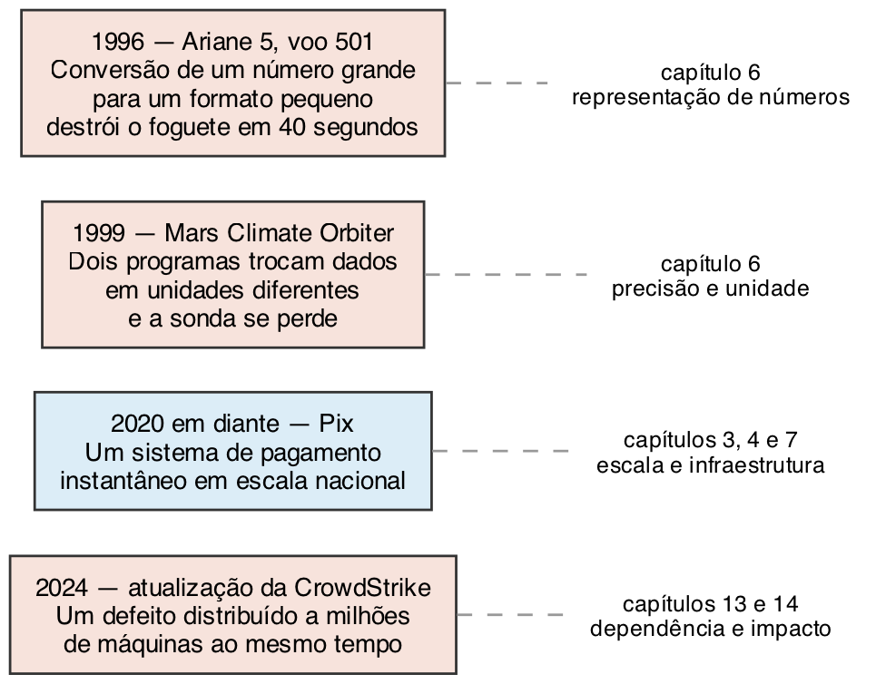
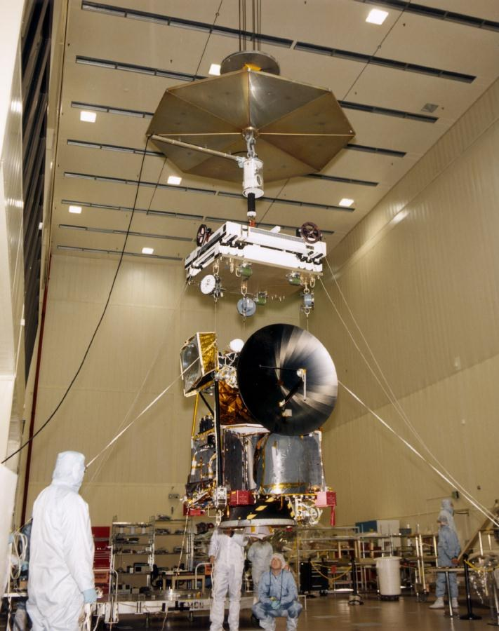
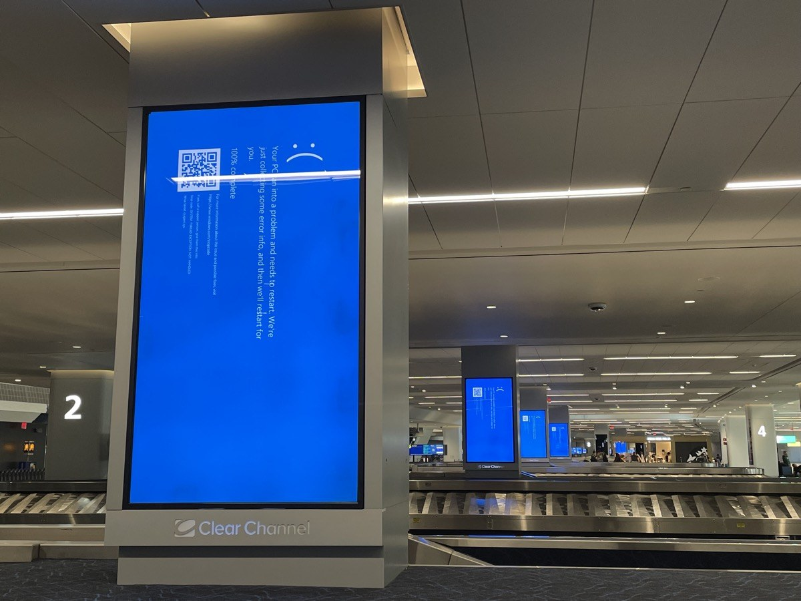
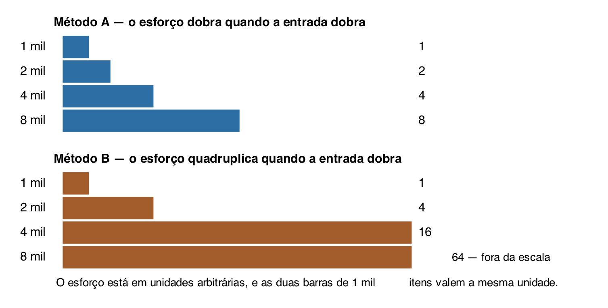
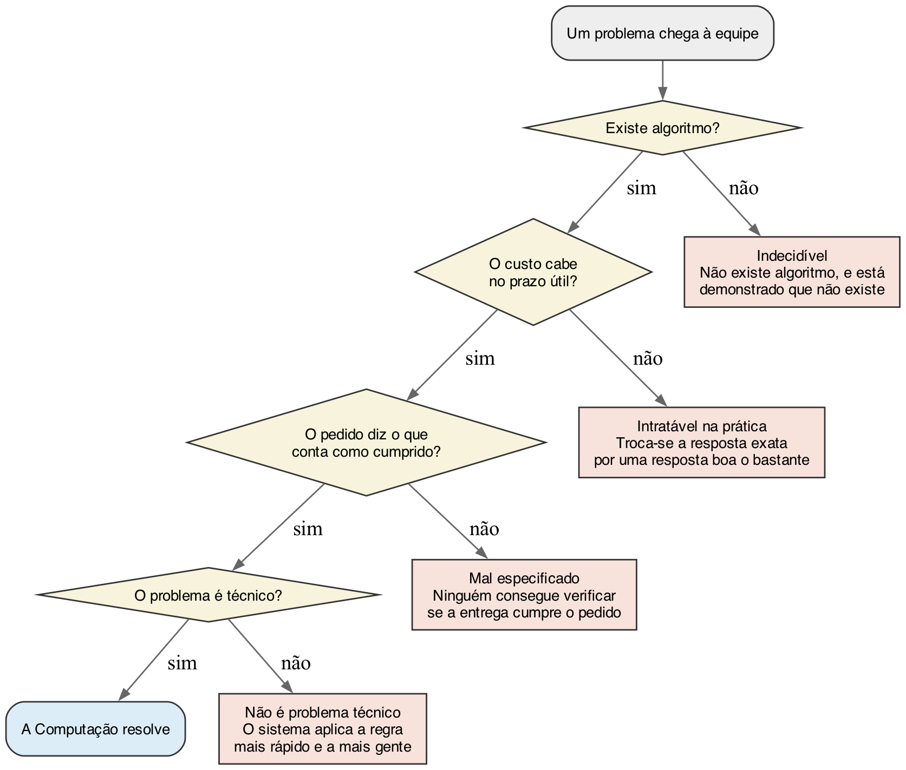
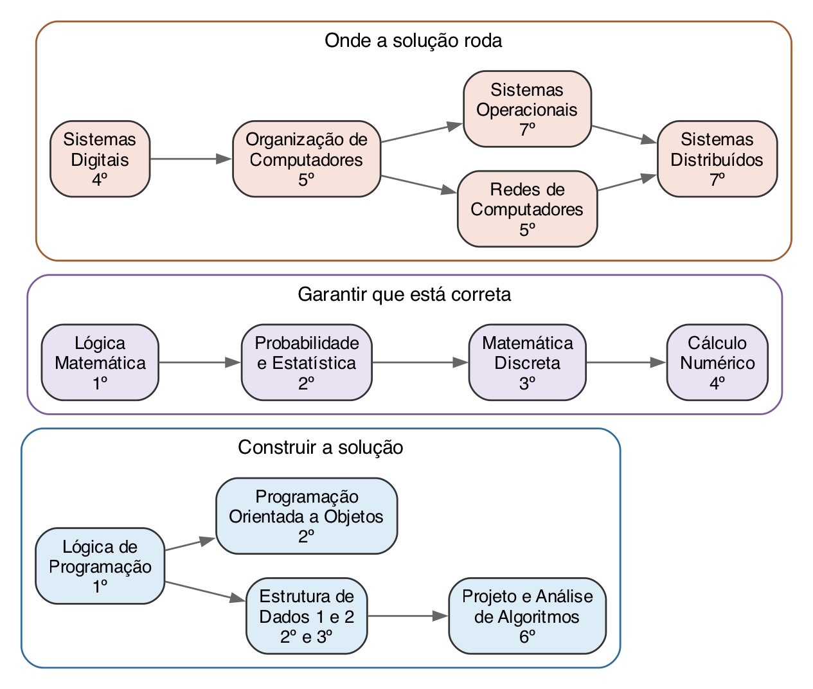
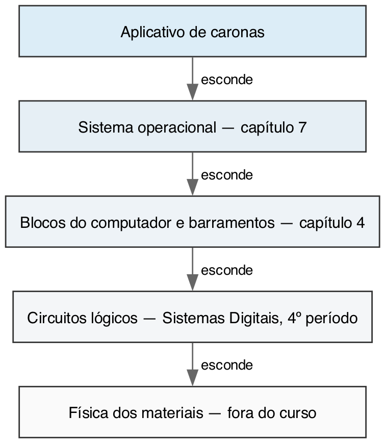

## Objetivos de aprendizagem

- Situar o curso de Ciência da Computação na sua organização curricular.
- Reconhecer o que a Ciência da Computação estuda, e o que ela não estuda.
- Identificar o próprio ponto de partida em relação aos conhecimentos da área.
- Descrever o que é pensamento computacional, em termos acessíveis a quem ainda
  não programa.

## Roteiro

- Apresentação da disciplina, do plano de ensino e dos critérios de avaliação.
- O curso e sua organização curricular.
- Panorama dos componentes do primeiro período.
- Diagnóstico de conhecimentos prévios, sem valor de nota.
- Pensamento computacional.

# O que a Ciência da Computação estuda

## Usar e construir são coisas distintas

Quem dirige um carro não precisa saber como o motor converte combustível em
movimento.

. . .

Quem projeta o motor precisa saber por quê.

. . .

**Vocês entraram no curso que estuda o porquê.**

## A pergunta central da área

Não é como usar um computador.

. . .

É **o que pode ser calculado, com que recursos e em quanto tempo**.

. . .

Um problema que ninguém sabe resolver não vira solução porque o computador é
rápido.

## O computador, em uma definição

Máquina de processamento de dados: recebe dados de entrada, transforma esses
dados segundo um programa armazenado e produz dados de saída [@forouzan2011].

. . .

Dessa definição saem quase todos os capítulos deste livro.

- Representar número, letra, foto e som → capítulos 5 e 6
- Onde o programa fica e como ele executa → capítulos 3, 4 e 7

## Algoritmo não é programa

**Algoritmo**: sequência finita de instruções, sem ambiguidade, que leva de uma
entrada a um resultado.

. . .

O algoritmo é o raciocínio. O programa é a escrita desse raciocínio em uma
linguagem que a máquina aceita.

. . .

Lógica de Programação trata da escrita. Esta disciplina trata do raciocínio e do
contexto.

## O que a área não é {.smaller}

Três expectativas que levam alunos a se decepcionar no primeiro ano.

::: {.incremental}
- **Curso de operação de programas.** Editor, planilha e editor de imagem são
  instrumentos de trabalho, e o curso não os ensina.
- **Curso técnico de manutenção.** Vocês estudam a estrutura interna para
  entender os limites da máquina, não para trocar peças.
- **Curso de programação.** A programação é a ferramenta central e continua
  sendo ferramenta. O produto do trabalho de vocês é a solução de problemas.
:::

# Quando o detalhe custa caro

## Casos reais e o que cada um antecipa

{fig-align="center" width="88%"}

## Ariane 5, 1996

Explodiu 40 segundos depois do lançamento, no voo inaugural.

. . .

Um número guardado em um formato grande foi convertido para um formato pequeno
demais para contê-lo [@esa1996].

. . .

O trecho defeituoso nem precisava estar rodando: servia ao alinhamento da
plataforma antes da decolagem.

## Mars Climate Orbiter, 1999

{fig-align="center" width="45%"}

Dois programas trocavam dados de impulso em unidades diferentes [@nasa1999].
Nenhum dos dois estava errado sozinho.

::: {.smaller}
Imagem da NASA/JPL, em domínio público, obtida no Wikimedia Commons.
:::

## CrowdStrike, 2024

{fig-align="center" width="60%"}

8,5 milhões de equipamentos, menos de 1% das máquinas com aquele sistema
[@microsoft2024]. Bastou para parar aeroporto.

::: {.smaller}
Fotografia de Smishra1, licenciada em CC BY-SA 4.0, obtida no Wikimedia Commons.
:::

## O que os três têm em comum

Em nenhum deles a equipe errou o objetivo do sistema.

. . .

O erro esteve em um detalhe de representação, de unidade ou de distribuição, e
se propagou muito além do trecho em que estava escrito.

. . .

É por isso que este livro gasta quatro capítulos com a forma como a informação é
representada dentro da máquina.

# Quanto custa uma solução

## Dez nomes e um milhão de nomes

Colocar dez nomes em ordem alfabética: qualquer método resolve.

. . .

Colocar em ordem as transações de um banco em um dia: outro problema, com a
mesma descrição.

. . .

O que muda é a escala.

## Dois métodos, o mesmo resultado

{fig-align="center" width="85%"}

## A escala é real

Em 2025, o Pix registrou quase 80 bilhões de transações e foi usado por cerca de
148 milhões de pessoas [@bcb2026].

. . .

Um método que quadruplica o esforço a cada duplicação não chega ao fim do dia.

. . .

**A pergunta a levar deste capítulo: quanto custa, e não apenas se funciona.**

# A área por dentro

## Três posturas na mesma área

::: {.incremental}
- **Matemática.** Um algoritmo é correto ou não, e isso não depende do
  equipamento.
- **Científica.** Um sistema real produz comportamento que ninguém previu, e
  entendê-lo exige medir, formular hipótese e testar.
- **Engenharia.** Prazo, orçamento e equipe limitam a solução tanto quanto a
  matemática do problema.
:::

. . .

Um profissional transita entre as três no mesmo dia.

## Os problemas que a área não resolve

{fig-align="center" width="82%"}

## Quatro categorias {.smaller}

::: {.incremental}
- **Indecidíveis.** Está demonstrado que não existe algoritmo. Turing provou
  isso mais de dez anos antes do primeiro computador eletrônico [@turing1937].
- **Intratáveis na prática.** A solução existe e o tempo é maior que qualquer
  prazo útil.
- **Mal especificados.** "Quero um sistema intuitivo" não diz o que contaria
  como cumprido.
- **Não técnicos.** Um sistema de matrícula não conserta uma regra injusta; ele
  a aplica mais rápido e a mais gente.
:::

# O curso

## Por que existem pré-requisitos

{fig-align="center" width="80%"}

Reprovar em uma disciplina do primeiro período custa além do semestre.

## Os componentes do primeiro período

- **Lógica de Programação** trata da escrita do algoritmo. Esta disciplina trata
  do raciocínio e do contexto.
- **Lógica Matemática** dá a linguagem formal que retorna em Sistemas Digitais.
- **Extensão e inovação** ligam o curso a demanda real, por exigência das
  diretrizes nacionais [@cne2018].

## Camadas de abstração

{fig-align="center" width="78%"}

# Pensamento computacional

## Quatro pilares

::: {.incremental}
- **Decomposição.** Quebrar o problema em partes tratáveis.
- **Reconhecimento de padrões.** Ver o que se repete entre as partes.
- **Abstração.** Decidir o que ignorar sem perder o essencial.
- **Algoritmo.** Descrever a solução em passos verificáveis.
:::

. . .

A formulação original está em @wing2006; um exame crítico dela, em @denning2019.

## O que ele não resolve

Pensamento computacional não substitui conhecimento do domínio.

. . .

Decompor um problema de saúde pública sem saber epidemiologia produz uma
decomposição arrumada e errada.

# Como a disciplina funciona

## Os dois blocos do semestre

| Encontros | Bloco |
|---|---|
| 1 a 8 | Fundamentos técnicos |
| 9 | Prova 1 |
| 10 a 17 | Profissão, ética e sociedade |
| 18 | Prova 2 |

## Piso e extensão

Cada capítulo distingue o que é **piso** do que é **extensão**.

. . .

Parte da turma programa desde a adolescência; parte nunca abriu um terminal.

. . .

Material calibrado só para o aluno mais preparado perde metade da turma em
silêncio.

## Como estudar

::: {.incremental}
- Ler o capítulo **antes** da aula, mesmo sem entender tudo.
- Exceção: quando o capítulo mandar parar e escrever, respondam ali, sem ler
  adiante.
- Os objetivos de aprendizagem são o critério de estudo: eles dizem o verbo que
  a avaliação vai cobrar.
- Conceito acumulativo não admite atraso. O capítulo 5 é usado sem aviso no
  capítulo 6.
:::

# A primeira tarefa

## Piso

**Uma frase.** Escrevam o que a Ciência da Computação estuda, sem usar a palavra
computador. Será comparada com o que vocês escreverem no capítulo 16.

. . .

**Uma decomposição.** Peguem uma tarefa que vocês executam sem pensar e quebrem
em passos verificáveis. Contem quantos passos surgiram e quais vocês nunca
tinham percebido que existiam.

## Extensão

Procurem os pontos em que a decomposição falha. E se o dado estiver errado? E se
a conexão cair? E se a operação for enviada duas vezes?

. . .

Cada resposta dessas é um passo que faltava, e é esse tipo de omissão que produz
defeito em software real.

## Referências {.scrollable}

::: {#refs}
:::
