## O propósito deste capítulo

> Ser capaz de avaliar uma afirmação sobre a origem de uma tecnologia,
> declarando o critério que a sustenta e distinguindo a data da ideia, a da
> primeira implementação e a da adoção em escala.

. . .

O propósito é **julgar afirmações sobre marcos**. Reconhecê-los é o meio.

## Objetivos de aprendizagem {.smaller}

- Justificar, com o critério declarado, por que um artefato é chamado de
  primeiro em alguma coisa.
- Distinguir a data da ideia, a da primeira implementação e a da adoção em
  escala.
- Reconhecer os marcos que separam as gerações de computadores e relacionar
  cada um ao problema que ele resolvia.
- Identificar pessoas cuja contribuição costuma ficar fora das listas usuais.
- Explicar por que a história da área ajuda a entender as tecnologias atuais.

# Cinco máquinas e uma pergunta

## Z3 {.smaller}

Konrad Zuse, Alemanha.

- Construída com **relés**, que são interruptores acionados eletricamente.
- Recebia a sequência de operações em fita perfurada.
- Funcionou.

## Colossus

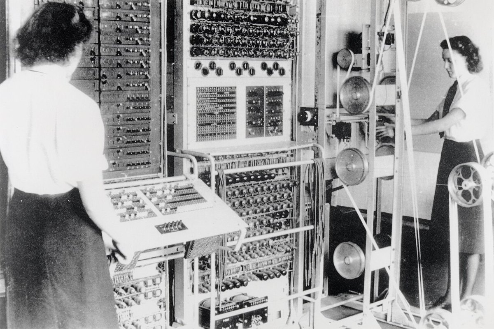{fig-align="center" width="62%"}

Bletchley Park, Reino Unido. Construído com válvulas para quebrar cifras.
Eletrônico, funcionou durante a guerra, fazia criptanálise.

::: {.smaller}
Imagem em domínio público, obtida no Wikimedia Commons.
:::

## Atanasoff-Berry Computer

Estados Unidos.

- Aplicava eletrônica à solução de sistemas de equações lineares.
- Nunca chegou a operar de forma plenamente confiável.

## Harvard Mark I

- Eletromecânico.
- Ocupava uma sala.
- Recebia instruções em fita.
- Produziu cálculos por anos seguidos.

## ENIAC

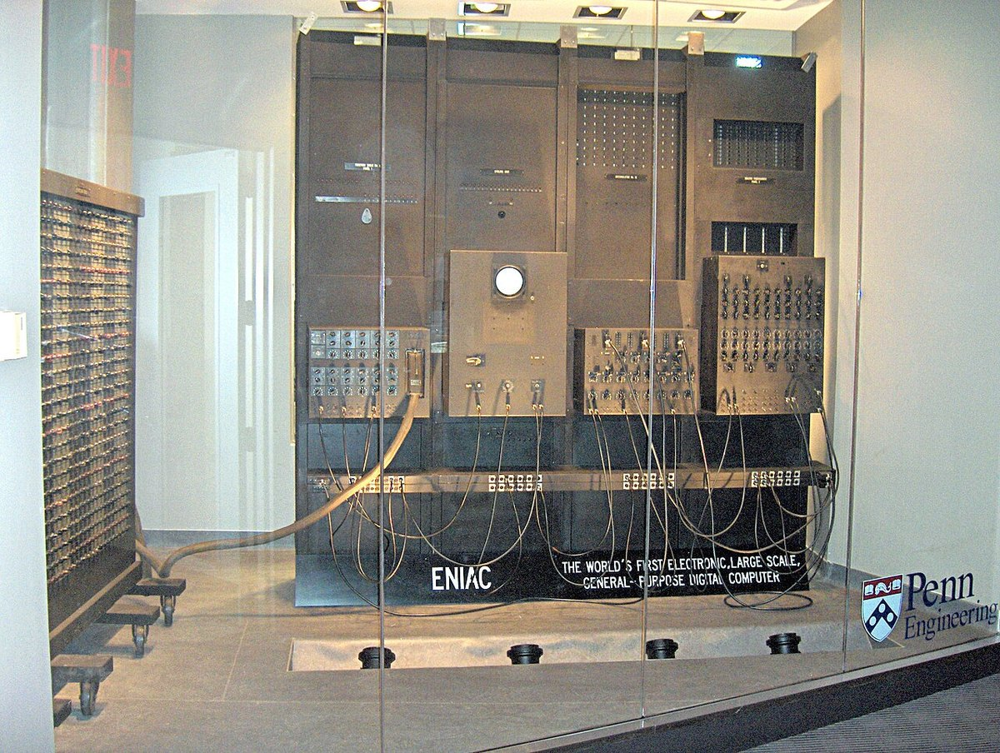{fig-align="center" width="62%"}

Eletrônico, resolvia problemas de tipos variados, funcionou. Programado por
cabos e chaves: trocar o problema levava dias.

::: {.smaller}
Fotografia de TexasDex, licenciada em CC BY-SA 3.0, obtida no Wikimedia Commons.
:::

# Parem aqui {background-color="#1a1a1a"}

## Escrevam agora {background-color="#1a1a1a" .r-fit-text}

1. Qual dessas cinco foi o **primeiro computador**?

2. Em uma frase, **por que** essa e não as outras?

## Guardem a folha {background-color="#1a1a1a"}

A segunda pergunta é a que interessa.

. . .

Escrevam mesmo que a resposta pareça óbvia.

. . .

A folha será usada duas vezes: daqui a cinco minutos e no fim do capítulo.

# Por que a resposta não fecha

## Comparem com dois colegas

::: {.incremental}
- **ENIAC**: "resolvia problemas de tipos diferentes"
- **Colossus**: "era eletrônico, os outros tinham peças que se moviam"
- **Z3**: "recebia um programa e podia ser reprogramado"
- **Harvard Mark I**: "funcionou de verdade, por anos"
:::

## Nenhuma dessas frases está errada

E é exatamente esse o problema.

. . .

Cada uma usa um **critério diferente** sem dizer que o está usando.

. . .

Versatilidade. Tecnologia. Programabilidade. Uso efetivo.

## O que falta não é dado

Duas pessoas que conheçam todos os fatos continuarão discordando enquanto não
disserem qual critério estão aplicando.

. . .

**O que falta é instrumento.**

## A pergunta de aprendizagem

> Que instrumentos permitem julgar uma afirmação sobre origem de tecnologia, em
> vez de apenas ter uma opinião sobre ela?

# Os instrumentos que faltavam

## Instrumento 1: o critério declarado {.smaller}

Peguem a folha de vocês. A frase contém um critério, mesmo sem nomeá-lo.

| **Critério** | **Pergunta que ele faz** |
|---|---|
| Eletrônico | Os sinais passam por componentes eletrônicos, e não por peças que se movem? |
| Programável | A sequência pode ser alterada sem reconstruir a máquina? |
| Propósito geral | Resolve classes variadas de problemas, ou apenas um? |
| Programa armazenado | As instruções ficam na memória, junto com os dados? |
| Operacional | Houve uso documentado e repetível, ou apenas um protótipo? |

Localizem o critério que vocês usaram sem nomear.

## O superlativo sem critério é propaganda

Quando lerem que uma empresa lançou o primeiro telefone com tela sensível ao
toque ou a primeira rede social, a pergunta é sempre a mesma:

. . .

**Primeiro sob qual critério?**

. . .

Protótipo, patente, venda, escala de adoção e influência são coisas distintas.

## Instrumento 2: as três camadas

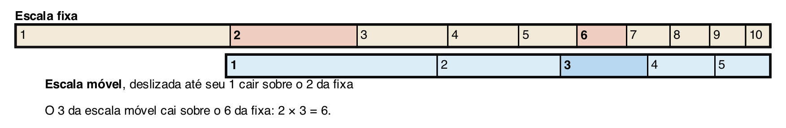{fig-align="center" width="92%"}

Problema, representação, mecanismo. A régua multiplica sem que o mecanismo saiba
multiplicar: ele só soma comprimentos.

## Instrumento 3: três datas diferentes

::: {.incremental}
- A data em que alguém **formulou a ideia**.
- A data em que alguém **construiu** um artefato que a incorpora.
- A data em que ele passou a ser **usado em escala**.
:::

. . .

A máquina analítica de Babbage: ideia sim, implementação não.

## Instrumento 4: evitar anacronismo

O ábaco é um registro de valores por posição, operado por quem conhece as regras.

. . .

Os cartões de Jacquard são um meio de controle que seleciona ações em um tear.

. . .

Apontem a continuidade **e** a diferença de escala, meio físico e capacidade.

# A cronologia

## Onze períodos

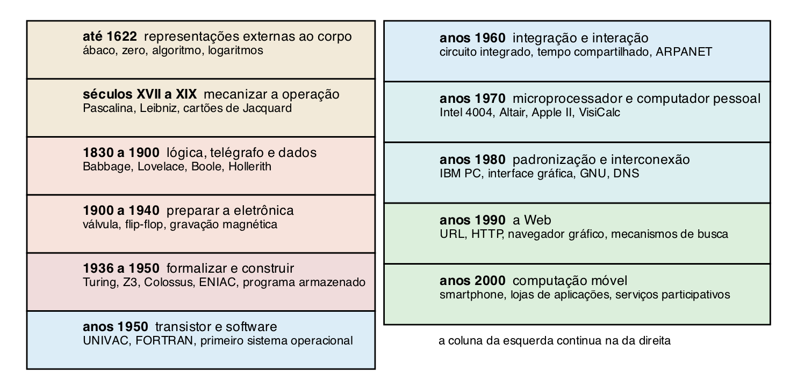{fig-align="center" width="92%"}

## O ábaco e a convenção de leitura

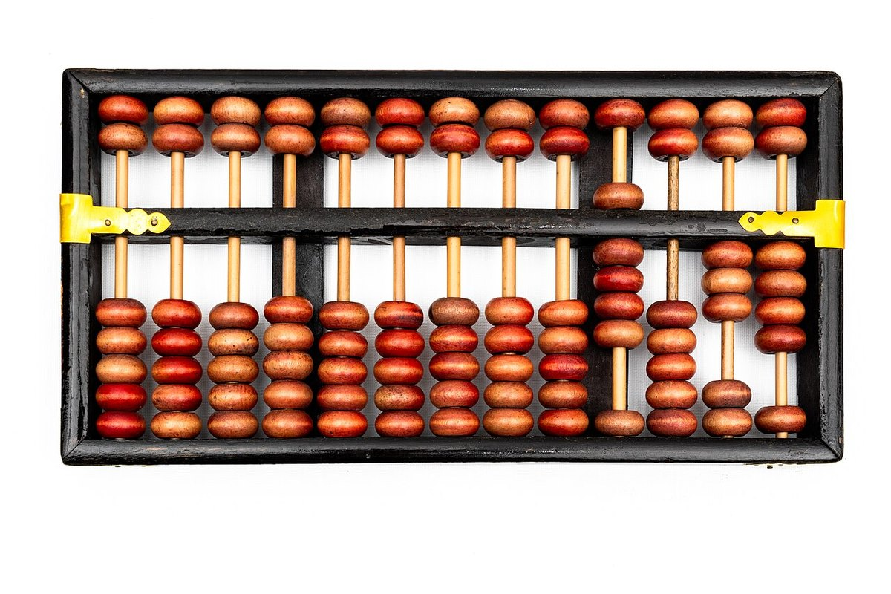{fig-align="center" width="52%"}

O resultado está na **convenção de leitura** combinada entre quem opera e quem
interpreta. A mesma lição volta no capítulo 5, com bits.

::: {.smaller}
Fotografia de Felix Winkelnkemper, licenciada em CC BY-SA 4.0,
Wikimedia Commons.
:::

## Pascalina: a engrenagem executa a convenção

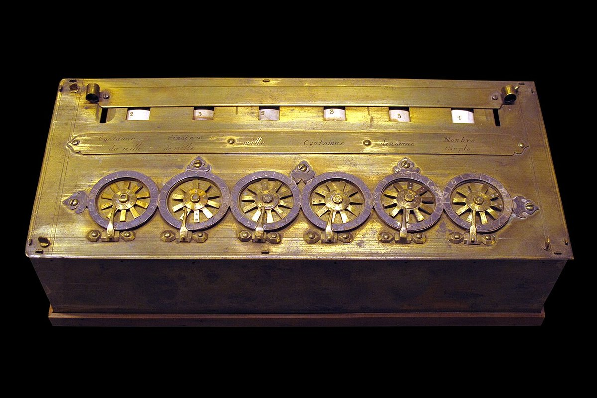{fig-align="center" width="55%"}

$8 + 7$: ao completar dez posições, a roda volta a zero e empurra uma unidade na
roda das dezenas. Ela não sabe aritmética.

::: {.smaller}
Fotografia de Rama, licenciada em CC BY-SA 3.0 fr, Wikimedia Commons.
:::

## Computador era uma pessoa

Por muito tempo, **computador** designava alguém contratado para executar
cálculos e produzir tabelas.

. . .

O trabalho era organizado como linha de produção: cada pessoa executava uma
etapa sobre o resultado da anterior, muitas vezes sem conhecer o objetivo do
conjunto.

. . .

Boa parte eram mulheres, e as equipes que operaram os primeiros computadores
eletrônicos vieram desse trabalho.

## A automação não fez o trabalho sumir

Ela o reorganizou, e com frequência tornou invisível quem o executava.

. . .

Reparem nas fotografias do Colossus e do ENIAC: em ambas há operadoras
trabalhando, e em nenhuma lista de "quem inventou o computador" elas aparecem.

. . .

É um padrão que volta no capítulo 13, com casos atuais.

## Jacquard: controle separado do mecanismo

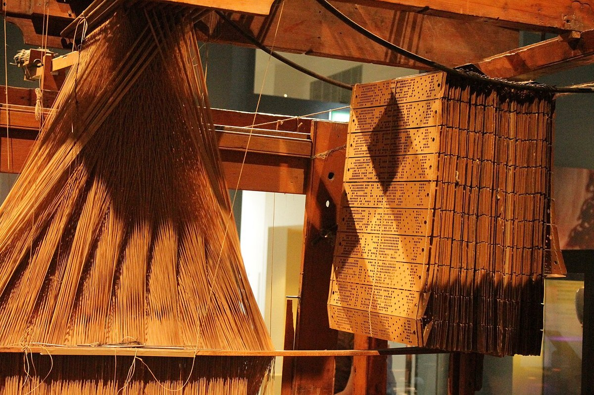{fig-align="center" width="58%"}

Trocar a sequência de cartões troca o produto sem reconstruir o tear.

::: {.smaller}
Fotografia de Stephencdickson, licenciada em CC BY-SA 4.0, Wikimedia Commons.
:::

## Babbage: as quatro funções

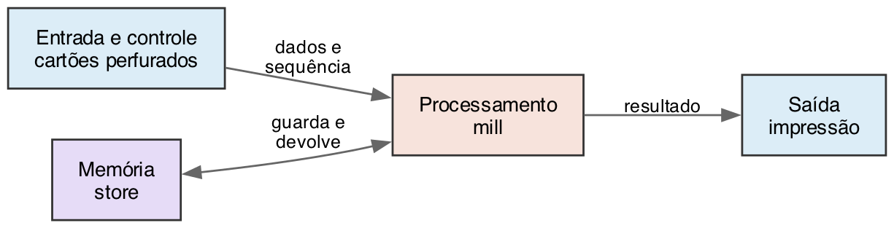{fig-align="center" width="88%"}

A mesma divisão reaparece nos capítulos 3 e 4, proposta um século antes de
existir máquina capaz de realizá-la.

## Lovelace e Boole

:::: {.columns}
::: {.column width="50%"}
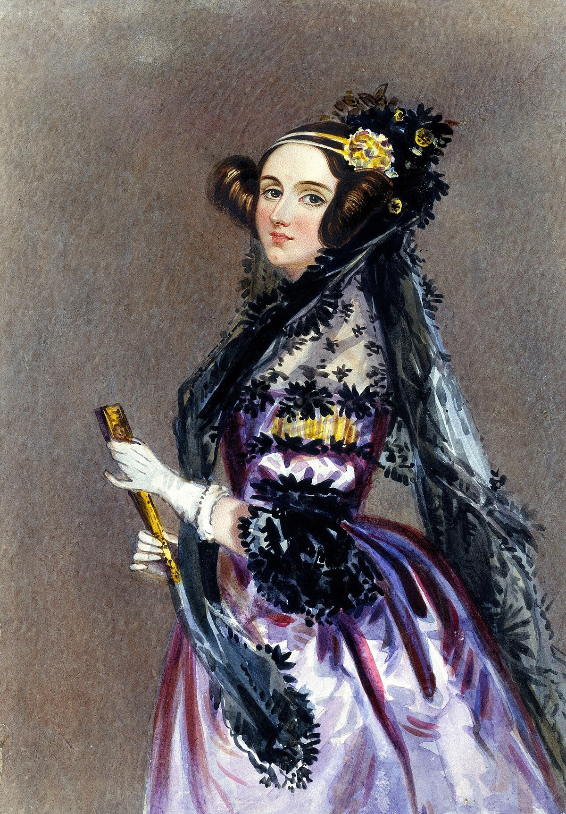{width="72%"}

Os símbolos não precisam representar quantidades.
:::
::: {.column width="50%"}
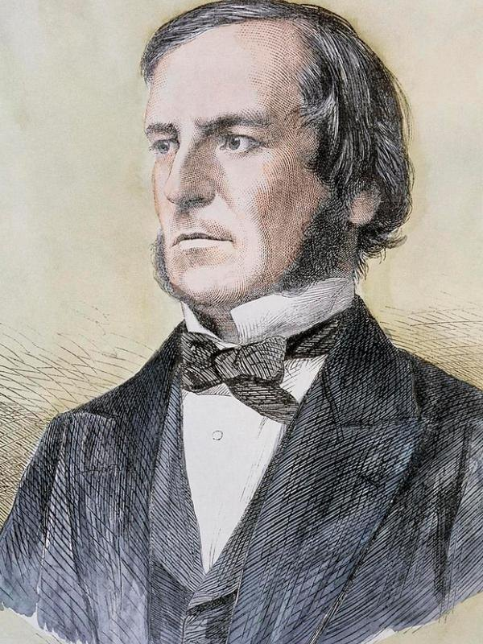{width="72%"}

Uma álgebra de dois valores, sem máquina em vista.
:::
::::

::: {.smaller}
Imagens em domínio público, obtidas no Wikimedia Commons.
:::

## Hollerith: a categoria vem antes do dado

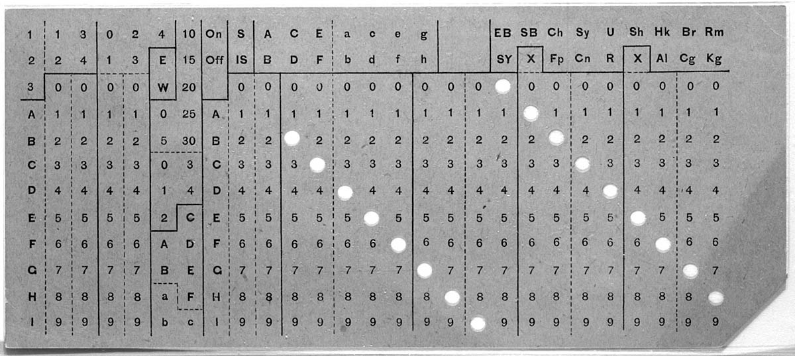{fig-align="center" width="88%"}

Um dado que não coube na categoria prevista não aparece no total, e ninguém que
leia o total percebe a ausência.

::: {.smaller}
Imagem em domínio público, obtida no Wikimedia Commons.
:::

## Turing: os limites antes dos instrumentos

Nos anos 1930, antes de qualquer computador eletrônico [@turing1937].

. . .

Fita, cabeçote, estados e regras. Ninguém pretendia construir isso.

. . .

**A área conheceu seus limites antes de conhecer seus instrumentos.**

# Voltando às cinco máquinas

## Agora com instrumento

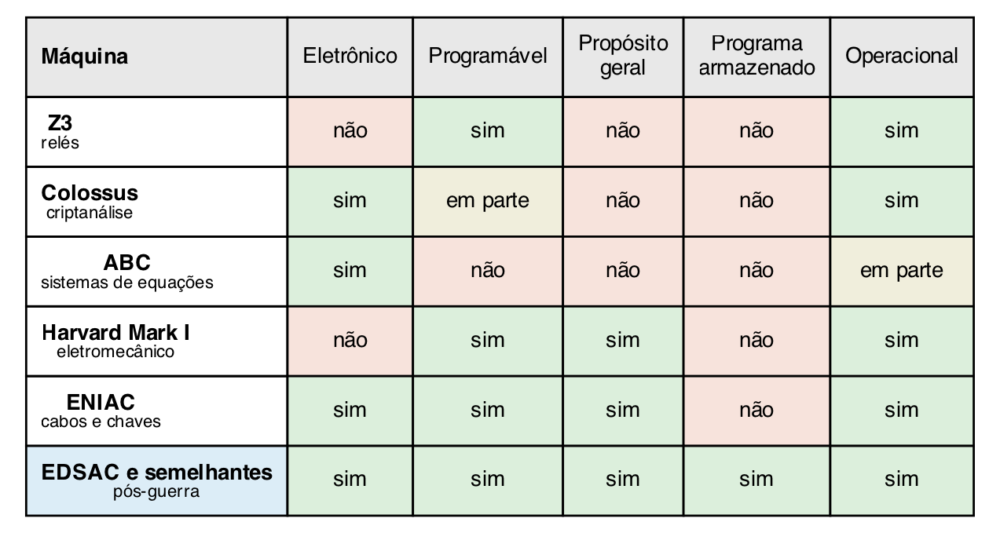{fig-align="center" width="92%"}

## Duas linhas resolvidas {.smaller}

**Z3**: programável (fita trocável) e operacional. Não eletrônica (relés se
movem), não é de propósito geral, não guarda programa. Duas colunas favoráveis.

. . .

**Colossus**: eletrônico e operacional, programável apenas em parte. Não é de
propósito geral.

. . .

Nenhuma é melhor que a outra: são favoráveis em **colunas diferentes**.

## Completem as outras três

ABC, Harvard Mark I e ENIAC.

. . .

Depois leiam por **coluna**, e não por linha: cada coluna tem pelo menos uma
resposta favorável, e nenhuma linha da guerra é favorável em tudo.

. . .

Só a linha do pós-guerra é favorável nas cinco.

## O programa armazenado

| Posição | Conteúdo | Papel |
|---|---|---|
| 0 | somar | Instrução |
| 1 | parar | Instrução |
| 2 | 4 | Dado |
| 3 | 5 | Dado |

Para trocar a soma por uma subtração, altera-se a posição 0. Sem cabo para
religar, sem cartão para reordenar.

## Três consequências {.smaller}

::: {.incremental}
- Programar deixa de ser trabalho físico e passa a ser **escrita**.
- Uma instrução, por estar na memória como dado, pode ser lida e escrita por
  outro programa. É o compilador do capítulo 7.
- Instrução e dado só se distinguem pelo uso. Essa fragilidade é a origem de
  toda uma família de problemas de segurança.
:::

# Do transistor ao telefone

## As quatro gerações {.smaller}

| Geração | Componente | O que a transição resolveu |
|---|---|---|
| Primeira | Válvula | Velocidade eletrônica, sem peça móvel |
| Segunda | Transistor | Confiabilidade, tamanho e consumo |
| Terceira | Circuito integrado | Custo por função e compatibilidade |
| Quarta | Microprocessador | Processador em uma peça |

A tabela conta a história pelo componente. Linguagem, sistema operacional,
interface e rede não aparecem nela, e explicam tanto quanto.

## O transistor

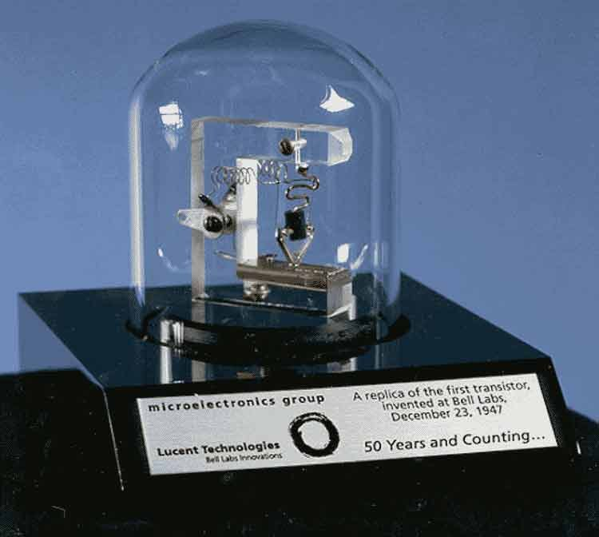{fig-align="center" width="40%"}

Comparem com os painéis do ENIAC. Uma máquina confiável pode ser vendida a quem
não tem equipe de manutenção própria.

::: {.smaller}
Fotografia de Revol Web, licenciada em CC BY-SA 2.0, Wikimedia Commons.
:::

# O software vira assunto próprio

## O que a tabela das gerações não conta

O programa como objeto de estudo distinto da máquina que o executa.

. . .

Depende do **programa armazenado**: sem instruções na memória, não há onde um
programa guardar o programa que ele produziu.

. . .

E depende de quem paga a conta. No laboratório, quem programava era quem havia
construído a máquina. Vendido a uma seguradora, o programador é um funcionário
que nunca viu o circuito — e a notação vira **problema de custo**.

## O UNIVAC I, 1951

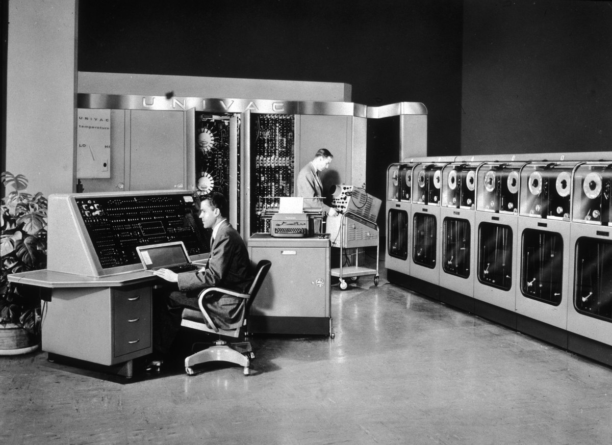{fig-align="center" width="62%"}

Doze mil caracteres de memória, cerca de duas mil operações por segundo, sete
toneladas. À direita, as fitas magnéticas que substituíram os cartões.

::: {.smaller}
Fotografia de funcionários do U.S. Census Bureau, em domínio público, Wikimedia
Commons.
:::

## Primeiro computador comercial? {.smaller}

| Máquina | Marco | Data |
|---|---|---|
| Ferranti Mark 1 | Entrega em Manchester | Fevereiro de 1951 |
| UNIVAC I | Aceitação pelo Censo dos EUA | 31 de março de 1951 |
| LEO I | Primeira aplicação comercial em uso | 5 de setembro de 1951 |

. . .

Ninguém discorda das datas. A divergência é sobre o que **comercial** quer dizer:
posta à venda, comprada por cliente pagante ou usada em rotina de negócio.

. . .

O LEO I foi construído por uma empresa de casas de chá, para calcular o custo de
pães e bolos.

## Grace Hopper {.smaller}

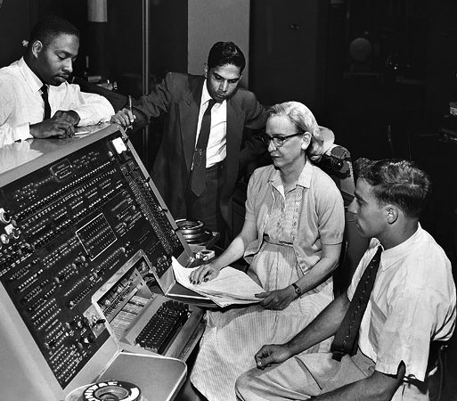{fig-align="center" width="40%"}

A tese: traduzir uma notação legível para instruções de máquina é **tarefa
mecânica**, e por isso cabe à máquina.

. . .

A resposta que ela ouviu: "computadores não entendiam inglês". Cerca de **três
anos** até a ideia ser aceita.

. . .

A objeção tinha base — gastar ciclos de um equipamento caríssimo traduzindo, em
vez de calcular, parecia desperdício. Tempo de máquina ficou barato; tempo de
gente, não.

::: {.smaller}
Hopper ao teclado de um UNIVAC, 1957. Smithsonian Institution, CC BY 2.0,
Wikimedia Commons.
:::

## A-0, 1952: cuidado com o anacronismo

Chamado de **compilador** na época.

. . .

Pelo vocabulário atual, é um **ligador e carregador**: juntava sub-rotinas
guardadas em fita e ajustava os endereços.

. . .

Não traduzia linguagem de alto nível — e não precisava, para provar o que
importava: a máquina pode montar o próprio programa.

## FLOW-MATIC, 1955–1959 {.smaller}

Primeira linguagem a expressar operações com frases parecidas com o inglês.

```
COMPARE PRODUCT-NO (A) WITH PRODUCT-NO (B)
IF EQUAL GO TO OPERATION 5
READ-ITEM A ; IF END OF DATA GO TO OPERATION 14
```

. . .

A razão foi outra: os clientes comerciais recusavam notação matemática.

. . .

**O leitor mudou, e a notação mudou com ele.**

## COBOL, 1959–1960

**Linguagem de alto nível**: construções descritas em termos do problema, e não
das operações do processador. "Alto" mede distância da máquina, não qualidade.

. . .

O Departamento de Defesa dos EUA operava 225 computadores, e um programa escrito
para um não servia aos outros.

. . .

Objetivo declarado: **portabilidade entre fabricantes**. É o que faz o código
sobreviver à troca do equipamento.

## Crédito, na direção contrária

Hopper é chamada com frequência de criadora do COBOL.

. . .

Ela foi **consultora técnica** do comitê. Jean Sammet liderou o projeto e
registrou isso explicitamente.

. . .

O crédito que cabe a ela é outro, e é grande: o FLOW-MATIC, base do COBOL, saiu
da equipe dela, e a tese sobre a máquina tradutora era dela.

## FORTRAN, LISP, ALGOL

Mesmo período, públicos incompatíveis.

::: {.incremental}
- **FORTRAN** — cálculo científico, feito para se parecer com notação matemática.
  Decisão oposta à do FLOW-MATIC, e as duas estão certas.
- **LISP** — manipulação de símbolos, não de quantidades. É o deslocamento que
  Lovelace apontou um século antes.
- **ALGOL** — a notação com que se escreve algoritmo até hoje.
:::

## O supervisor de lote

Antes: um operador humano preparava cada trabalho, e a máquina ficava parada
entre um e outro. Em equipamento alugado por hora, esse intervalo era o item mais
caro da conta.

. . .

O processamento em lote põe um **programa supervisor** a carregar o próximo assim
que o anterior termina. No caso melhor documentado, dez vezes mais trabalhos por
hora.

. . .

O supervisor é possível pelo mesmo motivo que o A-0: com programa armazenado, um
programa pode carregar e executar outro.

## Qual foi o primeiro sistema operacional {.smaller}

Mesma família da pergunta sobre o primeiro computador. Declarem o critério.

. . .

**Rodou em produção** — GM-NAA I/O, 1956, para o IBM 704. Feito pela General
Motors com a North American Aviation.

. . .

**Tem as funções que hoje definem um SO** — o supervisor do Atlas, Manchester,
1962: vários programas ao mesmo tempo e memória maior que a física.

. . .

Os primeiros sistemas operacionais foram escritos pelos **clientes**, não pelos
fabricantes. O que um SO faz é assunto do capítulo 7.

## O circuito integrado

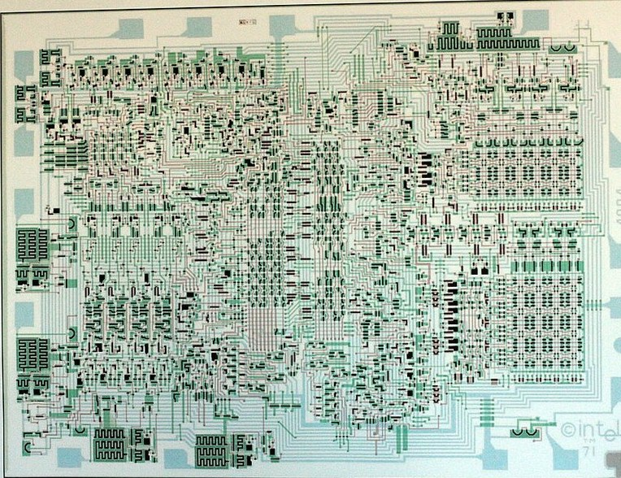{fig-align="center" width="50%"}

Compatibilidade preserva investimento, e por isso pesa mais que desempenho bruto
em quase toda decisão real.

::: {.smaller}
Desenho de projeto do Intel 4004. Fotografia de Wolfgang Stief, em CC0,
Wikimedia Commons.
:::

## O que os anos 1960 anteciparam

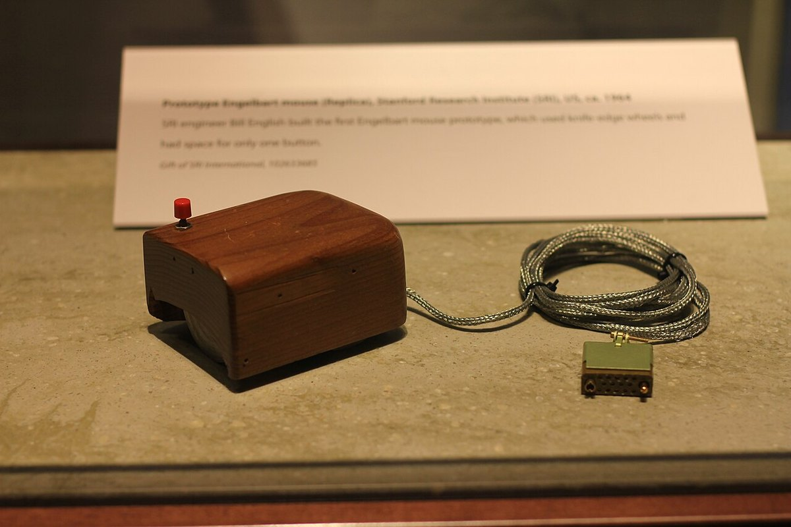{fig-align="center" width="45%"}

Entre esse objeto de madeira e o equipamento de vocês há mais de uma década.
Ideia, implementação e adoção outra vez.

::: {.smaller}
Fotografia de Michael Hicks, licenciada em CC BY 2.0, Wikimedia Commons.
:::

## Por que uma planilha vende um computador

Antes, testar uma hipótese exigia refazer todas as contas à mão, e por isso se
testava uma ou duas.

. . .

Depois, testar custa uma digitação, e por isso se testam vinte.

. . .

A máquina virou meio, e a aplicação virou motivo.

## Internet e Web não são a mesma coisa

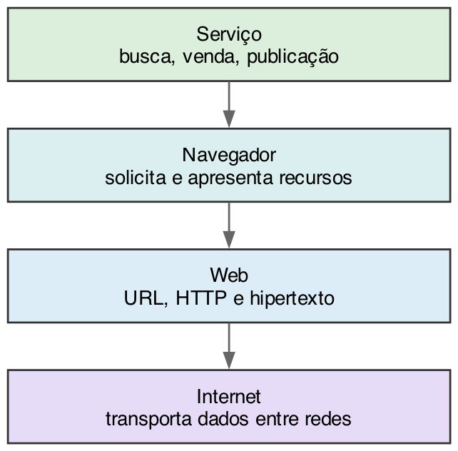{fig-align="center" width="38%"}

A Internet é anterior à Web em décadas. Correio eletrônico e transferência de
arquivos usam a Internet sem serem Web.

## Nuvem

Nuvem **não** elimina máquina física.

. . .

Ela desloca processamento e armazenamento para centros de dados que pertencem a
alguém, ficam em algum país, consomem energia de alguma matriz e estão sujeitos
a alguma legislação.

. . .

Cada um desses quatro fatos vira um capítulo do segundo bloco.

# Fechamento

## A etiqueta temporal {.smaller}

| Classe | Formulação segura |
|---|---|
| Marco documentado | "O livro registra que, em tal ano, ..." |
| Tendência observada | "O autor identifica uma tendência de ..." |
| Previsão | "O livro projeta que ..." |
| Estado atual | Verificar em fonte recente e datada |

Uma previsão impressa em um livro sério continua sendo uma previsão.

## Quatro padrões que se repetem {.smaller}

::: {.incremental}
- A **solução costuma preceder o problema**. A base dois esperou séculos por um
  circuito; a álgebra de Boole esperou quase um século por Shannon.
- A **adoção depende de aplicação concreta**, não de qualidade técnica isolada.
- **Compatibilidade e ecossistema** decidem disputas que a especificação não
  decide.
- Toda automação **reorganiza trabalho humano**, e o torna menos visível em vez
  de fazê-lo desaparecer.
:::

## A tarefa desta semana {.smaller}

**Aplicação.** Um marco da linha do tempo, com os quatro instrumentos: três
camadas, critério declarado, três datas, continuidade e diferença.

. . .

**Transferência.** Uma alegação de pioneirismo sobre um produto atual. Sob que
critério ela é verdadeira, e sob qual é falsa?

. . .

**Integração.** Recuperem a folha da abertura. Que critério vocês usaram sem
saber? O que conseguem decidir hoje que não conseguiam no início da aula?

## A pergunta que fecha

Se a resposta for "nada mudou, apenas sei mais nomes e datas", o capítulo falhou
com vocês.

. . .

O propósito era **julgar afirmações sobre marcos**. Reconhecê-los era só o
material de trabalho.

## Referências {.scrollable}

::: {#refs}
:::
