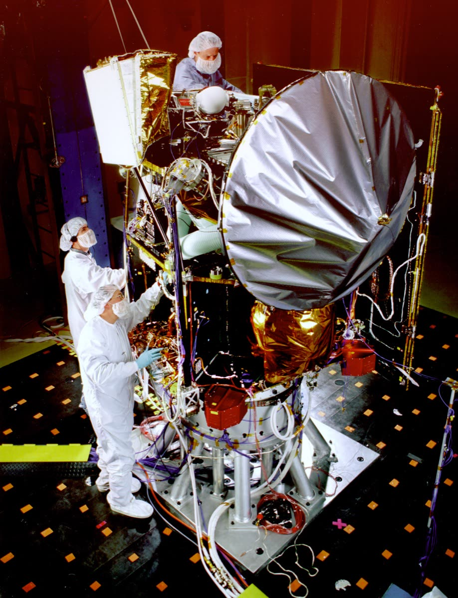

## Objetivos de aprendizagem

- Descrever um computador como um sistema com partes que interagem.
- Distinguir os papéis de hardware, software, dados, usuários e redes.
- Explicar o ciclo básico de funcionamento de um computador.
- Reconhecer que um mesmo problema pode ser resolvido em camadas diferentes do
  sistema.

## Roteiro

- A noção de sistema: partes, relações e fronteira.
- Hardware, software, dados, usuários e redes.
- Estrutura funcional: entrada, processamento, armazenamento e saída.
- O ciclo de busca e execução.
- Camadas de abstração, e em qual delas atacar um problema.

## O propósito deste capítulo

> Ser capaz de descrever um computador como um sistema, dizendo quais são as
> partes, o que passa entre elas e onde está a fronteira, e de usar essa
> descrição para decidir em que camada um problema deve ser atacado.

. . .

Reparem no verbo: **descrever**.

# Parem aqui {background-color="#1a1a1a"}

## Escrevam agora {background-color="#1a1a1a"}

Vocês enviam uma mensagem. Segundos depois ela aparece no telefone de um colega,
em outra cidade.

**Listem, em ordem, tudo o que aconteceu nesse intervalo.**

## Marquem onde {background-color="#1a1a1a"}

Ao lado de cada passo: aconteceu no telefone de vocês, no do colega, ou em outro
lugar?

. . .

Escrevam quantos passos conseguirem, mesmo os que vocês não sabem nomear.

. . .

A folha será usada duas vezes: daqui a alguns minutos e no fim da aula.

# Por que a lista não fecha

## Comparem com dois colegas

::: {.incremental}
- Quem escreveu **quatro passos** pôs "envia pela internet" como um passo só.
- Quem escreveu **trinta** abriu esse trecho em envio, roteamento, servidor,
  armazenamento e reenvio.
- Alguém marcou o servidor como "outro lugar".
- Alguém não mencionou servidor nenhum.
:::

## Nenhuma dessas listas está errada

E é exatamente aí que está o problema.

. . .

Cada uma corta o percurso em um lugar diferente, e para de dividir em um ponto
diferente, **sem dizer que critério usou**.

. . .

Duas pessoas que saibam todos os fatos continuam discordando sobre quantos
passos existem.

## O que falta não é informação sobre telefones

. . .

> Que descrição de um computador permite dizer, sem ambiguidade, quantas partes
> ele tem, o que cada uma faz e onde ele termina?

. . .

É essa descrição que as próximas seções constroem.

# A noção de sistema

## Sistema

Conjunto de partes que se relacionam para produzir um resultado que **nenhuma
das partes produz sozinha**.

. . .

Serve ao corpo humano, a uma escola, a um carro e a um computador. É essa
largura que a torna útil.

## Duas perguntas sobre as partes

| Pergunta | Elemento | No sistema de matrícula |
|---|---|---|
| Quais são as partes? | Partes | Telas, regras, banco de dados |
| O que cada uma faz? | Partes | Tela recebe; regra confere vaga |

## Duas perguntas sobre a relação

| Pergunta | Elemento | No sistema de matrícula |
|---|---|---|
| O que passa entre elas? | Relações | Pedido, consulta, resposta |
| Onde está a fronteira? | Fronteira | Dentro: telas e regras; fora: correio |

Há três elementos e quatro perguntas, porque as partes rendem duas.

## A fronteira é uma decisão

{fig-align="center" width="86%"}

O correio eletrônico está **fora**. A equipe entrega a mensagem e confia.

## Quem traça a fronteira decide de quem é a culpa

Fronteira mais larga: mais controle e mais responsabilidade, sempre nas duas
direções.

. . .

**Mars Climate Orbiter.** Um programa escrevia no sistema inglês, o outro lia
como métrico. A conversão não estava dentro de nenhum dos dois, porque ninguém a
colocou lá.

. . .

O defeito morava na relação, que é o lugar que a lista de peças não mostra.

## Mars Climate Orbiter

{width=35% fig-alt="Sonda Mars Climate Orbiter durante teste acústico, com três técnicos junto ao equipamento."}

Uma fronteira mal definida deixa uma responsabilidade sem dono.

## Nenhuma peça sabe o que é uma letra

Um teclado produz sinal elétrico. Um processador soma, compara e move valores.
Uma tela acende pontos coloridos.

. . .

O texto é resultado da **relação** entre os três.

. . .

E a recíproca: um sistema pode falhar sem que nenhuma peça esteja com defeito.

## Estado

O que o sistema acumulou até agora: quem está autenticado, quais turmas têm
vaga, quantas tentativas falharam.

. . .

Explica por que a mesma entrada nem sempre produz a mesma saída.

. . .

"O sistema deu erro quando cliquei aqui" é relato insuficiente. Falta o que já
tinha sido feito antes.

# Os cinco componentes

## Hardware, software, dados, usuários e redes

{fig-align="center" width="72%"}

## Cada um falha de um jeito

| Componente | Como a falha se apresenta |
|---|---|
| Hardware | Abrupta, ligada a calor ou desgaste |
| Software | Repetível: mesmas condições, mesmo erro |
| Dados | O programa funciona, o resultado está errado |
| Usuários | Faz o que foi pedido, e não o que se queria |
| Redes | Lentidão e intermitência |

. . .

Julho de 2024: 8,5 milhões de máquinas paradas e **nenhum equipamento quebrado**.

# A estrutura funcional

## Quatro funções, e onde cada bloco fica

{fig-align="center" width="92%"}

A posição se repete no capítulo 4. Guardem o desenho.

## O repertório do processador é pobre

Não existe instrução para exibir uma foto, enviar uma mensagem ou ordenar uma
lista.

. . .

Existe: somar, comparar, copiar, pular.

. . .

**Tudo o mais é combinação dessas operações, em quantidade.**

## Memória principal e armazenamento secundário

| Aspecto | Memória principal | Armazenamento secundário |
|---|---|---|
| O que guarda | O que executa agora | O que precisa durar |
| Ao desligar | Perde | Mantém |
| Acesso | Direto | Pela memória |
| Velocidade | Alta | Baixa |

## Vocês já viveram as duas

O documento não salvo some quando a máquina desliga, porque estava só na
memória principal.

. . .

A máquina fica lenta com muitos programas abertos porque falta memória
principal: o sistema começa a mover para o armazenamento secundário o que não
cabe, e o armazenamento secundário é lento.

## A mesma estrutura: elevador e semáforo

| Sistema | Entrada | Processamento | Armazenamento | Saída |
|---|---|---|---|---|
| Elevador | Botões, sensores | Ordem das chamadas | Chamadas e configuração | Motor, porta, visor |
| Semáforo | Sensor, relógio | Tempo de cada fase | Programa de fases | Lâmpadas |

## A mesma estrutura: telefone

| Entrada | Processamento | Armazenamento | Saída |
|---|---|---|---|
| Tela e microfone | Aplicativos | Memória e armazenamento | Tela, som e rede |

. . .

**Sistema embarcado.** Em número de unidades, é a maior parte dos computadores
do mundo, e quase nenhum tem tela ou teclado.

## Barramento

O caminho físico compartilhado por onde os blocos trocam valores.

. . .

Por ele passam **endereços**, **dados** e **sinais de controle**.

. . .

Quando duas trocas precisam do barramento ao mesmo tempo, uma delas espera.

# O ciclo de busca e execução

## O computador faz uma coisa só, e a repete

::: {.incremental}
- **Buscar** a instrução do endereço apontado.
- **Decodificar**: qual é a operação, quais são os operandos.
- **Executar** e guardar o resultado.
- **Recomeçar**, no endereço seguinte ou no que a instrução indicou.
:::

. . .

É a repetição, e não a complexidade de cada passo, que produz o que vocês veem
na tela.

## Programa armazenado

Cada posição tem um **endereço**.

. . .

Instruções e dados dividem a mesma memória.

. . .

O papel de cada posição vem do uso que o processador faz dela.

## Memória mínima

::: {style="font-size: 0.95em;"}
| Endereço | Conteúdo | Papel |
|---:|---|---|
| 0 | somar 4 + 5 → 6 | Instrução |
| 1 | comparar 6 e 7 | Instrução |
| 2 | se maior, ir para 0 | Instrução |
| 3 | parar | Instrução |
| 4 | 12 | Dado |
| 5 | 30 | Dado |
| 6 | 0 | Dado |
| 7 | 100 | Dado |
:::

## Contador de programa

Registrador que guarda o endereço da **próxima** instrução.

. . .

Ao terminar um ciclo, ele avança. Por isso as instruções ficam em posições
consecutivas.

. . .

Alterá-lo de propósito é o que produz repetição e decisão.

## Um traçado, quatro ciclos

| Ciclo | CP | Instrução | Resultado |
|---:|---:|---|---|
| 1 | 0 | $4 + 5 \to 6$ | $6$: $0 \to 42$ |
| 2 | 1 | comparar 6 e 7 | $42 < 100$ |
| 3 | 2 | se maior, ir para 0 | CP avança |
| 4 | 3 | parar | Termina |

. . .

O ciclo 3 gastou trabalho e não mudou nada. Boa parte de qualquer programa é
feita de ciclos assim.

## O processador não sabe o que calcula

Ele somou $12$ com $30$ porque a instrução mandou.

. . .

Se aqueles valores eram reais, gramas ou minutos, ele não sabe. O caso da sonda
mostra o preço de a equipe também não saber.

## Trocar um dado muda o programa

Troquem o limite da posição 7 de $100$ para $10$. Nenhuma instrução mudou.

. . .

Agora a comparação dá maior, o desvio volta para 0, e o programa soma de novo.

. . .

E de novo, sem parar: a posição 6 recebe sempre o mesmo $42$.

. . .

Um dado transformou um programa que termina em um que não termina.

## Um laço, do jeito que a máquina faz

| End. | Conteúdo |
|---:|---|
| 0 | somar o conteúdo de 5 ao de 4 e guardar em **4** |
| 1 | comparar o conteúdo de 4 com o de 6 |
| 2 | se menor, pular para 0 |
| 3 | parar |

Dados: posição 4 = $0$, o contador · posição 5 = $1$, o passo · posição 6 = $3$,
o limite

. . .

O resultado da soma volta para a **mesma posição** que entrou na conta. Por isso
o valor cresce a cada passagem.

## Duas voltas, e a terceira é de vocês

O contador de programa, ciclo a ciclo:

$$0 \to 1 \to 2 \;\to\; 0 \to 1 \to 2 \;\to\; \;?\;$$

A posição 4 vale $1$, depois $2$. E depois?

. . .

Chega a $3$. A comparação deixa de dar menor, o desvio não desvia, e o contador
avança até a parada.

## Nenhuma instrução se chama "repetir"

O laço saiu de **comparar** e **pular**, mais o contador voltando a um endereço
já visitado.

. . .

Três voltas, porque o limite vale $3$ e o passo vale $1$.

## Programa igual, estado diferente

Os ciclos 1, 4 e 7 são a mesma instrução.

. . .

Resultado diferente em cada um, porque o dado da posição 4 mudou entre eles.

. . .

O que Lógica de Programação escreve em uma linha é isto aqui embaixo.

## Desvio e interrupção

**Desvio** vem do programa: uma instrução manda continuar em outro endereço.

. . .

**Interrupção** vem de fora: um dispositivo avisa, o processador guarda onde
estava, atende e volta.

. . .

Esse "onde estava" é o **estado da máquina**: contador de programa,
registradores e memória.

. . .

É a interrupção que permite reagir ao mundo sem ficar perguntando o tempo todo
se alguém tocou na tela.

## Executando e avançando são coisas diferentes

Um pedido ao armazenamento secundário demora o equivalente a milhões de ciclos.
Pela rede, mais ainda.

. . .

O sistema operacional entrega o processador a outro programa e devolve quando o
dado chega.

. . .

Trocar o processador não acelera um programa que passa o tempo esperando.

## O relógio marca o ritmo

O relógio do processador libera os passos do ciclo em intervalos regulares.

. . .

Em uma fração de segundo, cabem milhões de ciclos. Por isso, operações simples
formam uma imagem em movimento.

. . .

Uma demora pequena em cada volta se torna grande quando a volta se repete muitas
vezes.

# Do toque na tela ao pixel

## O toque começa como fenômeno físico

{width=82% fig-alt="Pessoa toca a tela sensível de um computador portátil."}

O controlador mede a alteração física e a transforma em números para o
processador.

## O percurso completo

::: {.incremental}
1. O toque vira números e uma **interrupção**.
2. O sistema operacional entrega o evento ao aplicativo certo.
3. O aplicativo monta a mensagem na memória e pede o envio.
4. O sistema operacional passa os dados à placa de rede.
5. A mensagem cruza a rede, passa por um servidor e chega ao destinatário.
6. A confirmação volta, produz interrupção e atualiza a tela.
:::

## O percurso, em camadas

```{mermaid}
%%| fig-width: 9
%%| echo: false
flowchart LR
  T[Tela] -->|interrupção| SO[Sistema operacional]
  SO -->|evento| A[Aplicativo]
  A -->|mensagem| R[Rede]
  R --> S[Servidor]
  S -->|confirmação| R
  R --> A
  A -->|atualização| SO
  SO -->|imagem| T
```

## Onde o tempo é gasto

O processamento é a parte **mais rápida** de todas.

. . .

Quase todo o tempo de espera está na rede e no armazenamento secundário, que
envolvem distância física ou movimento de meio físico.

. . .

Otimizar a parte que consome 2% do tempo produz um ganho de, no máximo, 2%.

## Comparem com a folha de vocês

A resposta típica omite o sistema operacional inteiro e trata a rede como um
único passo.

. . .

Isso é esperado. É exatamente o efeito que as camadas de abstração produzem.

# Camadas de abstração

## Camada

Parte do sistema que oferece serviços às partes acima e **esconde como** esses
serviços são realizados.

. . .

O aplicativo pede o envio. Não sabe se a saída é por rede sem fio ou por cabo,
nem qual é o fabricante da placa.

. . .

A camada de cima conhece a de baixo pelo serviço. A de baixo não conhece quem
está acima.

## Por que elas existem

::: {.incremental}
- **Trocar a implementação** sem que a camada de cima perceba.
- **Dividir o trabalho**: ninguém domina do circuito ao aplicativo.
- **Limitar o que é preciso saber**: vocês vão programar neste semestre sem
  saber como o processador soma.
:::

## E o que elas custam

::: {.incremental}
- **Esforço adicional**: a passagem consome tempo e memória.
- **Distância entre defeito e sintoma**: erro três camadas abaixo chega
  deformado em cima.
- **A ilusão de que o que a camada esconde não existe.** É o preço mais caro.
:::

## Quando a abstração deixa de esconder

Buscar um dado na memória e buscá-lo em outro computador são oferecidos de forma
parecida. O tempo difere em várias ordens de grandeza.

. . .

Um programa escrito como se fossem equivalentes funciona no teste e falha em uso
real, sem que nenhuma mensagem de erro aponte a causa.

# Um sintoma, quatro camadas

## A lista de turmas leva oito segundos

{fig-align="center" width="72%"}

## Como escolher

| Critério | O que perguntar |
|---|---|
| Causa | Remove a causa? |
| Alcance | Quem mais muda? |
| Custo | O que exige? |
| Reversibilidade | Quanto custa desfazer? |
| Durabilidade | Vale com o volume dobrado? |

. . .

De cima para baixo: as camadas de cima são mais baratas, afetam menos gente e
são mais fáceis de desfazer.

## Os dois erros

Resolver **embaixo** o que é problema de cima: comprar equipamento para
compensar programa mal construído. Funciona uma vez.

. . .

Resolver **em cima** o que é problema de baixo: reescrever o programa quando a
lentidão vem da conexão.

. . .

Mesma origem: agir antes de medir.

# Fechamento

## A tarefa: aplicação e transferência

**Aplicação.** Descrevam um sistema que vocês usam pelas **quatro perguntas**, e
identifiquem nele os **cinco componentes**: hardware, software, dados, usuários e
redes.

. . .

**Transferência.** Três queixas reais sobre o sistema de matrícula. Para cada
uma: o instrumento das camadas ajuda? Uma delas não é problema de camada.

## A tarefa: integração

**Integração.** Recuperem a folha da abertura. Quantos passos vocês previram?
Quais dos omitidos pertencem a camadas que o sistema esconde de propósito?

. . .

O enunciado completo das três partes está no capítulo, na seção "A tarefa desta
semana", com as tabelas a que cada uma se refere.

## A pergunta que fecha

A lista de vocês estava incompleta porque o sistema foi projetado para que ela
pudesse estar.

. . .

Reconhecer o que uma camada esconde é diferente de saber o que ela faz.

. . .

O capítulo 4 desce uma camada e abre os blocos que aqui foram caixas fechadas.

## Referências {.scrollable}

::: {#refs}
:::
