## Objetivos de aprendizagem {.smaller}

- Identificar os componentes da unidade central de processamento e a função de
  cada um.
- Distinguir os tipos de memória pela velocidade, custo e volatilidade.
- Explicar a função dos barramentos e das interfaces na comunicação entre
  componentes.
- Classificar periféricos e dispositivos por sua função de entrada, saída ou
  ambas.
- Prever em que ponto do percurso de um valor o tempo de uma operação é gasto.

## Roteiro {.smaller}

- O processador por dentro: controle, cálculo e registradores.
- O repertório de instruções de uma máquina.
- A hierarquia de memória, do registrador ao disco.
- Barramentos de dados, endereços e controle.
- Interfaces, portas, controladoras e periféricos.

## O propósito deste capítulo {.smaller}

> Ser capaz de explicar por onde um valor passa dentro do equipamento, do
> registrador ao disco, e de usar essa explicação para prever onde o tempo de
> uma operação vai ser gasto.

. . .

O capítulo 3 deixou três caixas fechadas: o processador, a memória e o caminho
entre eles.

. . .

Reparem no verbo: **explicar**.

# Parem aqui {background-color="#1a1a1a"}

## Escrevam agora {background-color="#1a1a1a" .r-fit-text}

Um programa soma dois números guardados na memória e grava o resultado de volta.

**Escrevam, em ordem, tudo o que o equipamento faz.**

## Mais duas perguntas {background-color="#1a1a1a"}

Onde os dois números ficam guardados enquanto a soma acontece?

. . .

Qual das etapas que vocês listaram demora mais que as outras?

. . .

Guardem a folha. Ela volta no fim da aula.

# Por que a lista fica curta

## A resposta típica tem três passos

Buscar os dois números. Somar. Gravar o resultado.

. . .

Correta. E curta demais para prever qualquer coisa.

## A pergunta que denuncia {.smaller}

Com três passos, a resposta sobre qual demora mais costuma ser **a soma**.

. . .

Neste capítulo vocês vão ver que a soma é o passo mais rápido, com folga de
várias ordens de grandeza.

. . .

> Onde um valor está guardado em cada instante, quanto custa alcançá-lo em cada
> um desses lugares, e por que caminho ele viaja entre eles?

# O processador por dentro

## O interior do processador

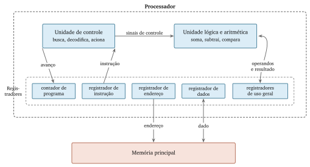{width=88% fig-alt="Dentro de uma moldura rotulada Processador, a unidade de controle e a unidade lógica e aritmética em cima, e cinco registradores em linha embaixo, ligados entre si e à memória principal."}

## Unidade de controle {.smaller}

Busca a próxima instrução, descobre o que ela manda fazer e aciona quem vai
fazê-la.

. . .

Executa sempre a mesma rotina, sem parar, enquanto houver energia.

. . .

Nenhum bloco da figura sabe o que o programa está fazendo. A unidade de
controle sabe qual é a instrução atual, e apenas ela.

## Unidade lógica e aritmética {.smaller}

Recebe um ou dois valores, recebe um sinal dizendo qual operação aplicar, e
devolve um resultado.

. . .

Repertório curto: somar, subtrair, comparar, operar sobre bits.

. . .

Ela não busca nada e não guarda nada.

## Duas palavras antes de seguir {.smaller}

Um **bit** é a menor porção de informação que o equipamento guarda, com dois
estados possíveis.

. . .

Um **byte** é um grupo de oito bits. É a unidade em que se mede capacidade: os
KB, MB e GB dos anúncios são múltiplos dele.

. . .

O capítulo 6 retoma os dois com o cuidado que eles merecem.

## Registradores {.smaller}

::: {.incremental}
- **Contador de programa** — o endereço da próxima instrução.
- **Registrador de instrução** — a instrução que está sendo executada.
- **Registrador de endereço** — onde ler ou escrever na memória.
- **Registrador de dados** — o valor lido ou a escrever.
- **Registradores de uso geral** — o rascunho do processador.
:::

## Por que eles existem

Alcançar a memória principal custa cerca de **cem vezes** mais tempo que
alcançar um registrador [@patterson2014].

. . .

Um programa que soma cem números busca cada um uma vez, acumula em um
registrador e escreve o resultado uma vez só.

## Exemplo: uma soma, passo a passo {.smaller .scrollable}

| Passo | Quem age | O que acontece |
|---|---|---|
| 1 | Unidade de controle | Coloca $40$ no registrador de endereço e pede leitura |
| 2 | Memória | Devolve $12$, que chega ao registrador de dados |
| 3 | Unidade de controle | Copia $12$ para um registrador de uso geral |
| 4 | Unidade de controle | Coloca $41$ no registrador de endereço e pede leitura |
| 5 | Memória | Devolve $30$, que chega ao registrador de dados |
| 6 | Unidade de controle | Copia $30$ para outro registrador de uso geral |
| 7 | Unidade lógica e aritmética | Soma os dois registradores |
| 8 | Unidade de controle | Coloca $42$ no registrador de endereço |
| 9 | Unidade de controle | Coloca o resultado no registrador de dados e pede escrita |
| 10 | Memória | Grava o valor na posição $42$ |

## Dez passos, uma soma

Dos dez passos, **apenas o passo 7** é a soma.

. . .

Os outros nove levam os valores até onde a soma pode acontecer e trazem o
resultado de volta.

## Uma fotografia do processador

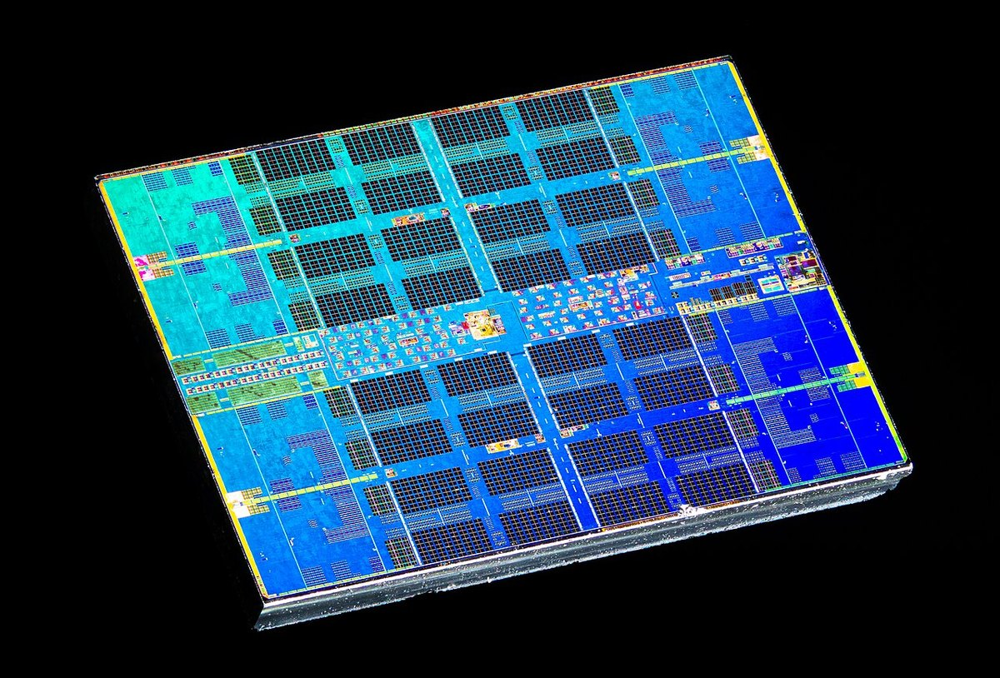{width=62% fig-alt="Pastilha de silício em cores falsas, com regiões extensas de padrão repetido e faixas estreitas de estrutura irregular."}

## O que a fotografia mostra {.smaller}

::: {.incremental}
- Regiões de padrão repetido: **memória**, o mesmo circuito copiado milhões de
  vezes.
- Regiões de estrutura irregular: **lógica**, o controle e o cálculo.
- A maior parte da área é memória.
:::

. . .

Em inglês, a unidade central de processamento é *central processing unit*, a
sigla CPU. A pastilha é o *die*; cada conjunto de controle, cálculo e
registradores dentro dela é um **núcleo**, ou *core*.

. . .

Oito núcleos, e não oito processadores.

# O repertório de instruções

## O que uma instrução carrega {.smaller}

| Instrução | Código da operação | Operando 1 | Operando 2 | Operando 3 |
|---|---|---|---|---|
| Somar dois registradores | somar | reg. 3 | reg. 1 | reg. 2 |
| Ler da memória | carregar | reg. 1 | endereço $40$ | — |
| Desviar se maior | desviar-se-maior | endereço $12$ | — | — |

. . .

Na memória, tudo isso é uma sequência de bits. Em muitas famílias ela tem
tamanho fixo, tipicamente quatro bytes; na x86, comprimento variável.

## As quatro famílias {.smaller}

| Família | O que faz | Exemplos |
|---|---|---|
| Transferência de dados | Move valores entre memória e registradores | carregar, armazenar |
| Aritmética e lógica | Combina valores e produz um resultado | somar, comparar |
| Controle de fluxo | Muda qual é a próxima instrução | desviar, chamar |
| Entrada e saída | Conversa com dispositivos | ler porta, escrever porta |

. . .

A primeira é a mais usada. A terceira é a que torna o computador programável no
sentido forte.

. . .

A quarta nem sempre existe: máquinas da família ARM alcançam o dispositivo pelas
instruções de transferência de dados, sobre endereços reservados.

## Exemplo: somar dez valores {.smaller .scrollable}

| Endereço | Instrução | O que faz |
|---|---|---|
| 0 | carregar reg. 1, valor $0$ | Zera o acumulador |
| 1 | carregar reg. 2, endereço $40$ | Guarda o endereço do próximo valor |
| 2 | carregar reg. 3, conteúdo do endereço em reg. 2 | Traz o valor apontado |
| 3 | somar reg. 1, reg. 1, reg. 3 | Acumula |
| 4 | somar reg. 2, reg. 2, valor $1$ | Aponta para o seguinte |
| 5 | comparar reg. 2, valor $50$ | Já passou do último? |
| 6 | desviar-se-menor endereço $2$ | Se não, volta |
| 7 | armazenar reg. 1, endereço $50$ | Grava o total |
| 8 | parar | Fim |

## Três observações {.smaller}

::: {.incremental}
- Somar mil números usaria as **mesmas nove instruções**. Muda o valor $50$.
- A instrução do endereço 2 usa um registrador como endereço: **endereçamento
  indireto**.
- Nada aqui se parece com uma linguagem de programação.
:::

## Repertório não é linguagem {.smaller}

O **repertório de instruções** é uma característica do equipamento, fixada no
circuito.

. . .

Duas famílias que vocês vão encontrar: **x86** em computadores de mesa e
servidores, **ARM** em telefones.

. . .

Daí vem metade da explicação de um programa precisar ser distribuído em duas
versões.

. . .

A outra metade é o sistema operacional, que também difere. Separar as duas é
assunto do capítulo 7.

# A hierarquia de memória

## O problema {.smaller}

Memória rápida é cara. Memória barata é lenta.

. . .

A velocidade dos processadores cresceu muito mais rápido que a da memória.
@wulf1995 chamaram esse afastamento de **muro da memória**.

. . .

A saída adotada foi não escolher: vários tipos ao mesmo tempo, em níveis.

## Três unidades, e a relação entre elas {.smaller}

- Um milissegundo (ms) é a milésima parte do segundo.
- Um microssegundo ($\mu$s) é a milésima parte do milissegundo.
- Um nanossegundo (ns) é a milésima parte do microssegundo.

. . .

Entre o topo e a base da hierarquia há um fator de cerca de **dez milhões**.

## Os cinco níveis

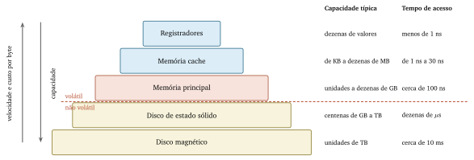{width=95% fig-alt="Cinco faixas de largura crescente: registradores, cache, memória principal, disco de estado sólido e disco magnético, com capacidade e tempo de acesso de cada uma."}

## Volátil e não volátil {.smaller}

**Volátil** perde o conteúdo sem alimentação elétrica: registradores, cache,
memória principal.

. . .

**Não volátil** mantém o conteúdo: discos.

. . .

Documento não salvo desaparece na queda de energia. Equipamento demora a ficar
pronto porque precisa copiar de baixo para cima.

## Por que a hierarquia funciona {.smaller}

A **localidade**, em duas formas:

::: {.incremental}
- **Temporal** — um valor recém-acessado costuma ser acessado de novo em pouco
  tempo.
- **Espacial** — posições vizinhas à última costumam ser acessadas em seguida.
:::

. . .

@wilkes1965 propôs a memória pequena e rápida entre o processador e a memória
principal; @smith1982 já a encontrou em uso generalizado.

## Linha de cache

Quando o processador pede um valor, a memória devolve um **bloco de vizinhos**,
de $32$ a $128$ bytes.

. . .

Trazer os vizinhos custa quase o mesmo. A aposta é a localidade espacial.

## Exemplo: quanto a cache economiza {.smaller}

Cache a $1$ ns, memória principal a $100$ ns. Taxa de acerto de $95\%$:

$$1 + 0{,}05 \times 100 = 6 \text{ ns}$$

. . .

Sem cache, $100$ ns. Cerca de **dezessete vezes** mais rápido.

. . .

Com $99\%$ de acerto:

$$1 + 0{,}01 \times 100 = 2 \text{ ns}$$

. . .

Quatro pontos de acerto valem um ganho adicional de três vezes.

## O ciclo de relógio {.smaller}

O processador trabalha ao ritmo de um sinal elétrico regular, o **relógio**.
Cada batida é um **ciclo de relógio**.

. . .

É o número em gigahertz do anúncio: $3$ GHz são três bilhões de batidas por
segundo, cerca de um terço de nanossegundo cada.

. . .

Não se confunde com o ciclo de busca e execução do capítulo 3, que leva vários
deles.

## Os mesmos tempos, em escala humana

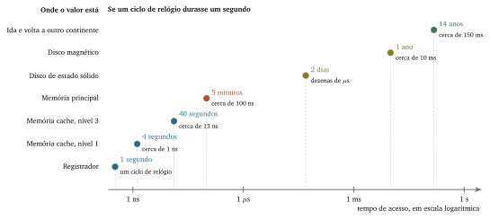{width=95% fig-alt="Sete pontos em escala logarítmica, do registrador à ida e volta pela rede, com o tempo real e o tempo equivalente se um ciclo de relógio durasse um segundo."}

## Um segundo, ou um ano {.smaller}

::: {.incremental}
- Registrador: **1 segundo**
- Memória principal: **5 minutos**
- Disco de estado sólido: **2 dias**
- Disco magnético: **1 ano**
- Ida e volta a outro continente: **14 anos**
:::

## A consequência {.smaller}

A diferença entre um programa rápido e um lento raramente está na quantidade de
contas.

. . .

Está em **quantas vezes ele precisa descer na hierarquia**.

. . .

Dois programas com a mesma quantidade de somas podem diferir por uma ordem de
grandeza no tempo total.

## A memória principal, por fora

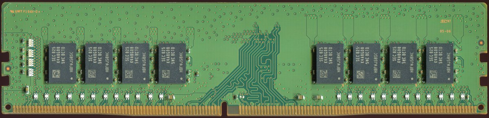{width=92% fig-alt="Módulo de memória DDR4 com oito pastilhas pretas e uma fileira de contatos dourados na borda inferior, interrompida por um encaixe fora do centro."}

## Três detalhes {.smaller}

::: {.incremental}
- As oito pastilhas são a memória. O resto da placa existe para ligá-las.
- Os contatos dourados são por onde passam os barramentos.
- O encaixe fora do centro muda entre gerações: **a peça errada não entra**.
:::

## Disco magnético

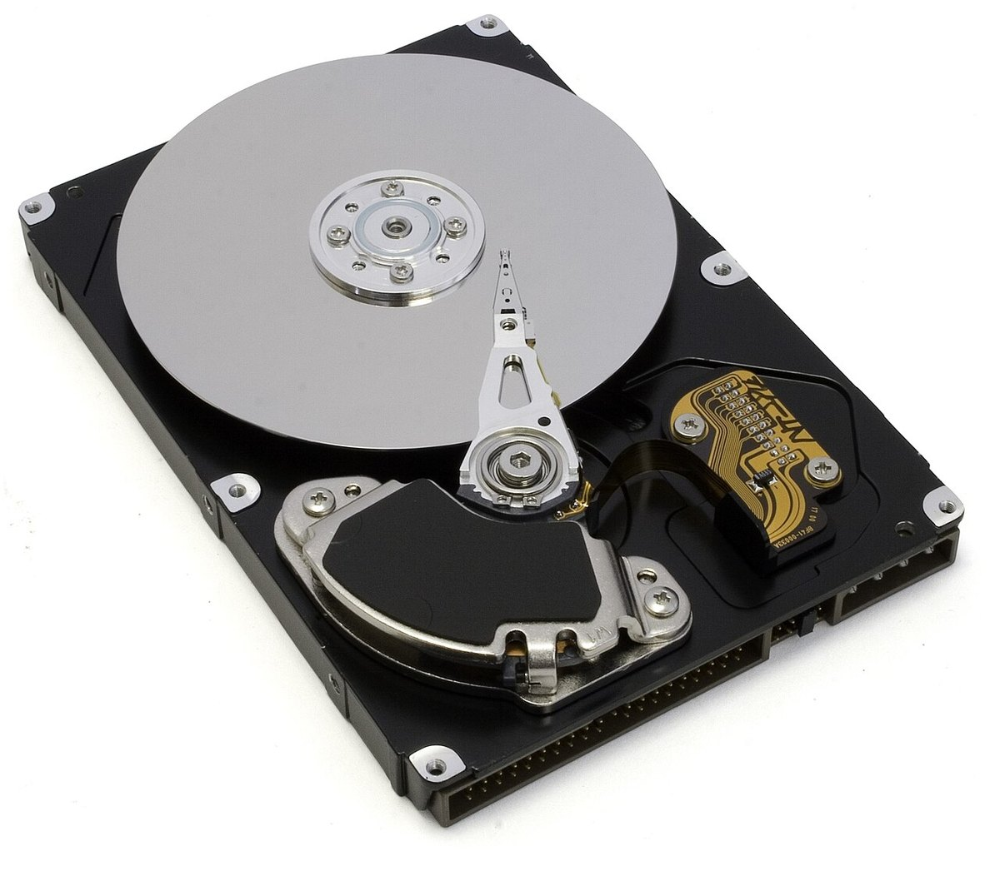{width=52% fig-alt="Disco rígido aberto, com o prato circular espelhado, o braço articulado e a cabeça de leitura."}

## Duas partes móveis

Prato que gira. Braço que se desloca.

. . .

São elas que explicam os $10$ ms. Nenhum outro nível da hierarquia depende de
algo mecânico.

. . .

O preço por byte e a capacidade vêm de outro lugar: o custo de fabricar a célula
de silício comparado ao de revestir um prato de metal.

## Disco de estado sólido

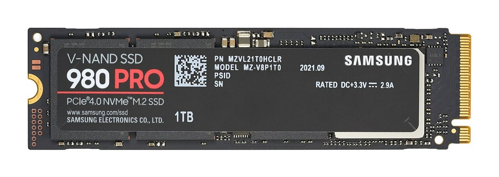{width=92% fig-alt="Disco de estado sólido no formato M.2, uma placa estreita e alongada com contatos dourados em uma das extremidades e nenhuma parte móvel."}

## Os dois, em comparação {.smaller}

| Aspecto | Disco magnético | Disco de estado sólido |
|---|---|---|
| Como guarda | Orientação magnética | Carga elétrica |
| Partes móveis | Prato e braço | Nenhuma |
| Tempo de acesso | Cerca de $10$ ms | Dezenas de $\mu$s |
| Custo por byte | Menor | Maior |
| Posição do dado | Importa muito | Quase não importa |
| Limite de uso | Desgaste mecânico | Escritas por célula |

# Os barramentos

## O que um barramento é {.smaller}

Um conjunto de vias **compartilhado** por vários blocos.

. . .

Cada via transporta um bit por vez; o conjunto transporta um valor de uma vez
só.

. . .

Um fio liga dois pontos. Um barramento é ligado a todos ao mesmo tempo.

## As três funções

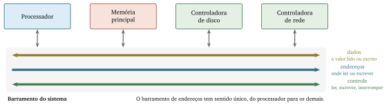{width=95% fig-alt="Processador, memória principal e duas controladoras ligados a uma faixa com três linhas: dados, endereços e controle."}

## Dados, endereços, controle {.smaller}

::: {.incremental}
- **Dados** — o valor lido ou escrito. Dois sentidos.
- **Endereços** — onde ler ou escrever. Na figura, o processador envia o
  endereço; em acesso direto à memória, a controladora também pode enviá-lo.
- **Controle** — ler, escrever, interromper. Dois sentidos.
:::

## Exemplo: a largura do barramento {.smaller}

No barramento de **dados**, a largura limita quantos bits atravessam por
transferência. $64$ vias transportam $8$ bytes; uma linha de $64$ bytes exige
oito transferências.

. . .

No barramento de **endereços**, cada via acrescentada **dobra** a quantidade de
endereços possíveis. Com $n$ vias, são $2^{n}$ endereços.

## O limite dos 4 GB {.smaller}

| Vias de endereço | Endereços possíveis | Memória alcançável |
|---|---|---|
| $16$ | $65\,536$ | $64$ KB |
| $32$ | $4\,294\,967\,296$ | $4$ GB |
| $64$ | mais de $18$ quintilhões | além do fabricado hoje |

. . .

Um equipamento que usa endereços de $32$ bits não alcança mais de $4$ GB nessa
organização, por mais módulos que sejam instalados.

## Recurso disputado {.smaller}

Apenas um bloco escreve por vez. A regra que decide se chama **arbitragem**.

. . .

Aumentar a velocidade de um bloco não aumenta a do sistema quando o barramento
está saturado.

. . .

Computadores de mesa e portáteis atuais usam caminhos ponto a ponto, como o PCI
Express. O modelo das três funções continua valendo.

. . .

Organização de Computadores, no 5º período, trata dos arranjos reais.

# Interfaces, portas e periféricos

## O caminho até o processador

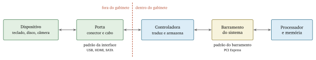{width=98% fig-alt="Dispositivo, porta, controladora, barramento do sistema e processador em linha, com uma linha tracejada separando o que está fora do gabinete do que está dentro."}

## Controladora {.smaller}

Circuito dedicado a um tipo de dispositivo, que **traduz** entre o padrão do
dispositivo e o padrão do barramento.

. . .

Também **armazena** os valores em trânsito: o dispositivo e o processador
trabalham em velocidades muito diferentes.

## Interface e porta {.smaller}

**Interface** é o conjunto de regras: quantas vias, que tensão, em que ordem os
sinais aparecem. USB, HDMI, SATA.

. . .

**Porta** é o ponto físico onde o cabo se conecta, e implementa uma interface.

. . .

Fora do gabinete, o padrão precisa valer entre fabricantes que não se conhecem.
Dentro, só precisa valer naquele equipamento.

## Uma porta USB, por fora

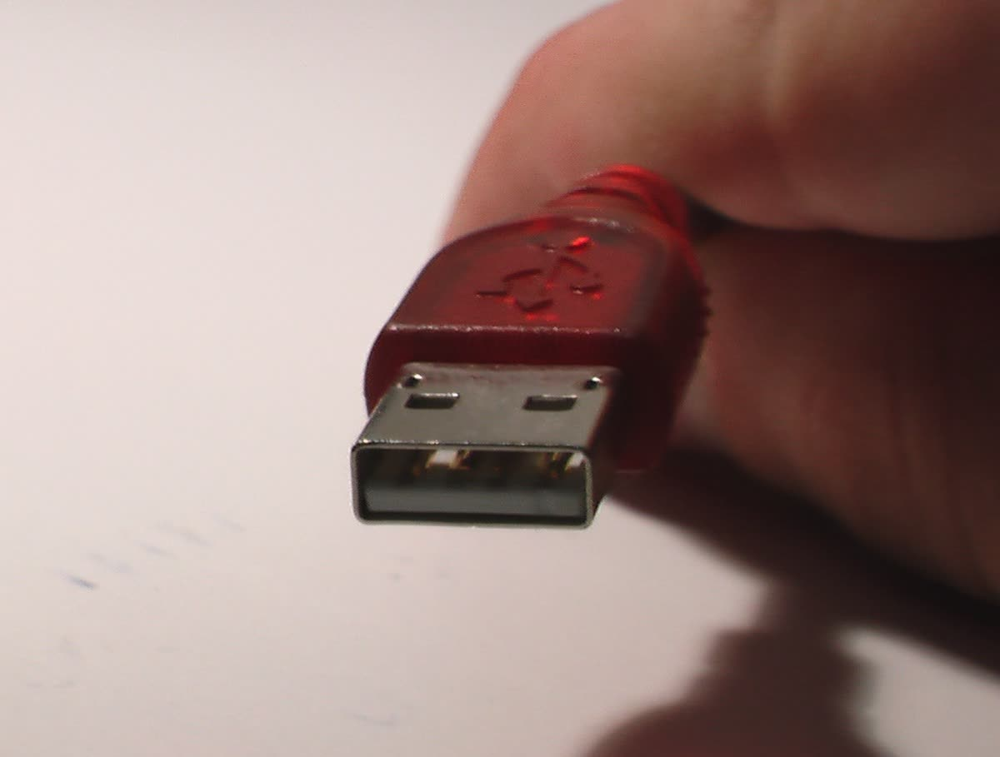{width=56% fig-alt="Conector USB tipo A visto de frente, com a parte metálica e quatro contatos internos."}

O conector é a parte visível. A interface inclui os sinais, as tensões e a ordem
da comunicação.

## Uma placa-mãe

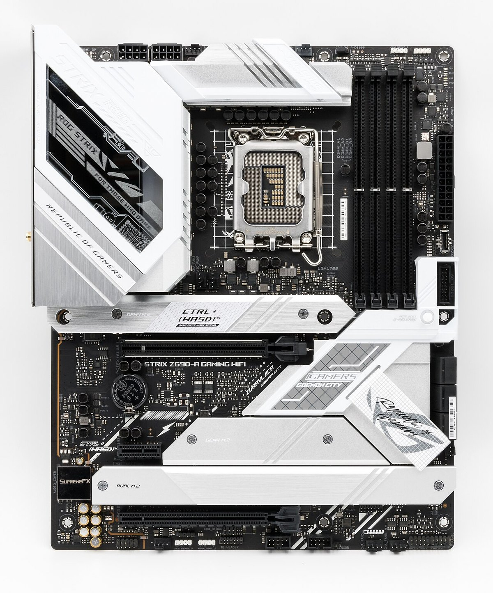{width=42% fig-alt="Placa-mãe vista de cima, com o soquete do processador ao centro, quatro encaixes de memória à direita e encaixes de expansão na metade inferior."}

## Quase tudo deste capítulo {.smaller}

::: {.incremental}
- O soquete central recebe a pastilha da fotografia do processador.
- Os quatro encaixes à direita recebem os módulos de memória, e ficam perto do
  soquete porque cada centímetro de trilha custa tempo.
- A maior parte da superfície visível é ligação: as conexões que o diagrama de
  barramentos simplifica.
:::

## Periféricos {.smaller}

| Classe | Sentido | Exemplos |
|---|---|---|
| Entrada | Do mundo para o sistema | Teclado, microfone, câmera, sensor |
| Saída | Do sistema para o mundo | Monitor, alto-falante, impressora, motor |
| Entrada e saída | Nos dois sentidos | Disco, placa de rede, tela sensível ao toque |

. . .

A terceira linha é a esquecida, e é a que tem mais casos importantes.

## Como conversar com algo lento {.smaller}

**Espera ativa** — o processador pergunta repetidamente se já terminou. Simples,
e joga fora todo o tempo de espera.

. . .

**Interrupção** — o processador pede, executa outro programa, e é avisado
quando o resultado está pronto.

## A leitura de um bloco, com interrupção

```{mermaid}
%%| fig-width: 6
%%| echo: false
sequenceDiagram
  participant P as Processador
  participant C as Controladora
  participant D as Disco
  P->>C: pede o bloco 4711
  Note over P: passa a executar<br/>outro programa
  C->>D: posiciona e lê
  D-->>C: conteúdo do bloco
  C->>P: interrupção
  P->>C: recolhe o conteúdo
  Note over P: retoma o programa<br/>interrompido
```

## Acesso direto à memória {.smaller}

Sem ele, o processador recolhe o conteúdo da controladora e o escreve na
memória, valor a valor.

. . .

Com ele, a **controladora escreve direto na memória** e só avisa quando o bloco
inteiro chegou.

. . .

É a razão de ser possível copiar um arquivo grande enquanto se usa o computador.

# Três equipamentos

## A mesma organização, portes diferentes {.smaller .scrollable}

| Aspecto | Computador de mesa | Telefone | Controlador de portão |
|---|---|---|---|
| Repertório | x86 | ARM | Família própria |
| Registradores | Dezenas | Dezenas | Dezenas |
| Níveis de cache | Três | Dois ou três | Em geral, nenhum |
| Memória principal | Módulos, dezenas de GB | Soldada, alguns GB | Alguns KB, na pastilha |
| Armazenamento | Estado sólido, TB | Soldado, centenas de GB | Alguns KB |
| Barramento | PCI Express | Interno à pastilha | Interno à pastilha |
| Periféricos | Muitos, conectáveis | Poucos, integrados | Um sensor e um motor |

## Um computador de placa única

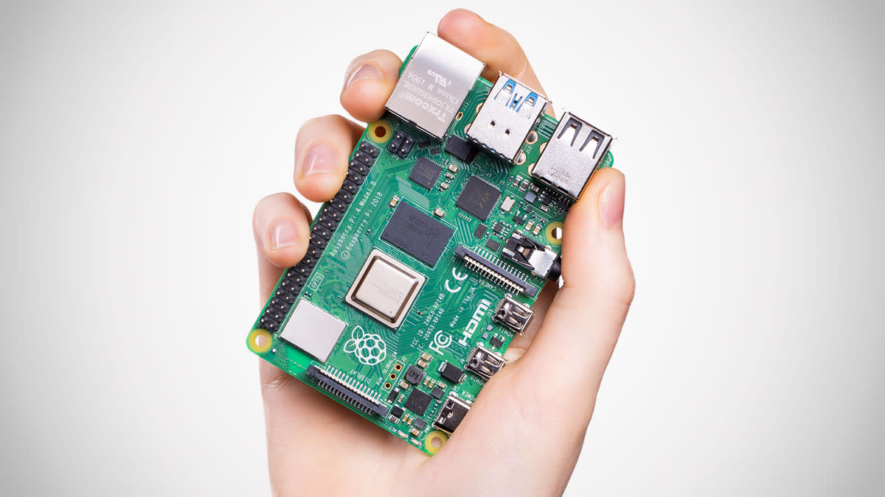{width=55% fig-alt="Computador de placa única Raspberry Pi 4 na mão de uma pessoa, mostrando processador, conectores USB, rede e outros componentes na mesma placa."}

Processador, memória, controladoras e portas podem caber em uma placa pequena.

## Tempo e energia {.smaller}

Este capítulo mediu o percurso de um valor em **tempo**, porque tempo é o que
vocês percebem.

. . .

A mesma assimetria vale para **energia**: alcançar um valor no registrador
consome muito menos que alcançá-lo na memória principal [@patterson2014].

. . .

O capítulo 14 retoma pelo outro lado, partindo do consumo de um equipamento e de
um centro de dados.

## Duas leituras {.smaller}

A linha dos registradores é igual nas três colunas. A das caches é a que mais
varia.

. . .

Registrador é parte da definição de processador. Cache resolve um problema que
só existe quando a memória é grande e distante.

. . .

A coluna da direita é um **microcontrolador**: processador, memória e
controladoras em uma pastilha só. Ele aparece em eletrodomésticos, automóveis,
medidores e brinquedos.

# O que reter

## Nem todo termo tem o mesmo peso {.smaller .scrollable}

| Assunto | Reter | Basta reconhecer |
|---|---|---|
| Processador | Unidade de controle, ULA, registrador | Núcleo, contador de programa |
| Instruções | Instrução, código da operação, operando, repertório | Endereçamento indireto |
| Memória | Hierarquia, volátil e não volátil, localidade, ciclo de relógio | Linha de cache, acerto, falta |
| Barramento | Dados, endereços, controle; largura | Arbitragem, PCI Express |
| Entrada e saída | Controladora, interface, porta, periférico, interrupção | Espera ativa, acesso direto à memória |

## As duas colunas {.smaller}

A do meio é o **piso**, e é dela que sai a tarefa desta semana.

. . .

A da direita é **repertório**: ninguém vai pedir a definição de arbitragem, e
vocês vão precisar reconhecer a palavra no dia em que ela aparecer em um manual.

# Atividades e exercícios da semana

## Aplicação {.smaller}

Multiplicar por dois o valor da posição $80$ e gravar em $81$, sem instrução de
multiplicação.

. . .

Escrevam a sequência no formato da tabela dos dez passos. Marquem cada ação como
movimentação de dados, cálculo aritmético ou coordenação de leitura e escrita.

. . .

Essa marcação descreve o modelo, e não classifica instruções de um processador
real.

. . .

Quantos passos tocam a memória principal? E se o valor já estivesse em um
registrador?

## Transferência {.smaller}

1. "Demora um minuto para abrir qualquer programa. Depois, funciona normal."
2. "Ao abrir o oitavo programa, todos ficam lentos. Fechando dois, normaliza."
3. "Instalei mais memória e continua levando quarenta minutos. O processador
   fica ocupado o tempo todo e o disco, parado."

. . .

Em que nível da hierarquia vocês procurariam primeiro, e por quê?

. . .

Uma das três não se resolve trocando de nível. Cada enunciado traz o sinal que
permite decidir.

## Integração {.smaller}

Recuperem a folha da abertura.

::: {.incremental}
- Quantos passos vocês previram, e quantos a tabela acrescentou?
- A sua resposta sobre onde os números ficam guardados mencionava registrador?
- A sua resposta sobre a etapa mais demorada apontava a soma?
:::

## Consolidação {.smaller}

Os exercícios 4 a 9 retomam o piso: registradores, volatilidade, largura do
barramento, percurso de uma câmera, periféricos e localidade.

. . .

Usem as figuras e tabelas indicadas em cada enunciado. As respostas-modelo estão
no apêndice de exercícios.

# Pesquisa e apresentação

## Organização {.smaller}

Dez grupos, com três ou quatro participantes, recebem por sorteio um tema de
processador, memória, armazenamento, barramento ou conexão.

. . .

Cada grupo prepara uma pergunta sobre outro tema, conforme a distribuição do
capítulo.

## Pesquisa e fontes {.smaller}

Pesquisem a fundo o tema do grupo. Levantem o tema da pergunta só o suficiente
para formulá-la.

. . .

Usem ao menos três fontes, incluindo documentação de fabricante, entidade de
padrão ou manual técnico.

. . .

Antes de usar uma fonte, confirmem autoria, informação sustentada e data de
publicação ou atualização. Artigo assinado e datado conta; matéria sem
assinatura do tipo "os dez melhores" não serve. Página de loja e resultado de
busca não contam como fonte.

## Produto, apresentação e síntese {.smaller}

Entreguem a apresentação em PDF, com créditos das fontes e das imagens. Cada
grupo apresenta por seis minutos e responde à pergunta em dois.

. . .

O grupo inclui um diagrama próprio. Ao final, cada estudante relaciona seu tema
a outro, usando um conceito do capítulo e uma aplicação ou limitação.

## Cronograma {.smaller}

- Encontro 4: sorteio e planejamento, em 50 minutos.
- Entre os encontros 4 e 8: pesquisa e produção em grupo.
- Encontro 8: seminário técnico de 100 minutos, com apresentações e síntese.

## O que fecha o capítulo {.smaller}

A soma é a etapa mais rápida, por várias ordens de grandeza.

. . .

A intuição contrária vem de tratar o cálculo como o trabalho e a movimentação
como preparação.

. . .

Os capítulos 5 e 6 descem mais um degrau: o sistema de numeração em que esses
valores estão escritos, e o que exatamente está guardado em cada posição.

## Referências {.scrollable}

::: {#refs}
:::
